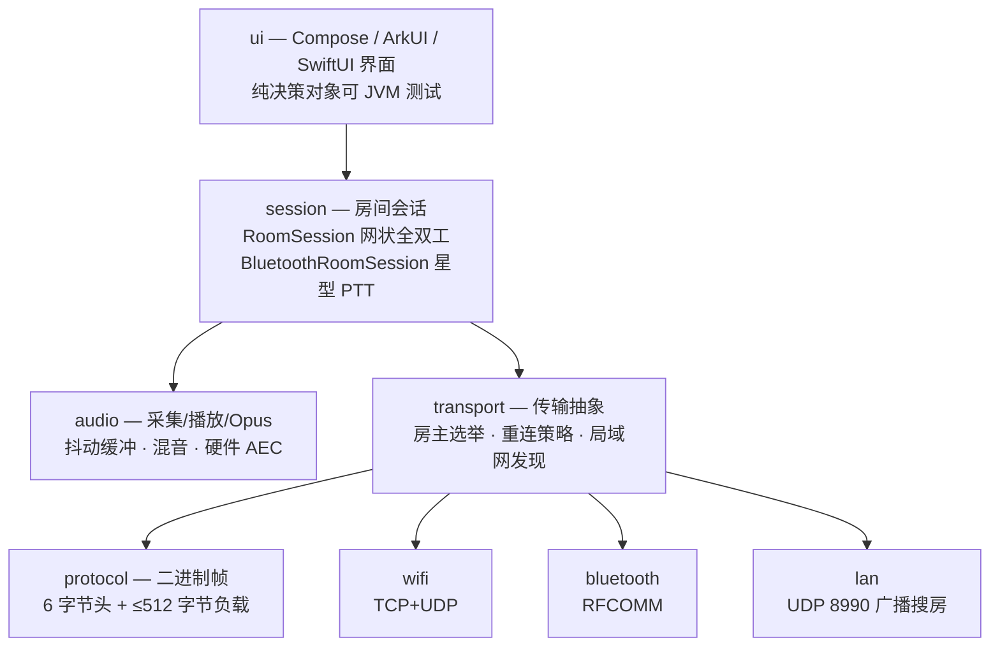

<p align="center">
  <br>
  
  <br>
  <br>
</p>

<h1 align="center">落日后残波</h1>

<p align="center"><sub>S U N S E T &nbsp;&nbsp; R I P P L E</sub></p>

<br>

<p align="center">
  夕阳已远，涟漪未散，犹诉未尽之言。
  <br>
  <sub><em>The sun has gone; the ripple hasn't.</em></sub>
</p>

<br>

<p align="center">
  <a href="https://github.com/Starlordzz/sunsetripple/releases"></a>
  
  
  
  
  
  <a href="LICENSE"></a>
</p>

<br>

<p align="center">
  琵琶弦上说相思。<br>
  当时明月在，曾照彩云归。
</p>

<br>
<br>

---

<br>

**落日后残波（SunsetRipple）** 是一个近场语音对讲应用（支持 **Android、iOS 与 HarmonyOS NEXT**）。没有账号，没有云端，没有一行语音数据离开你和对方的设备之间的那几十米。手机之间直接建链，最多 6 台，说完就散。

<br>

## 功能特性

<br>

- **Flutter 跨平台统一架构**——基于 Flutter 3.24+ 构建统一 Dart 会话核心、二进制协议与高质感天体界面，底层无缝桥接各平台原生音频 HAL 与蓝牙信道。
- **动态麦克风路由切换**——房内支持一键切换使用「手机自带麦克风」或「外接/蓝牙耳机麦克风」；使用手机麦拾音时自动释放通话 SCO 占用，切回 A2DP 高清媒体声道。
- **跨端局域网/热点免网对讲**——同一 Wi-Fi 或随身热点下，通过 UDP 8990 广播零配置自动搜房建连，4 秒无响应自动修剪僵尸房间。
- **两种可用房型**——WiFi 全双工房与 BLE L2CAP CoC 按住说话（PTT）房，均支持最多 6 台设备。
- **零语音基础设施**——无路由器、无账号、无服务器；语音只在设备之间点对点传输，检查更新时会访问 GitHub。
- **WiFi 房无缝房主转移**——支持房内手动转让房主或房主失联自动按快照选举继任者并重构组网，UDP 端口即刻同步登记。
- **全网静音与说话状态联动**——静音操作全房即时同步标志位，关闭麦克风实时熄灭音频声波动画。
- **断线自动重连**——多轮指数退避重试，重连后凭令牌恢复原成员身份与入房顺序。
- **连续建房转场**——从实际点击位置展开真实房间界面，首页与房间共享同一套落日页头和配色，不经过独立遮罩或二次弹页。
- **昼夜双配色**——白天是落日暖金，夜里换成月与海面（冷月白 + 玫瑰粉离开按钮，对比度 > 7.5:1）。
- **通话级音频**——`VOICE_COMMUNICATION` 采集、硬件回声消除（AEC/NS/AGC）、音频焦点协商、50 周期 HAL 容错缓冲与 Opus 丢包补偿。
- **脱敏诊断报告**——内置网络与音质诊断面板，一键生成脱敏日志便于提交 GitHub Issue。

<br>

## 房型对比

<br>

| | WiFi Direct 房 | 蓝牙 RFCOMM 房 | Nearby 房 |
| --- | --- | --- | --- |
| 状态 | ✅ 可用 | ✅ 可用 | ⏸ 已实现，入口隐藏 |
| 通话方式 | 全双工（同时说） | 按住说话（PTT） | 全双工 |
| 拓扑 | 网状——音频点对点直发 | 星型——房主端混音下发 | 网状 |
| 信令 / 音频 | TCP 8988 / UDP 8989 | 单条 RFCOMM 流复用 | Nearby BYTES 负载 |
| 码率 | 24 kbps | 16 kbps | 24 kbps |
| 最大人数 | 6 | 6 | 6 |
| 依赖 | 设备支持 WiFi P2P | 经典蓝牙 RFCOMM | Google Play 服务 |
| 房主转移 | ✅ | ✅ | ❌ 不支持 |

<br>

蓝牙只做 PTT 是个刻意的取舍：RFCOMM 的带宽撑不起 6 路全双工混音，与其做成断续的全双工，不如做成可靠的对讲机。

Nearby 房的代码与单元测试都在仓库里，但因为它依赖 Google Play 服务、国内机型大量缺失，且不支持房主转移，当前版本在首页隐藏了入口。

<br>

## 快速开始

<br>

从 [Releases](https://github.com/Starlordzz/sunsetripple/releases) 下载最新版本的安装包：
- **Android**：下载 `SunsetRipple-*.apk` 直接安装（体积约 10MB，含自带 Opus 引擎）。
- **iOS**：下载 `SunsetRipple-*.ipa`。这是真正纯原生编译的 ARM64 可执行二进制包（得益于 SwiftUI 零外部依赖与 Swift 运行时内置，极致精简不到 100KB），可通过 TrollStore (巨魔) 或 AltStore 等工具安装；或下载 `SunsetRipple-iOS-*.zip` Xcode 工程源码调试。
- **HarmonyOS NEXT**：由于云端 CI 暂未接入华为 ArkTS 编译器，Release 中的 `.hap` 仅为源码打包占位。**请下载 `SunsetRipple-HarmonyOS-*.zip` 源码，在您本地的 DevEco Studio 中打开并构建出真正的 `.hap` 安装包。**

> Android 端需要 Android 8.0（API 26）及以上。
> 若装过包名为 `com.wt.intercom` 的旧测试版，**必须先卸载**——包名已改为 `host.msknet.sunsetripple`，无法覆盖升级。

<br>

1. 一台设备点 **创建房间**，选 WiFi 房或蓝牙房，授予麦克风与附近设备权限。
2. 其他设备点 **加入房间**，在列表里选中房主设备。
3. WiFi 房直接开说；蓝牙房按住中间的圆盘说话，松手收听。
4. 房主离开后，其余成员会自动推选继任者并重建房间；重建期间语音会短暂中断。

点击创建后，扩散区域本身就是正在进入的房间界面；动画结束时不会再切换或弹出第二层页面。

保持设备在彼此的射频范围内（空旷环境下 WiFi Direct 约数十米，蓝牙更短）。

<br>

## 技术架构

<br>

Core-Shell 统一架构，Kotlin + Jetpack Compose / ArkUI / SwiftUI。核心是一条跨端统一的自定义二进制帧协议加一套与传输无关的会话层。



<br>

几个关键设计：

- **帧协议固定 6 字节头**——`[类型 1B][发送者 1B][序号 2B][长度 2B]`，负载上限 512 字节，覆盖音频、入房、花名册、PTT、心跳、离开与房主转移帧。
- **音频与信令分离**——WiFi 房把可靠的信令放 TCP，把可丢的音频放 UDP，并且音频直接网状发送，组主不承担转发负载。
- **房主不信任客户端身份**——蓝牙房主会用自己分配的成员 ID 重写收到的帧头，客户端伪造 `senderId` 无效。
- **纯 JVM 的决策层**——权限分级、应用与导航状态、房间生命周期、房主选举、混音计划、界面动效、主题档位和系统语言策略都抽成了不依赖 Android UI 的对象，可在普通 JVM 上验证，无需模拟器。
- **真实界面参与转场**——`MainActivity` 同时绘制首页与实际 `RoomScreen`，圆形揭示只负责裁剪可见区域；动画状态读取收敛在绘制层，避免逐帧重组整棵 Compose 页面。
- **Opus 走纯 JVM 实现**（Concentus），构建不需要 NDK，产物不含 `.so`。

音频参数：16 kHz 单声道，20 ms 一帧（320 采样），Opus VOIP 模式，抖动缓冲预缓存 3 帧、上限 10 帧，丢包位置交给 Opus PLC 补偿。

完整细节见 [架构总览](https://github.com/Starlordzz/sunsetripple/wiki/架构总览) 与 [协议规范](https://github.com/Starlordzz/sunsetripple/wiki/协议规范)。

<br>

## 从源码构建

<br>

需要 JDK 17 和 Android SDK 35；Gradle Wrapper 已包含在仓库中。

```powershell
$env:JAVA_HOME='C:\Path\To\jdk-17' # 已配置时可省略
.\gradlew.bat :app:testDebugUnitTest :app:assembleDebug :app:lintDebug
```

```bash
export JAVA_HOME=/path/to/jdk-17 # 已配置时可省略
./gradlew :app:testDebugUnitTest :app:assembleDebug :app:lintDebug
```

Debug APK 输出到 `app/build/outputs/apk/debug/app-debug.apk`。

发布签名、更新验签密钥和 GitHub Actions 自动发版说明见 [构建与发布](https://github.com/Starlordzz/sunsetripple/wiki/构建与发布)。正式发布时只需更新版本号与 CHANGELOG，再推送与 `versionName` 一致的 `v*` Tag。

<br>

## 项目状态

<br>

当前开发版本为 **`0.1.0-alpha.7`**（versionCode 8）。阶段 0、1、2、5、6 的软件实现已落地；阶段 3 已完成持久身份、签名握手、AEAD 密封帧和指纹 UI 核心；尝试多平台化（Core-Shell 统一架构与 iOS/鸿蒙原生工程）已就绪。

| 能力 | 状态 |
| :--- | :--- |
| Core-Shell 统一多端架构 | ✅ 已实现 |
| 跨端局域网/热点免网对讲 | ✅ 可用 |
| Android 原生对讲应用 | ✅ 可用 |
| HarmonyOS NEXT 纯血鸿蒙应用 | ✅ 已实现 (`harmonyos/`) |
| iOS 苹果原生对讲应用 | ✅ 已实现 (`ios/`) |
| WiFi Direct 全双工房 | ✅ 可用 |
| 蓝牙 PTT 房 | ✅ 可用 |
| 断线重连与身份恢复 | ✅ 可用 |
| 房主主动交接 | ✅ 可用 |
| 房主异常接管 | ⚠️ 已实现，待多机验收 |
| 连续 A→B→C 转移 | ⚠️ 待真机验收 |
| Nearby 房 | ⏸ 已实现，入口隐藏 |
| 锁屏通知交互 | ⏸ 已搁置 |
| 昼夜双配色与三档切换 | ✅ 可用 |
| 系统自动中英文 | ✅ 已实现 |
| 签名更新与系统安装确认 | ✅ 已实现，发布需配置公钥 |
| 诊断导出与 Issue 预填 | ✅ 已实现 |
| AEAD 会话安全核心 | ✅ 已实现，传输强制启用待兼容验证 |

<br>

## 已知限制

<br>

- **异常接管依赖快照**——客户端必须已收到最新的房主快照才能接管。房间刚建立就断电、所有候选设备同时离线、或无线环境完全隔离时无法恢复。
- **WiFi 房转移会中断语音**——继任过程需要重建 WiFi Direct 组，期间语音短暂中断，系统可能再次弹出连接确认。
- **Nearby 房入口隐藏**——依赖 Google Play 服务，且不支持房主转移。
- **锁屏通知未保证**——通知展示与按钮交互已搁置；屏幕关闭后的后台音频保活代码仍保留。
- **夜间配色未上真机**——仅在模拟器上完成视觉核对，尚未在真机屏幕上验收。
- **无真机矩阵验证**——三机连续转移、WiFi 系统确认弹窗、语音恢复耗时仍待验收，因此本版本仅作为 alpha 发布。
- **无真机性能数值**——Macrobenchmark 与 Baseline Profile 已接入，但帧时间和端到端延迟仍需目标设备实测。

<br>

## 文档

<br>

完整技术文档在 **[Wiki](https://github.com/Starlordzz/sunsetripple/wiki)**：

| 页面 | 内容 |
| --- | --- |
| [Core-Shell 统一多端架构](https://github.com/Starlordzz/sunsetripple/wiki/Core-Shell统一多端架构) | 统一核心、Ports & Adapters、各端 Shell |
| [iOS 平台适配指南](https://github.com/Starlordzz/sunsetripple/wiki/iOS平台适配指南) | AudioUnit 硬件 AEC、MultipeerConnectivity 免网 P2P |
| [HarmonyOS 平台适配指南](https://github.com/Starlordzz/sunsetripple/wiki/HarmonyOS平台适配指南) | @ohos.multimedia.audio、ArkTS / ArkUI 原生工程 |
| [架构总览](https://github.com/Starlordzz/sunsetripple/wiki/架构总览) | 分层结构、包职责、关键类 |
| [协议规范](https://github.com/Starlordzz/sunsetripple/wiki/协议规范) | 帧格式、8 种帧类型、各负载编码 |
| [房间模式对比](https://github.com/Starlordzz/sunsetripple/wiki/房间模式对比) | 三种房型的拓扑与取舍 |
| [音频管线](https://github.com/Starlordzz/sunsetripple/wiki/音频管线) | 采集到播放的完整链路与参数 |
| [房主转移机制](https://github.com/Starlordzz/sunsetripple/wiki/房主转移机制) | 主动交接与异常接管 |
| [构建与发布](https://github.com/Starlordzz/sunsetripple/wiki/构建与发布) | 工具链、依赖、签名、出包 |
| [故障排查](https://github.com/Starlordzz/sunsetripple/wiki/故障排查) | 连不上、没声音、频繁掉线 |
| [常见问题](https://github.com/Starlordzz/sunsetripple/wiki/常见问题) | FAQ |

变更记录见 [CHANGELOG.md](CHANGELOG.md)。

<br>

## 许可证

<br>

[Apache License 2.0](LICENSE) · Copyright 2026 Starlordzz

<br>
<br>

---

<br>

<p align="center"><sub>。<br><em>For the one who watched the sunset with me.</em><br><em>Never Meant</em></sub></p>

<br>