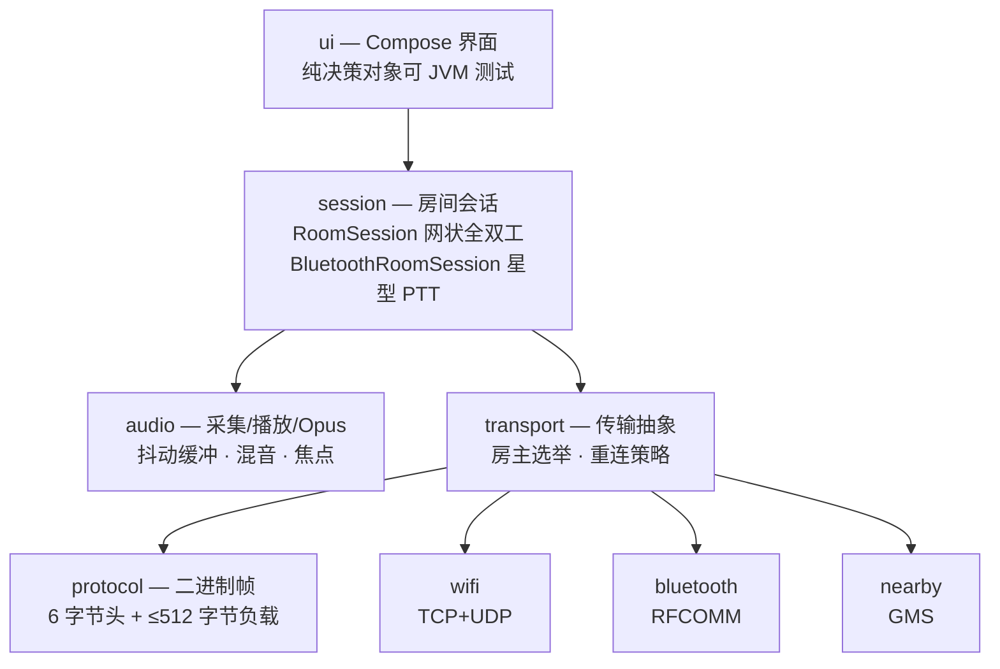

<p align="center">
  <br>
  
  <br>
  <br>
</p>

<h1 align="center">落日后残波</h1>

<p align="center"><sub>S U N S E T &nbsp;&nbsp; R I P P L E</sub></p>

<br>

<p align="center">
  落日之后，波纹仍在替我们说着那天没说完的话。
  <br>
  <sub><em>The sun has gone; the ripple hasn't.</em></sub>
</p>

<br>

<p align="center">
  <a href="https://github.com/Starlordzz/sunsetripple/releases"></a>
  
  
  
  <a href="LICENSE"></a>
</p>

<br>

<p align="center">
  有些声音<br>
  只在彼此还靠得够近的时候，才听得见。
</p>

<br>
<br>

---

<br>

**落日后残波（SunsetRipple）** 是一个 Android 近场语音对讲应用。没有账号，没有云端，没有一行语音数据离开你和对方的设备之间的那几十米。手机之间直接建链，最多 6 台，说完就散。

<br>

## 功能特性

<br>

- **两种可用房型**——WiFi Direct 全双工房与蓝牙按住说话（PTT）房，均支持最多 6 台设备。
- **零基础设施**——无路由器、无互联网、无账号、无服务器；语音只在设备之间点对点传输。
- **网状音频，不经中转**——WiFi 房中每台设备把音频 UDP 直发给其他成员，组主不做转发也不是瓶颈。
- **断线自动重连**——1 / 2 / 4 秒三次退避重试，重连后凭令牌恢复原成员身份与入房顺序。
- **房主自动接管**——房主主动离房、进程崩溃、被系统杀死或链路中断时，房间会自动选出继任者并重建，而不是直接解散。
- **连续建房转场**——从实际点击位置展开真实房间界面，首页与房间共享同一套落日页头和配色，不经过独立遮罩、黑帧或二次弹页。
- **轻量房内控制**——成员轨道、频道核心与底部操作共用一套视觉层级；静音、扬声器和离开均使用紧凑图标控件。
- **昼夜双配色**——白天是落日暖色，夜里换成月与海面：同一份绘制代码，页头那轮天体成为月亮，波纹成为月光在水面的反射。可跟随系统，也可手动锁定浅色或深色。
- **通话级音频**——`VOICE_COMMUNICATION` 采集、硬件回声消除、音频焦点协商、抖动缓冲与 Opus 丢包补偿。
- **前台保活**——麦克风类型前台服务 + WakeLock + WifiLock，通知栏可直接静音或离开。
- **只听模式**——被其他应用抢占音频焦点时自动降级为只听，不会静默掉线。
- **253 个单元测试**——协议编解码、抖动缓冲、混音、房主选举、重连、权限分级、界面动效与主题档位决策全部有覆盖，且全部是纯 JVM 测试。

<br>

## 房型对比

<br>

| | WiFi Direct 房 | 蓝牙 RFCOMM 房 | Nearby 房 |
| --- | --- | --- | --- |
| 状态 | ✅ 可用 | ✅ 可用 | ⏸ 已实现，入口隐藏 |
| 通话方式 | 全双工（同时说） | 按住说话（PTT） | 全双工 |
| 拓扑 | 网状——音频点对点直发 | 星型——房主端混音下发 | 网状 |
| 信令 / 音频 | TCP 8988 / UDP 8989 | 单条 RFCOMM 流复用 | Nearby BYTES 负载 |
| 码率 | 24 kbps | 16 kbps | 24 kbps |
| 最大人数 | 6 | 6 | 6 |
| 依赖 | 设备支持 WiFi P2P | 经典蓝牙 RFCOMM | Google Play 服务 |
| 房主转移 | ✅ | ✅ | ❌ 不支持 |

<br>

蓝牙只做 PTT 是个刻意的取舍：RFCOMM 的带宽撑不起 6 路全双工混音，与其做成断续的全双工，不如做成可靠的对讲机。

Nearby 房的代码与单元测试都在仓库里，但因为它依赖 Google Play 服务、国内机型大量缺失，且不支持房主转移，当前版本在首页隐藏了入口。

<br>

## 快速开始

<br>

从 [Releases](https://github.com/Starlordzz/sunsetripple/releases) 下载最新版本的 `app-release.apk` 直接安装；`app-release.aab` 用于应用商店分发，不能直接在手机上安装。

> 需要 Android 8.0（API 26）及以上。
> 若装过包名为 `com.wt.intercom` 的旧测试版，**必须先卸载**——包名已改为 `host.msknet.sunsetripple`，无法覆盖升级。

<br>

1. 一台设备点 **创建房间**，选 WiFi 房或蓝牙房，授予麦克风与附近设备权限。
2. 其他设备点 **加入房间**，在列表里选中房主设备。
3. WiFi 房直接开说；蓝牙房按住中间的圆盘说话，松手收听。
4. 房主离开后，其余成员会自动推选继任者并重建房间；重建期间语音会短暂中断。

点击创建后，扩散区域本身就是正在进入的房间界面；动画结束时不会再切换或弹出第二层页面。

保持设备在彼此的射频范围内（空旷环境下 WiFi Direct 约数十米，蓝牙更短）。

<br>

## 技术架构

<br>

Kotlin + Jetpack Compose，单 Activity，无 DI 框架，无数据库，无网络库。核心是一条自定义二进制帧协议加一套与传输无关的会话层。



<br>

几个关键设计：

- **帧协议固定 6 字节头**——`[类型 1B][发送者 1B][序号 2B][长度 2B]`，负载上限 512 字节，8 种帧类型覆盖音频、入房、花名册、PTT、心跳、离开与两种房主转移帧。
- **音频与信令分离**——WiFi 房把可靠的信令放 TCP，把可丢的音频放 UDP，并且音频直接网状发送，组主不承担转发负载。
- **房主不信任客户端身份**——蓝牙房主会用自己分配的成员 ID 重写收到的帧头，客户端伪造 `senderId` 无效。
- **纯 JVM 的决策层**——权限分级、房间流转、房主选举、混音计划、界面动效和主题档位决策都抽成了不依赖 Android 的对象，因此 253 个测试全部能在普通 JVM 上运行，无需模拟器。
- **真实界面参与转场**——`MainActivity` 同时绘制首页与实际 `RoomScreen`，圆形揭示只负责裁剪可见区域；动画状态读取收敛在绘制层，避免逐帧重组整棵 Compose 页面。
- **Opus 走纯 JVM 实现**（Concentus），构建不需要 NDK，产物不含 `.so`。

音频参数：16 kHz 单声道，20 ms 一帧（320 采样），Opus VOIP 模式，抖动缓冲预缓存 3 帧、上限 10 帧，丢包位置交给 Opus PLC 补偿。

完整细节见 [架构总览](https://github.com/Starlordzz/sunsetripple/wiki/架构总览) 与 [协议规范](https://github.com/Starlordzz/sunsetripple/wiki/协议规范)。

<br>

## 从源码构建

<br>

需要 JDK 17。仓库自带 Gradle 8.9 wrapper。

```powershell
$env:JAVA_HOME='D:\LEARNING\tools\jdk-17'
.\gradlew.bat :app:testDebugUnitTest :app:assembleDebug :app:lintDebug
```

```bash
export JAVA_HOME=/path/to/jdk-17
./gradlew :app:testDebugUnitTest :app:assembleDebug :app:lintDebug
```

发布签名、密钥管理与出包流程见 [构建与发布](https://github.com/Starlordzz/sunsetripple/wiki/构建与发布)。

<br>

## 项目状态

<br>

当前主线基线为 **`0.1.0-alpha.4`**；`alpha5-about-update` 分支正在开发关于与更新页面，核心链路仍属于早期公开测试阶段，多机真机验收还没做完。

| 能力 | 状态 |
| --- | --- |
| WiFi Direct 全双工房 | ✅ 可用 |
| 蓝牙 PTT 房 | ✅ 可用 |
| 断线重连与身份恢复 | ✅ 可用 |
| 房主主动交接 | ✅ 可用 |
| 房主异常接管 | ⚠️ 已实现，待多机验收 |
| 连续 A→B→C 转移 | ⚠️ 待真机验收 |
| Nearby 房 | ⏸ 已实现，入口隐藏 |
| 锁屏通知交互 | ⏸ 已搁置 |
| 昼夜双配色与三档切换 | ✅ 可用 |
| 多语言 | ❌ 暂无计划 |

<br>

## 已知限制

<br>

- **异常接管依赖快照**——客户端必须已收到最新的房主快照才能接管。房间刚建立就断电、所有候选设备同时离线、或无线环境完全隔离时无法恢复。
- **WiFi 房转移会中断语音**——继任过程需要重建 WiFi Direct 组，期间语音短暂中断，系统可能再次弹出连接确认。
- **Nearby 房入口隐藏**——依赖 Google Play 服务，且不支持房主转移。
- **锁屏通知未保证**——通知展示与按钮交互已搁置；屏幕关闭后的后台音频保活代码仍保留。
- **夜间配色未上真机**——仅在模拟器上完成视觉核对，尚未在真机屏幕上验收。
- **无真机矩阵验证**——三机连续转移、WiFi 系统确认弹窗、语音恢复耗时仍待验收，因此本版本仅作为 alpha 发布。

<br>

## 文档

<br>

完整技术文档在 **[Wiki](https://github.com/Starlordzz/sunsetripple/wiki)**：

| 页面 | 内容 |
| --- | --- |
| [架构总览](https://github.com/Starlordzz/sunsetripple/wiki/架构总览) | 分层结构、包职责、关键类 |
| [协议规范](https://github.com/Starlordzz/sunsetripple/wiki/协议规范) | 帧格式、8 种帧类型、各负载编码 |
| [房间模式对比](https://github.com/Starlordzz/sunsetripple/wiki/房间模式对比) | 三种房型的拓扑与取舍 |
| [音频管线](https://github.com/Starlordzz/sunsetripple/wiki/音频管线) | 采集到播放的完整链路与参数 |
| [房主转移机制](https://github.com/Starlordzz/sunsetripple/wiki/房主转移机制) | 主动交接与异常接管 |
| [构建与发布](https://github.com/Starlordzz/sunsetripple/wiki/构建与发布) | 工具链、依赖、签名、出包 |
| [故障排查](https://github.com/Starlordzz/sunsetripple/wiki/故障排查) | 连不上、没声音、频繁掉线 |
| [常见问题](https://github.com/Starlordzz/sunsetripple/wiki/常见问题) | FAQ |

变更记录见 [CHANGELOG.md](CHANGELOG.md)。

<br>

## 许可证

<br>

[Apache License 2.0](LICENSE) · Copyright 2026 Starlordzz

<br>
<br>

---

<br>

<p align="center"><sub>。<br><em>For the one who watched the sunset with me.</em></sub></p>

<br>
