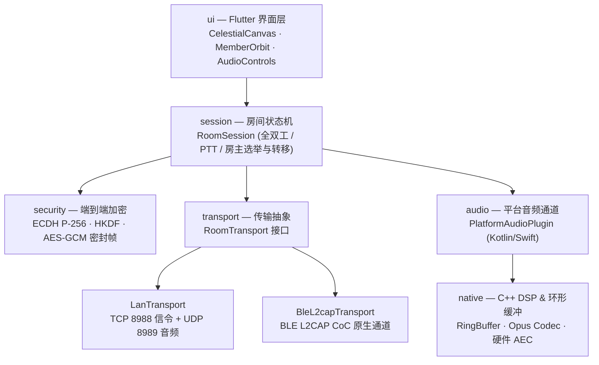

<p align="center">
  <br>
  
  <br>
  <br>
</p>

<h1 align="center">落日后残波</h1>

<p align="center"><sub>S U N S E T &nbsp;&nbsp; R I P P L E</sub></p>

<br>

<p align="center">
  夕阳已远，涟漪未散，犹诉未尽之言。
  <br>
  <sub><em>The sun has gone; the ripple hasn't.</em></sub>
</p>

<br>

<p align="center">
  <a href="https://github.com/Starlordzz/sunsetripple/releases"></a>
  
  
  
  
  
  <a href="LICENSE"></a>
</p>

<br>

<p align="center">
  琵琶弦上说相思。<br>
  当时明月在，曾照彩云归。
</p>

<br>
<br>

---

<br>

**落日后残波（SunsetRipple）** 是一个近场无网语音对讲应用。没有账号，没有云端，没有一行语音数据离开你和对方的设备之间的那几十米。手机之间直接建链，最多 6 台，说完就散。

<br>

> **各平台完成度**——Flutter 主线（统一 Dart 会话核心）目前**只在 Android 上功能完整**。
> iOS 另有一套独立的原生 SwiftUI 实现（`ios/SunsetRipple/`），可用但不共享 Dart 核心；
> Flutter 版 iOS 宿主仍是空壳，缺口与计划见 [docs/ios-flutter-port.md](docs/ios-flutter-port.md)。
> HarmonyOS NEXT 是一套独立的原生 ArkTS 工程（`harmonyos/`），需自行用 DevEco Studio
> 构建，见 [docs/harmonyos-build.md](docs/harmonyos-build.md)。

| 平台 | 实现 | 发布产物 | 状态 |
| --- | --- | --- | --- |
| Android 8.0+ | Flutter + Kotlin 原生插件 | `.apk`，直接安装 | ✅ 功能完整 |
| iOS 15+ | 独立原生 SwiftUI | `.ipa`，**未签名**，需侧载重签 | ⚠️ 可用，不共享 Dart 核心 |
| iOS 15+ | Flutter 宿主 | `.ipa`，未签名 | 🚧 空壳，音频/发现/BLE 均未接通 |
| HarmonyOS NEXT | 独立原生 ArkTS | 源码工程 zip | 🚧 需自行构建签名 |

<br>

## 功能特性

<br>

- **Flutter 统一会话核心**——基于 Flutter 构建统一 Dart 会话核心、二进制帧协议与高质感天体界面，通过平台通道桥接原生音频 HAL（硬件 AEC/NS/AGC）与 BLE L2CAP 信道。**目前只有 Android 侧的平台通道已实现**（`PlatformAudioPlugin.kt` / `BleL2capPlugin.kt`）。
- **动态麦克风路由切换**——房内支持一键切换使用「手机自带麦克风」或「外接/蓝牙耳机麦克风」；使用手机麦拾音时自动释放通话 SCO 占用，切回 A2DP 高清媒体声道。
- **跨端局域网/热点免网对讲**——同一 Wi-Fi 或随身热点下，通过 UDP 8990 广播零配置自动搜房建连，周期性自动修剪僵尸房间（房主关闭 4 秒内自动移除）。音频本身为单播。<br>注意：iOS 14+ 起发送广播需 `com.apple.developer.networking.multicast` 授权（付费账号 + Apple 逐案审批），因此 iOS 侧搜房必须改走 Bonjour，详见 [docs/ios-flutter-port.md](docs/ios-flutter-port.md)。
- **两种可用房型**——WiFi 全双工房与 BLE L2CAP CoC 按住说话（PTT）房，均支持最多 6 台设备。
- **零语音基础设施**——无路由器、无账号、无服务器；语音只在设备之间点对点传输，版本检查在用户操作时访问 GitHub Releases。
- **WiFi 房无缝房主转移**——支持房内手动转让房主或房主失联自动按快照选举继任者并重构组网，新房主 UDP 端口即刻同步登记，保障音频不掉线。
- **全网静音与说话状态联动**——静音操作全房即时同步标志位，关闭麦克风实时熄灭音频声波动画。
- **断线自动重连**——多轮指数退避重试，重连后凭令牌恢复原成员身份与入房顺序。
- **连续建房转场**——从实际点击位置展开真实房间界面，首页与房间共享同一套落日页头和配色，不经过独立遮罩或二次弹页。
- **昼夜双配色**——白天是落日暖金，夜里换成月与海面（冷月白 + 玫瑰粉离开按钮，对比度 > 7.5:1）。
- **通话级音频**——`VOICE_COMMUNICATION` 采集、硬件回声消除（AEC/NS/AGC）、音频焦点协商、50 周期 HAL 容错缓冲与 Opus 丢包补偿。
- **端到端会话加密核心**——内置 ECDH P-256 密钥协商、HKDF-SHA256 密钥派生、12 字节 Nonce + 16 字节 Tag 的 AES-256-GCM 密封帧体系与 65536 深度防重放窗口。
- **脱敏诊断报告**——内置网络与音质诊断面板，一键生成脱敏日志便于提交 GitHub Issue。

<br>

## 房型对比

<br>

| | WiFi 局域网/热点房 | 蓝牙 BLE L2CAP 房 |
| --- | --- | --- |
| 状态 | ✅ 可用（推荐） | ✅ 可用 |
| 通话方式 | 全双工（同时自由交谈） | 按住说话（PTT 对讲） |
| 拓扑架构 | 星型/网状混合——控制 TCP + 音频 UDP 直发 | 星型拓扑——动态分配 PSM，原子帧转发 |
| 信令 / 音频 | TCP 8988 / UDP 8989 | BLE L2CAP 面向连接通道 (CoC) |
| 协议发现 | UDP 8990 广播发现 | BLE 广播厂商自定义数据 (Company ID 0xFFFF) |
| 音频码率 | 24 kbps Opus | 16 kbps Opus |
| 最大人数 | 6 台设备 | 6 台设备 |
| 依赖要求 | 同一 Wi-Fi 路由或随身热点 | 蓝牙 5.0+ (Android 10+ / iOS 15+ / 鸿蒙 NEXT) |
| 房主转移 | ✅ 支持手动转让与故障自愈 | ❌ 暂不支持（主机退出即散会） |

<br>

> **为什么选 BLE L2CAP CoC 而非经典蓝牙 RFCOMM？**
> 
> L2CAP CoC 在 iOS 侧有 `CBL2CAPChannel` 对应物、不需要苹果 MFi 认证硬件支持，在 HarmonyOS NEXT 与 Android 10+ 亦有原生支持，是跨端共用同一套底层蓝牙音频协议的最佳方案。

<br>

## 快速开始

<br>

从 [Releases](https://github.com/Starlordzz/sunsetripple/releases) 下载最新版本：

- **Android**（需 8.0 / API 26 以上）：下载 `SunsetRipple-*.apk` 直接安装。体积约 45 MB，包含 Flutter 引擎与原生 Opus HAL。
- **iOS**（需 15.0 以上）：下载 `SunsetRipple-native-*-unsigned.ipa`。这是**未签名**包，需用 [AltStore](https://altstore.io/) 或 [Sideloadly](https://sideloadly.io/) 以你自己的 Apple ID 在电脑上重签后安装（免费 Apple ID 签名有效期 7 天，到期需重签）。
- **HarmonyOS NEXT**：下载 `SunsetRipple-HarmonyOS-source-*.zip`，用 DevEco Studio 打开自行构建并签名，步骤见 [docs/harmonyos-build.md](docs/harmonyos-build.md)。

> **为什么 iOS 和鸿蒙没有「下载即装」的包？**
> Apple 要求安装包必须签名，签名需 Apple Developer Program（99 美元/年）证书，
> ad-hoc 分发还需预先登记设备 UDID；本项目没有付费账号，因此只能提供未签名包。
> 鸿蒙 NEXT 零售机只接受 AGC 调试证书（绑定设备 UDID、上限 100 台）或应用市场
> 发布签名的 HAP，不存在未签名侧载路径，且 DevEco 命令行工具需华为开发者账号
> 登录才能获取，无法在公共 CI 上构建。
>
> 另有 `SunsetRipple-flutter-*-unsigned.ipa` 为 Flutter 主线的构建产物，
> 目前音频、搜房与 BLE 均未接通，仅供构建验证，请勿使用。

<br>

### 使用流程

1. 一台设备点击 **创建房间**（选择 WiFi 房或蓝牙房），授予麦克风与附近设备权限；
2. 其他设备点击 **加入房间**，在雷达列表中点击目标房间直接加入；
3. WiFi 房即刻开说（支持全双工多人同时说话）；蓝牙房按住中央圆盘说话，松手收听；
4. 点击底部操作栏可切换静音、扬声器/听筒、手机麦/耳机麦，房主可通过右上角按钮一键转让房主。

<br>

## 技术架构

<br>



<br>

### 核心设计原则

- **帧协议统一 6 字节二进制头**——`[类型 1B][发送者 1B][序号 2B][长度 2B]`，载荷上限 512 字节，标准化定义音频、入房、花名册、PTT 状态、心跳、离开与房主转移帧。
- **网络与音频解耦**——会话层与音频采集播放完全独立运行；重连或房主转移期间音频管线平滑过渡，避免出现爆音或硬件重建延迟。
- **硬件级音频优化**——采用 `VOICE_COMMUNICATION` 采集模式，接入底层硬件回声消除（AEC）、噪声抑制（NS）与自动增益（AGC），具备 50 周期 HAL 容错避让机制。
- **零外部服务器依赖**——无需搭建任何云端后端，设备间使用原生 Socket 直连，隐私数据不出局域物理圈。

<br>

## 从源码构建与运行

<br>

### 环境要求
- **Flutter SDK**: `>= 3.24.0`
- **Dart SDK**: `>= 3.5.0`
- **Java**: `JDK 17`
- **Android SDK**: `API 34+`（支持 Android 8.0 ~ Android 15）

<br>

### 常用命令

```powershell
# 1. 获取依赖包
flutter pub get

# 2. 运行全量单元测试 (58/58 用例)
flutter test

# 3. 运行代码静态分析
flutter analyze

# 4. 在连接的真机/模拟器上调试运行
flutter run

# 5. 打包 Release 发布版 APK
flutter build apk --release
```

Release APK 生成路径位于 `build/app/outputs/flutter-apk/app-release.apk`。

<br>

## 项目结构导览

<br>

```text
SunsetRipple/
├── android/               # Android 原生宿主、PlatformAudioPlugin 与 BleL2capPlugin
├── ios/                   # iOS 原生宿主、PlatformAudioPlugin 与 SwiftUI 资产
├── native/                # 跨平台 C++ 核心（无锁环形缓冲区 RingBuffer、DSP 混音）
├── lib/
│   ├── core/
│   │   ├── audio/         # 音频抽象接口 (AudioIo)
│   │   ├── diagnostics/   # 应用日志 (AppLog) 与脱敏报告生成 (DiagnosticReport)
│   │   ├── ffi/           # 原生 C++ 动态链接桥接 (NativeCoreFfi)
│   │   ├── platform/      # 平台通道实现 (PlatformAudioChannel)
│   │   ├── protocol/      # 二进制帧编解码 (Frame, Payload)
│   │   ├── security/      # 会话加密与安全握手 (SessionCipher, SecureFrameCodec)
│   │   ├── session/       # 房间状态机、成员模型与房主选举 (RoomSession, HostTransfer)
│   │   ├── transport/     # 网络传输层 (LanTransport, BleL2capTransport, LanRoomDiscovery)
│   │   └── update/        # 语义化版本解析与 GitHub Releases 检查 (UpdateService)
│   ├── l10n/              # 纯类型双语国际化支持 (AppStrings)
│   ├── ui/
│   │   ├── pages/         # 页面 (HomePage, RoomPage, AboutPage, DiagnosticsSheet)
│   │   ├── theme/         # 昼夜落日天体主题调色板 (AppTheme)
│   │   ├── transitions/   # 连续圆形揭示路由 (RoomEntryRevealRoute)
│   │   └── widgets/       # 核心组件 (CelestialCanvas, MemberOrbit, AudioControlsBar)
│   └── main.dart          # 应用入口
├── test/                  # 58 个纯 Dart 单元测试与 Widget 自动化测试
└── pubspec.yaml           # 项目配置与依赖管理
```

<br>

## 文档索引

<br>

完整技术文档参见 **[Wiki 目录](docs/wiki/Home.md)**：

- [Core-Shell 统一多端架构](docs/wiki/Core-Shell统一多端架构.md)
- [架构总览](docs/wiki/架构总览.md)
- [协议规范与二进制帧格式](docs/wiki/协议规范.md)
- [房间模式对比与拓扑](docs/wiki/房间模式对比.md)
- [音频管线与硬件 AEC](docs/wiki/音频管线.md)
- [房主转移与故障恢复机制](docs/wiki/房主转移机制.md)
- [构建与发布指南](docs/wiki/构建与发布.md)
- [常见问题与故障排查](docs/wiki/故障排查.md)

详细变更历史请参阅 **[CHANGELOG.md](CHANGELOG.md)**。

<br>

## 许可证

<br>

[Apache License 2.0](LICENSE) · Copyright 2026 Starlordzz

<br>
<br>

---

<br>

<p align="center"><sub>。<br><em>For the one who watched the sunset with me.</em><br><em>Never Meant</em></sub></p>

<br>