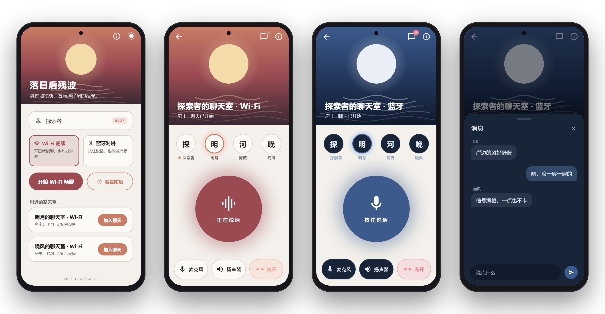

# 落日后残波（SunsetRipple）

[简体中文](README.md) | [English](README_EN.md)

一款近场语音对讲应用，支持最多 6 台设备通过局域网、Wi-Fi Direct 或蓝牙通话，无需注册账号或部署服务器。当前主要支持 Android。



## 主要功能

- **Wi-Fi 房**：支持同一局域网、手机热点和 Wi-Fi Direct，可同时自由交谈。
- **蓝牙房**：通过 BLE L2CAP CoC 连接，按住说话、松开收听。
- **房内消息**：支持文字聊天和撤回，消息仅保存在内存中，退房后清除。
- **通话控制**：支持静音、扬声器/听筒切换，以及手机/耳机麦克风切换。
- **连接恢复**：支持断线重连；Wi-Fi 房支持手动转让房主和房主失联后的自动选举。

## 平台支持

| 平台 | 当前状态 | 分发方式 |
| --- | --- | --- |
| Android 8.0+ | 可用；蓝牙房需 Android 10+ | APK，直接安装 |
| iOS 15+ | 音频与 BLE 已实现，尚未接入 Bonjour 搜房，暂不可完整使用 | 未签名 IPA，需自行重签 |
| HarmonyOS NEXT | 仅实现 UDP 发现，语音与消息传输尚未接通 | 源码工程，需自行构建和签名 |
| Windows / macOS / Linux | 不支持，缺少原生音频后端 | 无 |

详细能力与限制见 [平台支持说明](docs/platform-support.md)。

## 安装与使用

从 [Releases](https://github.com/Starlordzz/sunsetripple/releases) 下载 Android APK 并安装。

1. Wi-Fi 房使用同一局域网、手机热点或 Wi-Fi Direct；蓝牙房需开启蓝牙。
2. 在一台设备上创建房间，选择房型，并按提示授予麦克风、附近设备等权限。
3. 其他设备搜索附近房间并加入。
4. Wi-Fi 房可直接交谈；蓝牙房按住中央圆盘说话，松开后收听。

## 隐私与安全

语音和房内消息不经云端中转；手动检查更新时会访问 GitHub Releases。**加密模块默认未启用，默认会话不提供端到端加密保障。**

## 从源码构建

主工程使用 Flutter / Dart，Android 与 iOS 通过原生插件接入平台能力。HarmonyOS 为独立 ArkTS 工程。

开发环境：Flutter **3.29.0**（与 [CI](.github/workflows/flutter-ci.yml) 一致）、JDK 17 和 Android SDK。

```sh
# Bash / Git Bash：使用与锁文件一致的依赖源
export PUB_HOSTED_URL=https://pub.flutter-io.cn
flutter pub get --enforce-lockfile
flutter run
```

检查与打包（Release 打包前需配置 `android/key.properties` 签名文件）：

```sh
flutter analyze
flutter test
bash scripts/check-clock-injection.sh
flutter build apk --release
```

时间检查脚本需要 Bash 环境。APK 输出路径为 `build/app/outputs/flutter-apk/app-release.apk`。

iOS 与 HarmonyOS 的构建和签名步骤分别见 [iOS 指南](docs/ios-flutter-port.md) 和 [HarmonyOS 指南](docs/harmonyos-build.md)。

## 文档

- [文档首页](docs/wiki/Home.md)
- [架构总览](docs/wiki/架构总览.md)
- [构建与发布](docs/wiki/构建与发布.md)
- [故障排查](docs/wiki/故障排查.md)
- [更新日志](CHANGELOG.md)

## 许可证

[Apache License 2.0](LICENSE) · Copyright 2026 Starlordzz
