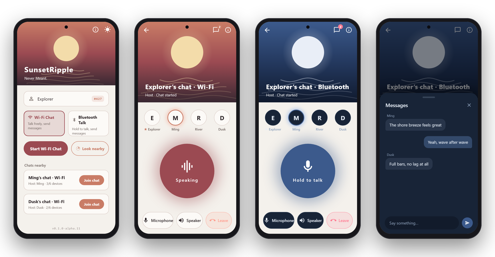
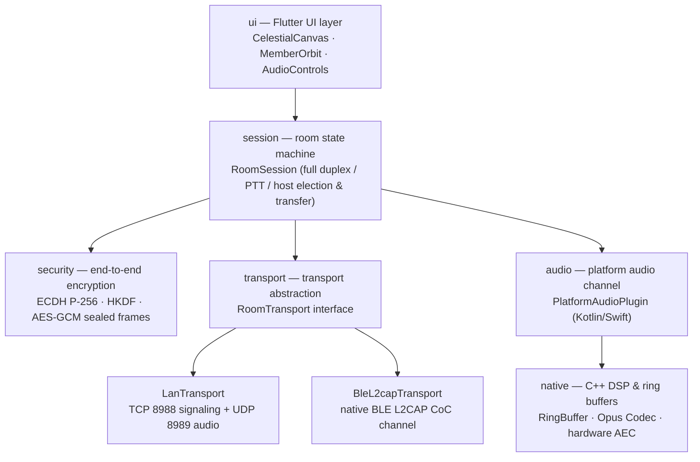

<p align="center">
  <a href="README.md">简体中文</a> | <a href="README_EN.md">English</a>
</p>

<br>

<p align="center">
  <br>
  
  <br>
  <br>
</p>

<h1 align="center">SunsetRipple</h1>

<p align="center"><sub>S U N S E T &nbsp;&nbsp; R I P P L E</sub></p>

<br>

<p align="center">
  The sun has gone; the ripple hasn't.
  <br>
  <sub><em>夕阳已远，涟漪未散，犹诉未尽之言。</em></sub>
</p>

<br>

<p align="center">
  <a href="https://github.com/Starlordzz/sunsetripple/releases"></a>
  
  
  
  
  
  <a href="LICENSE"></a>
</p>

<br>

<p align="center">
  <em>琵琶弦上说相思。当时明月在，曾照彩云归。</em><br>
  <sub>On pipa strings, an old longing still plays — the moon that once lit her way home.</sub>
</p>

<br>

---

<br>

**SunsetRipple is a decentralized near-field voice intercom app. No accounts, no cloud services — voice travels peer-to-peer between devices within local physical range only. It supports instant group sessions of up to 6 devices and leaves no trace when the session ends.**

<br>

<p align="center">
  
  <br>
  <sub>Home · Wi-Fi Room · Bluetooth Talk (moonlit) · In-room messages — the UI follows system language and day/night theme</sub>
</p>

<br>

> **Platform status** — the Flutter mainline (a unified Dart session core) covers both Android and iOS.
> iOS has fully converged on the unified Flutter host (`ios/Runner/`), sharing the Dart state machine and frame protocol; native audio and BLE plugins are in place.
> HarmonyOS NEXT is a standalone native ArkTS project (`harmonyos/`) that you build yourself with DevEco Studio — see the [HarmonyOS platform guide](docs/wiki/en/HarmonyOS-Platform-Guide.md).

| Platform | Stack | Artifact | Status |
| --- | --- | --- | --- |
| Android 8.0+ | Flutter + native Kotlin plugins | `.apk`, install directly | ✅ Fully functional |
| iOS 15+ | Flutter + native Swift plugins | `.ipa`, **unsigned**, must be re-signed to sideload | 🚧 Native audio & BLE ready; discovery pending Bonjour adaptation |
| HarmonyOS NEXT | Standalone native ArkTS | Source project zip | 🚧 Requires local DevEco build & signing |

<br>

## Features

<br>

- **Unified Flutter session core** — a single Dart session core, binary frame protocol, and a polished celestial UI built on Flutter, bridging the native audio HAL (hardware AEC/NS/AGC), BLE L2CAP channels, and Wi-Fi Direct near-field connections through platform channels. **The Android-side platform channels are fully implemented** (`PlatformAudioPlugin.kt` / `BleL2capPlugin.kt` / `WifiDirectPlugin.kt`).
- **Dynamic microphone routing** — switch in-room between the built-in microphone and an external/Bluetooth headset with one tap; when using the phone mic, the call SCO link is released automatically in favor of the high-quality A2DP media channel.
- **Router-free direct connections** — works over the same Wi-Fi, a personal hotspot, or **fully offline Wi-Fi Direct links**. Zero-config room discovery with automatic pruning of stale rooms (a room vanishes within 4 seconds of its host closing the app). Audio itself is unicast.<br>Note: since iOS 14, sending multicast/broadcast requires the `com.apple.developer.networking.multicast` entitlement (paid account + per-case Apple approval), so iOS discovery must use Bonjour instead — see the [iOS platform guide](docs/wiki/en/iOS-Platform-Guide.md).
- **Two room types** — Wi-Fi rooms (full duplex over LAN, hotspot, or Wi-Fi Direct offline link) and BLE L2CAP CoC push-to-talk (PTT) rooms, both up to 6 devices.
- **In-room text messages** — open the message panel next to the room type and exchange instant text of up to 480 bytes; memory-only storage, destroyed on leave, never written to disk, no server. Wi-Fi room messages run over the reliable TCP control plane relayed by the host, Bluetooth rooms reuse the BLE link; long-press to recall, with unread badges.
- **Zero voice infrastructure** — no router, no account, no server; voice only ever travels device-to-device, and the update check touches GitHub Releases only when you ask for it.
- **Seamless host transfer in Wi-Fi rooms** — hand over the host role manually, or let members elect a successor automatically from snapshots when the host disappears; the new host's UDP port is registered immediately so audio never drops.
- **Network-wide mute with speaking-state sync** — mute flags propagate to the whole room instantly, and the audio waveform animation dims in real time when a microphone goes off.
- **Automatic reconnection** — multi-round exponential backoff; after reconnecting, members restore their original identity and join order via tokens.
- **Continuous room-enter transition** — the real room UI expands from the actual tap position; home and room share the same sunset header and palette, with no separate overlay or second page push.
- **Day & night themes** — warm sunset gold by day, moon and sea at night (cold moonlight white + rose-pink leave button, contrast ratio > 7.5:1).
- **Call-grade audio** — `VOICE_COMMUNICATION` capture, hardware echo cancellation (AEC/NS/AGC), audio focus negotiation, a 50-cycle HAL fault-tolerance buffer, and Opus packet-loss concealment.
- **End-to-end session encryption** — built on ECDH P-256 key agreement, HKDF-SHA256 key derivation, and AES-256-GCM sealed frames (12-byte nonce + 16-byte tag) with a 65536-deep anti-replay window.
- **Sanitized diagnostics** — a built-in network & audio quality panel that generates sanitized reports with one tap for GitHub issues.

<br>

## Room Comparison

<br>

| | Wi-Fi Room (LAN / hotspot / direct) | Bluetooth BLE L2CAP Room |
| --- | --- | --- |
| Status | ✅ Available (recommended) | ✅ Available |
| Conversation | Full duplex (talk simultaneously) | Push-to-talk (PTT) |
| Topology | Star/mesh hybrid — TCP control + direct UDP audio | Star topology — dynamically assigned PSM, atomic frame forwarding |
| Signaling / audio | TCP 8988 / UDP 8989 | BLE L2CAP Connection-Oriented Channel (CoC) |
| Discovery | UDP 8990 broadcast + Wi-Fi Direct P2P probes | BLE manufacturer-specific advertising (Company ID 0xFFFF) |
| Audio bitrate | 24 kbps Opus | 16 kbps Opus |
| Max participants | 6 devices | 6 devices |
| Requirements | Same Wi-Fi router, personal hotspot, or router-free Wi-Fi Direct | Bluetooth 5.0+ (Android 10+ / iOS 15+ / HarmonyOS NEXT) |
| Host transfer | ✅ Manual handover + automatic failover | ❌ Not yet (session ends if the host leaves) |

<br>

> **Why BLE L2CAP CoC instead of classic Bluetooth RFCOMM?**
>
> L2CAP CoC has an iOS counterpart (`CBL2CAPChannel`), doesn't require MFi-certified hardware, and is natively supported on HarmonyOS NEXT and Android 10+ — making it the best foundation for one shared Bluetooth audio protocol across platforms.

<br>

## Quick Start

<br>

Grab the latest build from [Releases](https://github.com/Starlordzz/sunsetripple/releases):

- **Android** (8.0 / API 26+): download `SunsetRipple-*.apk` and install directly. About 45 MB, bundling the Flutter engine and the native Opus HAL.
- **iOS** (15.0+): download `SunsetRipple-flutter-*-unsigned.ipa`. This is an **unsigned** package on the unified Flutter host — re-sign it with your own Apple ID on a computer using [AltStore](https://altstore.io/) or [Sideloadly](https://sideloadly.io/) (free Apple ID signatures last 7 days and must be renewed).
- **HarmonyOS NEXT**: download `SunsetRipple-HarmonyOS-source-*.zip`, open it in DevEco Studio, then build and sign it yourself — see the [HarmonyOS platform guide](docs/wiki/en/HarmonyOS-Platform-Guide.md).

> **Why isn't there a "download & install" package for iOS and HarmonyOS?**
> Apple requires signed installers, and signing requires an Apple Developer Program
> certificate ($99/year); ad-hoc distribution also demands pre-registered device UDIDs.
> This project has no paid account, so only unsigned packages can be provided.
> Retail HarmonyOS NEXT devices only accept AGC debug certificates (bound to device
> UDIDs, capped at 100 devices) or store-signed HAPs — there is no unsigned sideload
> path, and DevEco's CLI tools require a Huawei developer account login, so they
> cannot run on public CI.

<br>

### How to Use

1. On one device, tap **Start a chat** (choose a Wi-Fi room or a Bluetooth room) and grant microphone + nearby-devices permissions;
2. On other devices, tap **Look nearby** and join a room straight from the list;
3. Wi-Fi rooms start talking immediately (full duplex, multiple speakers at once); in Bluetooth rooms hold the central disc to talk and release to listen;
4. Use the bottom bar to toggle mute, speaker/earpiece, and phone/headset microphone; the host can hand over the host role from the top-right button.

<br>

## Architecture

<br>



<br>

### Core Design Principles

- **One unified 6-byte binary frame header** — `[type 1B][sender 1B][seq 2B][length 2B]`, payload capped at 512 bytes, standardizing audio, join, roster, PTT state, heartbeat, leave, and host-transfer frames.
- **Network and audio decoupled** — the session layer and audio capture/playback run fully independently; audio pipelines transition smoothly across reconnects and host transfers, avoiding pops or hardware rebuild delays.
- **Hardware-level audio optimization** — `VOICE_COMMUNICATION` capture mode taps the underlying hardware echo cancellation (AEC), noise suppression (NS), and auto gain control (AGC), with a 50-cycle HAL fault-tolerance mechanism.
- **Zero external server dependencies** — no cloud backend at all; devices talk over raw sockets and private data never leaves the local physical circle.

<br>

## Build & Run from Source

<br>

### Requirements
- **Flutter SDK**: `>= 3.24.0`
- **Dart SDK**: `>= 3.5.0`
- **Java**: `JDK 17`
- **Android SDK**: `API 34+` (supports Android 8.0 through Android 15)

<br>

### Common Commands

```powershell
# 1. Fetch packages
flutter pub get

# 2. Run the full unit test suite (128/128 cases)
flutter test

# 3. Run static analysis
flutter analyze

# 4. Debug on a connected device/emulator
flutter run

# 5. Build a release APK
flutter build apk --release
```

The release APK is written to `build/app/outputs/flutter-apk/app-release.apk`.

<br>

## Project Layout

<br>

```text
SunsetRipple/
├── android/               # Android native host: PlatformAudioPlugin, BleL2capPlugin, WifiDirectPlugin
├── ios/                   # iOS Flutter host: PlatformAudioPlugin, BleL2capPlugin
├── native/                # Cross-platform C++ core (lock-free RingBuffer, DSP mixing)
├── lib/
│   ├── core/
│   │   ├── audio/         # Audio abstraction interface (AudioIo)
│   │   ├── diagnostics/   # App logging (AppLog) & sanitized reports (DiagnosticReport)
│   │   ├── ffi/           # Native C++ dynamic library bridge (NativeCoreFfi)
│   │   ├── platform/      # Platform channel implementation (PlatformAudioChannel)
│   │   ├── protocol/      # Binary frame codec (Frame, Payload)
│   │   ├── security/      # Session crypto & secure handshake (SessionCipher, SecureFrameCodec)
│   │   ├── session/       # Room state machine, members, host election (RoomSession, HostTransfer)
│   │   ├── transport/     # Network transport (LanTransport, BleL2capTransport, LanRoomDiscovery)
│   │   └── update/        # Semver parsing & GitHub Releases check (UpdateService)
│   ├── l10n/              # Typed bilingual localization (AppStrings)
│   ├── ui/
│   │   ├── pages/         # Pages (HomePage, RoomPage, AboutPage, DiagnosticsSheet)
│   │   ├── theme/         # Day/night celestial palette (AppTheme)
│   │   ├── transitions/   # Continuous reveal routing (RoomEntryRevealRoute)
│   │   └── widgets/       # Core widgets (CelestialCanvas, MemberOrbit, AudioControlsBar)
│   └── main.dart          # App entry point
├── test/                  # 58 pure-Dart unit suites & widget tests
└── pubspec.yaml           # Project configuration & dependencies
```

<br>

## Documentation

<br>

Full technical docs live in the **[Wiki](docs/wiki/en/Home.md)**（**[简体中文](docs/wiki/Home.md)** — bilingual, kept in sync）:

- [Core-Shell unified multi-platform architecture](docs/wiki/en/Core-Shell-Architecture.md)
- [Architecture overview](docs/wiki/en/Architecture-Overview.md)
- [Protocol specification & binary frame format](docs/wiki/en/Protocol-Specification.md)
- [Room modes & topology comparison](docs/wiki/en/Room-Modes.md)
- [Audio pipeline & hardware AEC](docs/wiki/en/Audio-Pipeline.md)
- [Host transfer & failure recovery](docs/wiki/en/Host-Transfer.md)
- [Build & release guide](docs/wiki/en/Build-and-Release.md)
- [Troubleshooting & FAQ](docs/wiki/en/Troubleshooting.md)

For the full change history, see **[CHANGELOG.md](CHANGELOG.md)**.

<br>

## License

<br>

[Apache License 2.0](LICENSE) · Copyright 2026 Starlordzz

<br>
<br>

---

<br>

<p align="center"><sub>。<br><em>For the one who watched the sunset with me.</em><br><em>Never Meant</em></sub></p>

<br>
