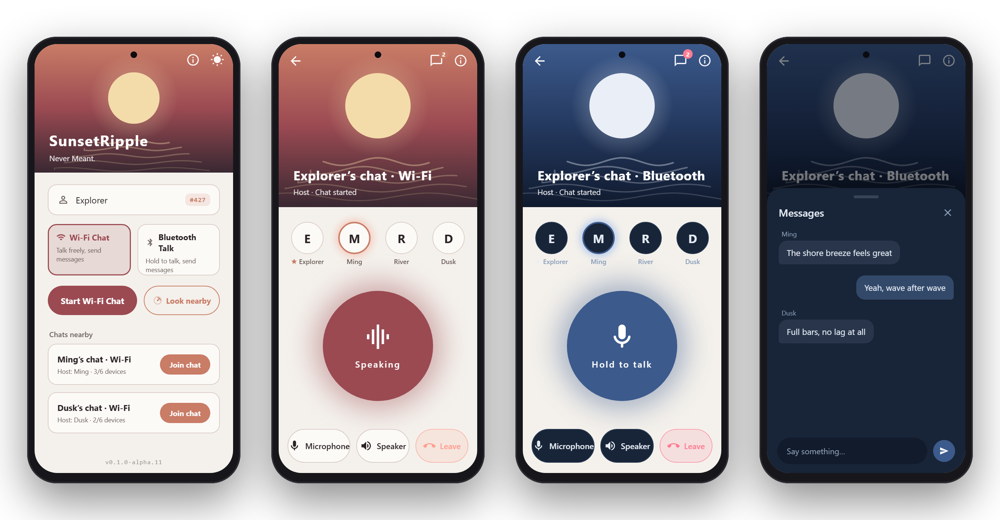

# SunsetRipple

[简体中文](README.md) | [English](README_EN.md)

A local voice intercom app for up to 6 devices over a LAN, Wi-Fi Direct, or Bluetooth. No account or server setup is required. Android is currently the primary supported platform.



## Features

- **Wi-Fi rooms**: full-duplex conversations over a shared LAN, personal hotspot, or Wi-Fi Direct.
- **Bluetooth rooms**: push-to-talk over BLE L2CAP CoC. Hold to speak, release to listen.
- **In-room messages**: text chat with message recall. Messages stay in memory and are cleared when you leave.
- **Audio controls**: mute, switch between speaker and earpiece, and select the phone or headset microphone.
- **Connection recovery**: automatic reconnection, plus manual host transfer and automatic host election in Wi-Fi rooms.

## Platform Support

| Platform | Current status | Distribution |
| --- | --- | --- |
| Android 8.0+ | Available; Bluetooth rooms require Android 10+ | APK, install directly |
| iOS 15+ | Audio and BLE implemented; Bonjour room discovery is not integrated, so the app is not fully usable | Unsigned IPA, requires re-signing |
| HarmonyOS NEXT | UDP discovery only; voice and message transport is not connected | Source project, requires local build and signing |
| Windows / macOS / Linux | Unsupported; native audio backends are missing | None |

See [Platform Support](docs/platform-support.md) (Chinese) for detailed capabilities and limitations.

## Install and Use

Download and install the Android APK from [Releases](https://github.com/Starlordzz/sunsetripple/releases).

1. For Wi-Fi rooms, use a shared LAN, personal hotspot, or Wi-Fi Direct. For Bluetooth rooms, enable Bluetooth.
2. Create a room on one device, select the room type, and grant the requested microphone and nearby-device permissions.
3. On the other devices, search for nearby rooms and join.
4. Speak freely in Wi-Fi rooms. In Bluetooth rooms, hold the central disc to speak and release it to listen.

## Privacy and Security

Voice and in-room messages are not relayed through a cloud server. Manual update checks access GitHub Releases. **Session encryption is disabled by default; default sessions are not end-to-end encrypted.**

## Build from Source

The main app uses Flutter / Dart with native plugins for Android and iOS platform capabilities. HarmonyOS is a separate ArkTS project.

Development requirements: Flutter **3.29.0** (matching [CI](.github/workflows/flutter-ci.yml)), JDK 17, and the Android SDK.

```sh
# Bash / Git Bash: use the package host recorded in the lockfile
export PUB_HOSTED_URL=https://pub.flutter-io.cn
flutter pub get --enforce-lockfile
flutter run
```

Checks and packaging (release APK builds require signing credentials in `android/key.properties`):

```sh
flutter analyze
flutter test
bash scripts/check-clock-injection.sh
flutter build apk --release
```

The clock-injection check requires Bash. The APK is written to `build/app/outputs/flutter-apk/app-release.apk`.

For iOS and HarmonyOS build and signing instructions, see the [iOS guide](docs/wiki/en/iOS-Platform-Guide.md) and [HarmonyOS guide](docs/wiki/en/HarmonyOS-Platform-Guide.md).

## Documentation

- [Documentation home](docs/wiki/en/Home.md)
- [Architecture overview](docs/wiki/en/Architecture-Overview.md)
- [Build and release](docs/wiki/en/Build-and-Release.md)
- [Troubleshooting](docs/wiki/en/Troubleshooting.md)
- [Changelog](CHANGELOG.md)

## License

[Apache License 2.0](LICENSE) · Copyright 2026 Starlordzz
