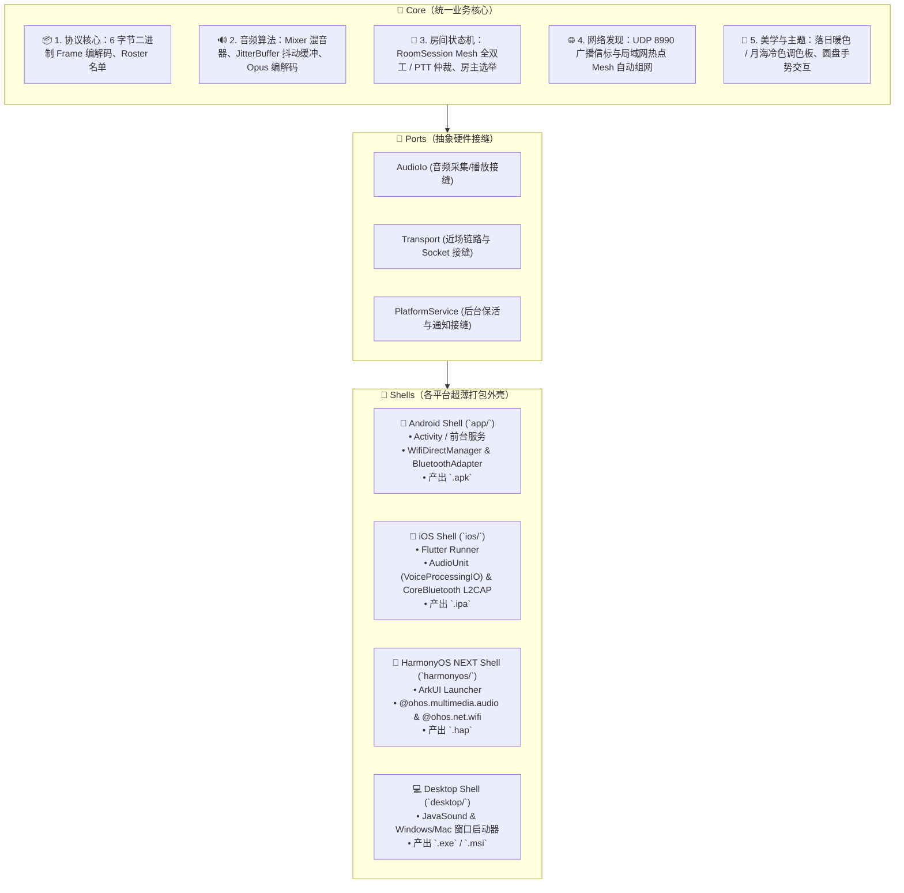

# Core-Shell（核心-外壳）统一多端架构规范

SunsetRipple（落日后残波）采用业界成熟的 **Core-Shell（核心-外壳）** 与 **Ports & Adapters（端口与适配器）** 架构。

---

## 1. 架构核心思想

像 **FlClash / Clash Verge / Spotify** 等优秀的跨平台应用一样：
> **“核心引擎与界面业务沉淀在 Core，各操作系统仅作为一层极薄的 Shell（启动与硬件外壳）。”**

---

## 2. 目录规范与职责划分

| 层次 / 模块 | 目录路径 | 职责与技术栈 |
| :--- | :--- | :--- |
| **Core 统一核心** | [`app/src/main/kotlin/host/msknet/sunsetripple/`](file:///d:/LEARNING/vibeproject/SunsetRipple/app/src/main/kotlin/host/msknet/sunsetripple/) | • `protocol/`：统一二进制帧 • `audio/`：混音、抖动缓冲、`AudioIo` 接口 • `transport/lan/`：UDP 8990 跨端房间发现 • `session/`：房间会话生命周期 • `ui/`：落日调色板与工具栏决策模型 |
| **Android Shell** | [`app/`](file:///d:/LEARNING/vibeproject/SunsetRipple/app/) | 承载 AndroidManifest、前台保活服务、`WifiP2pManager` 与 `BluetoothServerSocket` |
| **HarmonyOS Shell** | [`harmonyos/`](file:///d:/LEARNING/vibeproject/SunsetRipple/harmonyos/) | 承载 DevEco Studio 工程、ArkTS 入口、`AudioCapturer`/`AudioRenderer`、ArkUI 界面 |
| **iOS Shell** | [`ios/`](file:///d:/LEARNING/vibeproject/SunsetRipple/ios/) | 承载 Xcode 工程、Flutter Runner、`PlatformAudioPlugin` (VoiceProcessingIO)、`BleL2capPlugin` |

---

## 3. 跨端行为一致性保证

1. **协议字节一致**：
   所有平台生成的音频与控制帧严格遵循 `[Type 1B][SenderId 1B][Seq 2B][Length 2B][Payload ≤512B]` 规范，大小端保持网络字节序（Big-Endian）。
2. **音频参数一致**：
   全平台统一采样率 **16,000 Hz**，单声道 16-bit PCM，每帧采样点 **320 Samples (20ms)**。
3. **视觉调色板一致**：
   - **日间落日**：主强调 `#9B4A52`（暖珊瑚），离开按钮 `#FF9E90`，背景 `#F4F1EC`。
   - **夜间月海**：主强调 `#3F76AC`（海蓝），离开按钮 `#FF7B92`（冷调玫瑰粉），背景 `#0E1626`。

