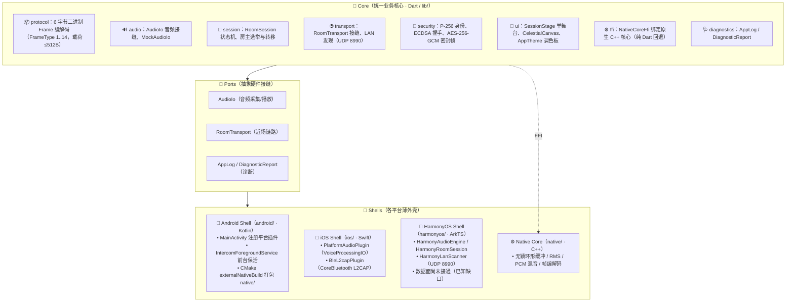

> 🌐 [English](en/Core-Shell-Architecture.md) | 简体中文
# Core-Shell（核心-外壳）统一多端架构规范

SunsetRipple（落日后残波）采用 **Core-Shell（核心-外壳）** 与 **Ports & Adapters（端口与适配器）** 架构。

> 本文描述的是当前的 Flutter/Dart 实现：**Core 是 `lib/` 下的 Dart 代码**，各平台外壳只承担启动、权限、原生音频与近场链路等硬件职责；共享的 C++ 核心放在 `native/`，经 FFI 暴露给 Dart。

---

## 1. 架构核心思想

> **“核心引擎与业务沉淀在 Dart Core，各操作系统仅作为一层极薄的 Shell（启动与硬件外壳）。”**

```mermaid
flowchart TD
    subgraph CORE ["💎 Core（统一业务核心 · Dart / lib/）"]
        direction TB
        PROTO["📦 protocol：6 字节二进制 Frame 编解码（FrameType 1..14，载荷 ≤512B）"]
        AUDIO["🔊 audio：AudioIo 音频接缝、MockAudioIo"]
        SESSION_SM["🧠 session：RoomSession 状态机、房主选举与转移"]
        TRANS["🌐 transport：RoomTransport 接缝、LAN 发现（UDP 8990）"]
        SEC["🔐 security：P-256 身份、ECDSA 握手、AES-256-GCM 密封帧"]
        UI["🎨 ui：SessionStage 单舞台、CelestialCanvas、AppTheme 调色板"]
        FFI["⚙️ ffi：NativeCoreFfi 绑定原生 C++ 核心（纯 Dart 回退）"]
        DIAG["🩺 diagnostics：AppLog / DiagnosticReport"]
    end

    subgraph PORTS ["🔌 Ports（抽象硬件接缝）"]
        P_AUDIO["AudioIo（音频采集/播放）"]
        P_TRANS["RoomTransport（近场链路）"]
        P_DIAG["AppLog / DiagnosticReport（诊断）"]
    end

    subgraph SHELLS ["🐚 Shells（各平台薄外壳）"]
        S_AND["📱 Android Shell（android/ · Kotlin）<br/>• MainActivity 注册平台插件<br/>• IntercomForegroundService 前台保活<br/>• CMake externalNativeBuild 打包 native/"]
        S_IOS["🍏 iOS Shell（ios/ · Swift）<br/>• PlatformAudioPlugin（VoiceProcessingIO）<br/>• BleL2capPlugin（CoreBluetooth L2CAP）"]
        S_HARMONY["🔴 HarmonyOS Shell（harmonyos/ · ArkTS）<br/>• HarmonyAudioEngine / HarmonyRoomSession<br/>• HarmonyLanScanner（UDP 8990）<br/>• 数据面尚未接通（已知缺口）"]
        S_NATIVE["⚙️ Native Core（native/ · C++）<br/>• 无锁环形缓冲 / RMS / PCM 混音 / 帧编解码"]
    end

    CORE --> PORTS
    PORTS --> SHELLS
    CORE -. FFI .-> S_NATIVE
```

---

## 2. 目录规范与职责划分

| 层次 / 模块 | 目录路径 | 职责与技术栈 |
| :--- | :--- | :--- |
| **Core 统一核心** | `lib/core/` | • `protocol/`：6 字节二进制帧、`FrameType` 1..14 • `audio/`：`AudioIo` 接缝与 `MockAudioIo` • `transport/`：`RoomTransport` 接缝、`LanTransport`、`BleL2capTransport`、`LanRoomDiscovery`、`WifiDirectManager` • `session/`：`RoomSession` 状态机、`host_transfer` 房主选举与交接 • `security/`：P-256 身份、ECDSA 握手、AES-256-GCM 密封帧 • `platform/`：`PlatformAudioChannel`（`AudioIo` 的平台通道实现） • `ffi/`：`NativeCoreFfi` / `NativeRingBuffer` • `diagnostics/`：`AppLog`、`DiagnosticReport` • `update/`：`UpdateService` |
| **UI 界面核心** | `lib/ui/` | • `pages/`：`SessionStage` 单舞台、首页/房间/诊断等 • `widgets/`：`CelestialCanvas`、成员轨道、PTT 盘等 • `theme/app_theme.dart`：日间落日 / 夜间月海调色板 • `transitions/`：进房/退房编排 |
| **Android Shell** | `android/` | Kotlin 薄壳：`MainActivity`、`PlatformAudioPlugin`、`BleL2capPlugin`、`WifiDirectPlugin`、`IntercomForegroundService`；`externalNativeBuild` 编译 `native/` |
| **iOS Shell** | `ios/` | Swift 薄壳：`PlatformAudioPlugin`（VoiceProcessingIO）与 `BleL2capPlugin`（CoreBluetooth L2CAP） |
| **HarmonyOS Shell** | `harmonyos/` | ArkTS 工程：`HarmonyAudioEngine`、`HarmonyRoomSession`、`RoomPage`/`Index`、`EntryAbility`、`HarmonyLanScanner`；部分线路尚未接通 |
| **Native C++ Core** | `native/` | 共享 C++：无锁 SPSC 环形缓冲、RMS、PCM 混音、协议帧编解码；由 Android/iOS 打包，经 `lib/core/ffi` 暴露给 Dart |

---

## 3. 跨端行为一致性保证

1. **协议字节一致**：
   所有平台生成的音频与控制帧严格遵循 `[Type 1B][SenderId 1B][Seq 2B][Length 2B][Payload ≤512B]` 规范，大小端保持网络字节序（Big-Endian）。`FrameType` 取值为 1..14。
2. **音频参数一致**：
   全平台统一采样率 **16,000 Hz**，单声道 16-bit PCM，每帧采样点 **320 Samples (20ms)**。
3. **视觉调色板一致**（以 `lib/ui/theme/app_theme.dart` 为准）：
   - **日间落日**：主强调 `#9B4A52`（sunsetBurgundy），副色 `#C97C66`（sunsetCoral），背景 `#F4F1EC`，离开按钮 `#FF9E90`。
   - **夜间月海**：主强调 `#3C5A8C`（nightSkyBlue），背景 `#0E1626`，离开按钮 `#FF7B92`（深调玫瑰粉）。
4. **单元测试**：`flutter test` 当前 **144/144** 通过。

---

## 4. 已知缺口

- **HarmonyOS 数据面未接通**：`harmonyos/entry/src/main/ets/plugin/PlatformAudioPlugin.ets` 目前是**空文件**，音频/链路数据面尚未接驳；`HarmonyRoomSession` 的本地 PCM 回调仍未打包成帧发出。`HarmonyLanScanner` 已按 Dart `LanRoomDiscovery` 的 JSON 广播协议对齐（UDP 8990、`SUNSET_RIPPLE_DISCOVERY_V1`），可用于房间发现。
- **C++ 原生核心为可选加速**：`NativeCoreFfi.initialize()` 在原生库不可用时静默回退到纯 Dart 实现，两端语义保持一致（`native/` 未接入构建时不会报错，只是失去加速）。
