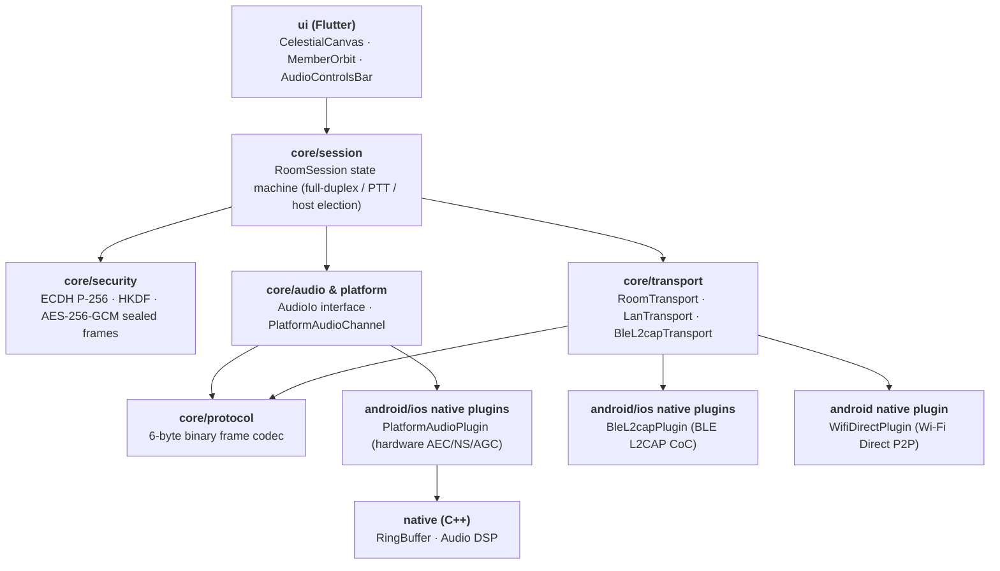

> 🌐 English | [简体中文](../架构总览.md)

# Architecture Overview

The source code follows a **unified Flutter cross-platform architecture**: the business core lives in `lib/core`, UI components in `lib/ui`, and the native underpinnings in `android/`, `ios/`, and `native/`.

## Layering



The flow is strictly one-directional: `ui` drives `session`; `session` is programmed against the `transport` and `audio` interfaces; transport and audio bridge platform-native capabilities through Platform Channels.

## Package Responsibilities

| Directory | Responsibility |
| --- | --- |
| `lib/core/protocol` | Binary frame definitions and per-type payload codecs |
| `lib/core/security` | Device identity, ECDH negotiation, HKDF derivation, and AES-256-GCM sealed-frame encryption |
| `lib/core/session` | Room state machine, member roster, PTT talk tokens, host election and handover snapshots |
| `lib/core/transport` | Transport interfaces, LanTransport (TCP/UDP), BleL2capTransport (BLE L2CAP), LanRoomDiscovery (UDP 8990 broadcast), WifiDirectManager (Wi-Fi P2P) |
| `lib/core/audio` | Audio input/output abstraction and platform-channel bridging |
| `lib/core/diagnostics` | Structured logging (AppLog) and sanitized diagnostic report generation (DiagnosticReport) |
| `lib/ui` | Flutter screens, sunset/moon-night celestial canvas, member orbit animations, the audio action bar, and diagnostics dialogs |
| `android/` | Android host, foreground keep-alive service, PlatformAudioPlugin, BleL2capPlugin, and WifiDirectPlugin |
| `ios/` | iOS Flutter host, PlatformAudioPlugin (AudioUnit VoiceProcessingIO), and BleL2capPlugin |
| `native/` | Cross-platform C++ core (lock-free RingBuffer, DSP mixing algorithms) |

## Core Abstractions

### Frame (`protocol`)

- `Frame` / `FrameType` — a fixed 6-byte header plus a payload of at most 512 bytes; see the [Protocol Specification](Protocol-Specification.md) for details.
- `FrameStreamReader` — a length-prefix framer for TCP / RFCOMM; blocking; returns `null` on EOF or when the length is out of range.
- `FrameReading.readFrameSafely()` — swallows `IllegalArgumentException` into `null`; the semantics are "protocol error, drop this peer", not "crash the whole room".

### Transport (`transport`)

The `Transport` interface collapses the three physical link types into one set of capabilities: send, broadcast, listen, close, and the `isHost` flag. The session layer programs only against it.

| Implementation | Description |
| --- | --- |
| `WifiHostTransport` / `WifiClientTransport` | TCP signaling server + UDP audio socket; the client rebuilds TCP, UDP, and its threads on every reconnect |
| `BluetoothHostTransport` / `BluetoothClientTransport` | Star; accept loop + per-client read thread + per-client write thread |
| `NearbyRoomTransport` | Mesh; a client initiates connections only to peers with `member.id > selfId` to avoid duplicate links |

Helper components:

- `WifiDirectManager` — wraps `WifiP2pManager`, converting the callback-style API into `StateFlow` (`peers`, `connection`, `thisDevice`, `lastError`, `channelLost`).
- `BluetoothRoomManager` — adapters for discovery / paired devices / discoverable intent; the discoverable window is 300 seconds.
- `BluetoothSendQueue` — a bounded audio queue with capacity 3; on overflow the oldest audio frame is dropped, while signaling frames are never dropped.
- `ReconnectPolicy` — backoff sequence `[1s, 2s, 4s]`; when exhausted it returns `null`, meaning give up.

### Session (`session`)

Two sessions correspond to the two topologies; each implements its own transport-listening interface, and both expose `StateFlow<RoomUiState>`:

| Session | Topology | Used for |
| --- | --- | --- |
| `RoomSession` | Mesh full-duplex | Wi-Fi Room, Nearby Room |
| `BluetoothRoomSession` | Star PTT, mixed on the host | Bluetooth Room (PTT) |

`RoomSession` maintains a separate `JitterBuffer` + `OpusCodec` + `SpeakingDetector` set for every remote peer. Its lifecycle is one-shot: `start` may be called only once, and after `shutdown` it cannot be reused; 10 consecutive send failures proactively close the session.

`BluetoothRoomSession` instead lets the host do the mixing: every downstream member gets its own encoder and its own 16-bit sequence counter, and the received mix has the receiver's own voice subtracted out.

### Audio (`audio`)

`AudioEngine` is the only class that touches `AudioRecord` / `AudioTrack`; internally it is isolated behind the `AudioIo` interface for testability. Everything else is pure computation: `OpusCodec`, `JitterBuffer`, `Mixer`, `MicGate`, `SpeakingDetector`, `BluetoothMixPlanner`. Parameters and the full chain are covered in the [Audio Pipeline](Audio-Pipeline.md).

### UI (`ui`)

Navigation is just an enum plus a `mutableStateOf` — no Navigation component:

```kotlin
enum class Screen { HOME, SCAN, BLUETOOTH_SCAN, NEARBY_SCAN, ROOM, LOOPBACK }
```

Screen files: `HomeScreen`, `ScanScreen`, `BluetoothScanScreen`, `NearbyScanScreen`, `RoomScreen`, `LoopbackScreen`. Branding and motion live in `SunsetRippleTheme`, `BrandElements`, `SunsetControls`, `SunsetMotion`, `RoomToolbarModel`. Day/night theming lives in `ThemeMode`, `ThemeModeStore`, `ThemeModeToggle`.

`RoomScreen` decides whether to render the PTT core or the full-duplex core based on whether `onPttChanged` is `null` — only the Bluetooth Room (PTT) passes a non-null value.

**Pure decision objects** are the key design of this layer. The following objects have zero Android dependencies and can therefore be tested directly on the JVM:

| Object | What it decides |
| --- | --- |
| `RoomFlow` | When joining the room is allowed, group-owner address timeout, and when a room counts as "dead" |
| `BluetoothRoomFlow` / `NearbyRoomFlow` | The create/join/cleanup path for each room type |
| `RoomPermissions` / `BluetoothPermissions` / `NearbyPermissions` | Permission lists graded by SDK version and role, plus the Chinese-language denial copy |
| `HostTransferFlow` | After a transfer plan arrives, whether this device should become host, go connect to the new host, or ignore it |
| `HomeRoomAvailability` | Which room types the home page shows (currently Wi-Fi + Bluetooth) |
| `ThemeModeResolver` | How the three modes (follow system / force light / force dark) resolve to the actual palette, plus mode cycling and the mapping to and from the persisted value |

### Service (`service`)

`CallForegroundService` is a `microphone`-type foreground service with notification channel `room_call` (low importance), notification ID `1001`, and category `CATEGORY_CALL`. It holds an uncounted, untimed `WifiLock` (low-latency mode on Android Q+) and a `PARTIAL_WAKE_LOCK`, released in `onDestroy`. When the task is removed, it leaves the room automatically.

The service itself **holds no session reference**; it controls the call through the `CallControlBridge` / `ActiveCallControls` in-process bridge instead, avoiding mutual references between service and session that would leak.

## State and Concurrency

- UI state flows uniformly through `StateFlow`, collected lifecycle-aware via `lifecycle-runtime-compose`.
- The transport layer uses **raw threads** (accept loop, read threads, write threads), not coroutines — because the underlying socket / stream APIs are blocking.
- The session layer uses coroutines to schedule the audio tick and state updates.
- The shutdown path is guarded to be idempotent: when `leave()` and `onDisconnected` race, resources are released exactly once — a scenario the tests deliberately cover.

## Notable Trade-offs

- **The host does not trust client-reported identity** — when the Bluetooth host receives a frame, it rewrites the frame header with the member ID it assigned itself; a client forging `senderId` accomplishes nothing.
- **The roster is personalized unicast** — every member receives a different `yourId`, so it cannot be broadcast.
- **Audio is not relayed through the host** (Wi-Fi / Nearby) — the group owner is just an ordinary participant, avoiding it becoming a bandwidth bottleneck and a single point of latency.
- **Bluetooth must be relayed through the host** — RFCOMM is a star of point-to-point links; clients physically cannot connect to each other directly.
- **Opus is implemented in pure JVM** — some CPU is traded away so the build does not depend on the NDK and the artifacts contain no `.so`.

## Things That Deliberately Do Not Exist

- No `androidTest` instrumented-test source set, no Robolectric.
- No `gradle/libs.versions.toml` version catalog; version numbers are inlined in the build scripts.
- No `strings.xml` / `colors.xml`, no multi-language resources; `res/values-night` holds only the window theme, no copy text.
- One palette for day and one for night (`SunsetDayPalette` / `SunsetNightPalette`), provided through `LocalSunsetPalette`, each mapped onto Material 3's `lightColorScheme` / `darkColorScheme`.

## Room Text Chat

A **pure in-memory, current-room-lifetime-only, zero-server** design; the Wi-Fi Room and the Bluetooth Room (PTT) share the same Dart session model and UI drawer panel.

### 1. Channel Isolation and Routing

- **Wi-Fi Room**: text messages are encoded by `ChatMessagePayload` into `FrameType.chat (0x0c)` and strictly routed onto the TCP 8988 control channel, where the host relays them to the other clients; leaking into the UDP 8989 audio port is **strictly forbidden**, preserving top scheduling priority for voice.
- **Bluetooth Room (PTT)**: reuses the existing BLE L2CAP logical channel; the Dart layer pushes to `sendL2capData` and the Android native layer distributes it as an exclusive broadcast.
- **Security envelope**: production defaults to plaintext for compatibility; when `secureCodec` is configured on the session, `sendFrame` automatically seals frames as `FrameType.sealed (0x0b)`.

### 2. Platform Capability Status and Known Gaps (Platform Matrix)

| Platform | Wi-Fi text chat | Bluetooth (BLE L2CAP) text chat | Status and known blocking gaps |
| :--- | :--- | :--- | :--- |
| **Android** | ✅ Fully supported | ✅ Fully supported | Wi-Fi Direct P2P group formation and Client are both verified; `BleL2capPlugin.kt` provides a 1024B native buffer and host multi-cast. |
| **iOS** | ⚠️ LAN supported | ❌ Blocking gap | Only LAN TCP chat over the same Wi-Fi/hotspot; `BleL2capPlugin.swift` currently **lacks stream fragmentation reassembly and host broadcast relay**. |
| **HarmonyOS** | ❌ Data plane not connected | ❌ Data plane not connected | `harmonyos/` only has basic UDP discovery (`LanRoomDiscovery.ets`); the room data channel is not yet connected. |

## Related Pages

- [Protocol Specification](Protocol-Specification.md) · [Audio Pipeline](Audio-Pipeline.md) · [Host Transfer](Host-Transfer.md) · [Room Modes](Room-Modes.md)
