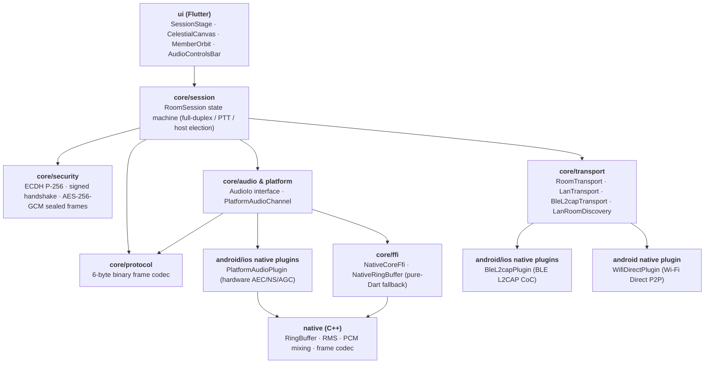

> 🌐 English | [简体中文](../架构总览.md)

# Architecture Overview

The source code follows a **unified Flutter cross-platform architecture**: the business
core lives in `lib/core`, UI components in `lib/ui`, the platform-native plugins in
`android/` and `ios/`, the cross-platform C++ core in `native/`, and the HarmonyOS host
in `harmonyos/`.

## Layering

```mermaid
flowchart TD
    UI["<b>ui (Flutter)</b><br/>SessionStage · CelestialCanvas · MemberOrbit · AudioControlsBar"]
    SESSION["<b>core/session</b><br/>RoomSession state machine (full-duplex / PTT / host election)"]
    CRYPTO["<b>core/security</b><br/>ECDH P-256 · signed handshake · AES-256-GCM sealed frames"]
    AUDIO["<b>core/audio & platform</b><br/>AudioIo interface · PlatformAudioChannel"]
    TRANS["<b>core/transport</b><br/>RoomTransport · LanTransport · BleL2capTransport · LanRoomDiscovery"]
    PROTO["<b>core/protocol</b><br/>6-byte binary frame codec"]
    FFI["<b>core/ffi</b><br/>NativeCoreFfi · NativeRingBuffer (pure-Dart fallback)"]
    NATIVE_AUDIO["<b>android/ios native plugins</b><br/>PlatformAudioPlugin (hardware AEC/NS/AGC)"]
    NATIVE_BLE["<b>android/ios native plugins</b><br/>BleL2capPlugin (BLE L2CAP CoC)"]
    NATIVE_WIFI["<b>android native plugin</b><br/>WifiDirectPlugin (Wi-Fi Direct P2P)"]
    NATIVE_DSP["<b>native (C++)</b><br/>RingBuffer · RMS · PCM mixing · frame codec"]

    UI --> SESSION
    SESSION --> CRYPTO
    SESSION --> AUDIO
    SESSION --> TRANS
    SESSION --> PROTO
    AUDIO --> NATIVE_AUDIO
    TRANS --> NATIVE_BLE
    TRANS --> NATIVE_WIFI
    AUDIO --> PROTO
    AUDIO --> FFI
    NATIVE_AUDIO --> NATIVE_DSP
    FFI --> NATIVE_DSP
```

The flow is one-directional: `ui` drives `session`; `session` is programmed against the
`transport` and `audio` interfaces; transport and audio bridge platform-native
capabilities through Platform Channels. The `native/` C++ is both statically linked into
the Android/iOS audio plugins and exposed directly to Dart through `core/ffi`.

## Package Responsibilities

| Directory | Responsibility |
| --- | --- |
| `lib/core/protocol` | Binary frame definitions and per-type payload codecs |
| `lib/core/security` | Device identity (P-256), ECDSA signed handshake, AES-256-GCM sealed frames |
| `lib/core/session` | Room state machine, member roster, PTT talk state, host election and handover snapshots |
| `lib/core/transport` | `RoomTransport` interface, `LanTransport` (TCP/UDP), `BleL2capTransport` (BLE L2CAP), `LanRoomDiscovery` (UDP 8990 broadcast), `WifiDirectManager` (Wi-Fi P2P) |
| `lib/core/audio` | Audio input/output abstraction and in-memory test impl (`AudioIo` / `MockAudioIo`) |
| `lib/core/platform` | Platform-channel implementation (`PlatformAudioChannel`) |
| `lib/core/ffi` | Native C++ dynamic-library bridge (`NativeCoreFfi` / `NativeRingBuffer`), with a pure-Dart fallback |
| `lib/core/diagnostics` | Structured logging (`AppLog`) and sanitized diagnostic reports (`DiagnosticReport`) |
| `lib/core/update` | Semantic version parsing and update checks (`UpdateService`) |
| `lib/ui` | Single stage (`SessionStage`), celestial canvas, member orbit, audio controls, chat drawer and diagnostics sheet |
| `android/` | Android host, foreground keep-alive service, `PlatformAudioPlugin`, `BleL2capPlugin`, and `WifiDirectPlugin` |
| `ios/` | iOS Flutter host, `PlatformAudioPlugin` (AudioUnit VoiceProcessingIO), and `BleL2capPlugin` |
| `harmonyos/` | HarmonyOS host; currently UDP room discovery only (`HarmonyLanScanner`), data plane not connected |
| `native/` | Cross-platform C++ core (lock-free ring buffer, RMS, PCM mixing, frame codec) |

## Core Abstractions

### Frame (`protocol`)

- `Frame` / `FrameType` — a fixed 6-byte header plus a payload of at most 512 bytes; see the [Protocol Specification](Protocol-Specification.md).
- `_FrameAccumulator` — the length-prefix framer inside `LanTransport`. Half-frames that
  span callbacks are held in a `NativeRingBuffer` (C++ lock-free ring buffer); the native
  library is optional and there is a pure-Dart fallback.
- `Frame.decode` — returns `null` for malformed or unknown frames; the semantics are
  "drop this frame", not "crash the whole room".

### Transport (`transport`)

The `RoomTransport` interface collapses the physical links into one set of capabilities:
send, broadcast, receive, disconnect notification, `isHost`, peer endpoints, host
transfer, and close/dispose. The session layer programs only against it.

| Implementation | Description |
| --- | --- |
| `LanTransport` | TCP 8988 signaling + UDP 8989 audio; the client rebuilds TCP/UDP on every reconnect; the host relays control and audio frames |
| `BleL2capTransport` | BLE L2CAP CoC star; the PSM is allocated dynamically by the host's system and advertised; forwarding happens natively; host transfer unsupported |

Helper components:

- `WifiDirectManager` — wraps the callback-style `WifiP2pManager` into Dart `Stream`s
  (`peersStream`, `connectionStream`) and offers `connectAndWait`.
- `LanRoomDiscovery` — UDP 8990 broadcast discovery with a JSON payload and magic
  `SUNSET_RIPPLE_DISCOVERY_V1`, with a room-count cap and source-IP binding.
- `ReconnectController` — backoff sequence `[1s, 2s, 4s]`; when exhausted it tells the
  session to enter `disconnected`.

### Session (`session`)

`RoomSession` is the **single** session state machine; `RoomMode` distinguishes the topologies:

| Mode | Topology | Used for |
| --- | --- | --- |
| `RoomMode.wifiFullDuplex` | Star signaling + host-relayed full-duplex audio | Wi-Fi Room |
| `RoomMode.bluetoothPtt` | Star PTT | Bluetooth Room (L2CAP CoC) |

The session keeps a speaking-timeout decision per remote peer: full-duplex mode clears
"speaking" when audio stops, while PTT mode is driven by `pttState` frames. The host
allocates member IDs, broadcasts the roster, periodically broadcasts handover snapshots,
and prunes silent members; members detect host failure and migrate using the snapshot.
The lifecycle is one-shot: `leave()` / `dispose()` are idempotent and the object is not
reusable after `dispose`.

### Audio (`audio`)

The `AudioIo` interface abstracts capture and playback: `PlatformAudioChannel` goes
through platform channels, `MockAudioIo` serves unit tests and desktop placeholders.
Capture, Opus codec, jitter buffer, mixing, and speaker output all run natively; Dart only
moves Opus packets (a `[data, level]` event).

### Security (`security`)

`DeviceIdentity` generates/holds the P-256 identity key pair; `SessionHandshake` verifies
peers with ECDSA signatures; `SecureFrameCodec` seals ordinary frames into `SEALED`
frames. Plaintext by default; enabled only when a `secureCodec` is injected.

### UI (`ui`)

Home and room are two foregrounds on the same canvas, choreographed by `SessionStage` on a
single `AnimationController`: the background celestial body interpolates from the home
form to the room form while the foregrounds animate in and out, with no page navigation.
The only route is `AboutPage` (`Navigator.push`). Theming is driven by `AppTheme`'s two
day/night palettes via `MaterialApp.themeMode`.

Main widgets: `SessionStage`, `HomeContent`, `RoomContent`, `CelestialCanvas`,
`MemberOrbit`, `AudioControlsBar`, `RoomChatSheet`, `DiagnosticsSheet`.

## State and Concurrency

- Session state flows through Dart `Stream`s (`stateStream`, `membersStream`,
  `waveStream`, chat streams); the UI subscribes with `StreamBuilder`, and controllers
  are closed at lifecycle end.
- The transport layer uses async `Stream`s over sockets; no extra thread model is introduced.
- Incoming frames are serialized: `RoomSession` queues them through `_incomingTail` to
  preserve arrival order.
- The shutdown path is idempotent: when `leave()` races with a disconnect, resources are
  released exactly once.

## Notable Trade-offs

- **The host does not trust client-reported identity** — the TCP and UDP header
  `senderId` is rewritten from the connection or filtered by the roster whitelist.
- **Roster is unicast** — a client only accepts a roster whose `senderId == hostId`,
  so a remote forgery cannot overwrite local state.
- **Audio is relayed through the host** (Wi-Fi and Bluetooth) — a client sends UDP audio
  to the host, which forwards it to every endpoint except the source; both room types use
  a star audio path today.
- **Bluetooth must be relayed through the host** — L2CAP is a star of point-to-point
  links; clients physically cannot connect directly.
- **Native C++ is optional** — when `NativeCoreFfi` fails to load, every capability has
  an equivalent pure-Dart fallback, so unit tests need no native build on desktop.

## Things That Deliberately Do Not Exist

- No old `app/` Kotlin/Compose project, and no deleted implementations such as
  `NearbyRoomTransport`, `FrameStreamReader`, RFCOMM services, `BluetoothRoomSession`,
  or `CallForegroundService`.
- No Android instrumented-test source set, no Robolectric.
- No `gradle/libs.versions.toml` version catalog; version numbers are inlined in the build scripts.
- No multi-language resource files; bilingual copy is implemented purely in Dart via
  `lib/l10n/app_strings.dart`.

## Room Text Chat

A **pure in-memory, current-room-lifetime-only, zero-server** design; the Wi-Fi Room and
the Bluetooth Room share the same Dart session model and UI drawer panel.

### 1. Channel Isolation and Routing

- **Wi-Fi Room**: text messages are encoded by `ChatMessagePayload` into
  `FrameType.chat (0x0c)` and strictly routed onto the TCP 8988 control channel, where the
  host relays them to the other clients; leaking into the UDP 8989 audio port is
  **strictly forbidden**, preserving top scheduling priority for voice.
- **Bluetooth Room**: reuses the BLE L2CAP logical channel; the Dart layer pushes to
  `sendL2capData` and the native layer distributes it to the other members.
- **History and recall**: `chatSync (0x0d)` lets the host backfill history to a new
  member; `chatDelete (0x0e)` broadcasts a recall and validates authorship against the
  actual frame sender.
- **Security envelope**: plaintext by default; only when `secureCodec` is configured does
  `sendFrame` seal frames as `FrameType.sealed (0x0b)`.

### 2. Platform Capability Status and Known Gaps (Platform Matrix)

| Platform | Wi-Fi text chat | Bluetooth (BLE L2CAP) text chat | Status and known blocking gaps |
| :--- | :--- | :--- | :--- |
| **Android** | ✅ Fully supported | ✅ Fully supported | Wi-Fi Direct P2P group formation and Client are both verified; `BleL2capPlugin.kt` provides a native buffer and host broadcast. |
| **iOS** | ⚠️ LAN supported | ⚠️ Plugin implemented | LAN TCP over the same Wi-Fi/hotspot works; `BleL2capPlugin.swift` already does length-prefixed reassembly and host forwarding, but outbound is not MTU-fragmented, forwarding loses the original sender identity, and the data plane is not device-validated. |
| **HarmonyOS** | ❌ Data plane not connected | ❌ Data plane not connected | `harmonyos/` only has UDP discovery (`HarmonyLanScanner`); the room data channel is not yet connected. |

## Related Pages

- [Protocol Specification](Protocol-Specification.md) · [Audio Pipeline](Audio-Pipeline.md) · [Host Transfer](Host-Transfer.md) · [Room Modes](Room-Modes.md)
