> 🌐 English | [简体中文](../音频管线.md)

# Audio Pipeline

The complete path from microphone to speaker, along with the parameters and trade-offs at every stage.

## Parameter Summary

| Parameter | Value | Defined in |
| --- | --- | --- |
| Sample rate | 16,000 Hz | `AudioConfig.SAMPLE_RATE` |
| Frame length | 20 ms | `AudioConfig.FRAME_MILLIS` |
| Frame samples | 320 (16-bit mono PCM) | `AudioConfig.FRAME_SAMPLES` |
| Codec | Opus, `OPUS_APPLICATION_VOIP`, mono | `OpusCodec.kt` |
| Opus implementation | Concentus 1.0.2 (pure JVM) | `app/build.gradle.kts` |
| Bitrate (Wi-Fi / Nearby / loopback) | 24,000 bps | `OpusCodec` default |
| Bitrate (Bluetooth) | 16,000 bps | `BluetoothRoomSession.BLUETOOTH_BITRATE` |
| Encoding scratch buffer | 512 B | `OpusCodec.encBuf` |
| Capture source | `VOICE_COMMUNICATION` | `AudioEngine` |
| Echo cancellation | `AcousticEchoCanceler`, enabled when available | `AudioEngine` |
| Playback attributes | `USAGE_VOICE_COMMUNICATION` + `CONTENT_TYPE_SPEECH`, `CHANNEL_OUT_MONO`, `MODE_STREAM` | `AudioEngine` |
| Buffer size | `max(minBufferSize, FRAME_SAMPLES * 4)`, same rule for capture and playback | `AudioEngine` |
| Audio mode | `MODE_IN_COMMUNICATION` when in a room, `MODE_NORMAL` when leaving | `MainActivity.setCommunicationMode` |
| Audio focus | `AUDIOFOCUS_GAIN_TRANSIENT_EXCLUSIVE`, accepts delayed focus grant, pauses when ducked | `AudioFocusChange` |
| Jitter buffer pre-buffering | 3 frames | `JitterBuffer` |
| Jitter buffer cap | 10 frames | `JitterBuffer` |
| VAD threshold | RMS 500.0 | `SpeakingDetector` |
| VAD hangover | 15 frames (about 300 ms) | `SpeakingDetector` |
| Bluetooth send queue audio capacity | 3 frames | `BluetoothSendQueue` |

Choosing 16 kHz wideband mono is the standard compromise for voice: far clearer than 8 kHz narrowband, yet far cheaper in bandwidth and CPU than 48 kHz. A 20 ms frame length is Opus's default sweet spot, balancing encoding efficiency against latency.

## The Pipeline

```mermaid
flowchart LR
    MIC["Microphone<br/>VOICE_COMMUNICATION"] --> AEC["AEC echo cancellation"]
    AEC --> GATE["MicGate<br/>mute gate"]
    GATE --> ENC["OpusCodec<br/>encoding"]
    ENC --> TX["Transport layer"]
    TX -.->|"network"| RX["Transport layer"]
    RX --> JB["JitterBuffer<br/>one per remote stream"]
    JB --> DEC["OpusCodec<br/>decoding / PLC"]
    DEC --> MIX["Mixer<br/>saturating add"]
    MIX --> SPK["Speaker<br/>AudioTrack"]
```



The beat is provided by **blocking `AudioTrack.write`** — the write blocks once the buffer is full, naturally forming a 20 ms clock with no extra timer needed.

## Capture Side

`AudioEngine` is the only class that touches `AudioRecord` / `AudioTrack`; internally it is isolated behind the `AudioIo` interface, so session-layer tests can inject fakes.

`MicGate` decides whether audio is actually sent:

```kotlin
effectiveMuted = userMuted || focusInterrupted
```

The two conditions are independent. This means **recovering audio focus does not clear a mute set manually by the user** — behavior explicitly locked down by a unit test.

## Audio Focus

The request type is `AUDIOFOCUS_GAIN_TRANSIENT_EXCLUSIVE`, with `acceptsDelayedFocusGain = true` and `willPauseWhenDucked = true`.

| Focus change | Behavior |
| --- | --- |
| `LOSS` family | Switch to listen-only mode (no sending; still receiving and playing) |
| `GAIN` | Resume sending (unless the user muted manually) |
| Unknown change code | Keep the current state unchanged |

The request result maps to three states: `GRANTED` / `DELAYED` / `DENIED`. When another app (an incoming call, navigation prompts) preempts focus, the session **does not disconnect** — it merely degrades to listen-only.

## Jitter Buffer

One `JitterBuffer` per remote stream. Internally it is an ordered map keyed by the 16-bit sequence number **unwrapped into a monotonic `Long`**.

Behavior rules:

- **Pre-buffering** — output only starts after 3 frames have accumulated, to absorb network jitter.
- **Reordering** — packets with later sequence numbers that arrive early are held back and released in order.
- **Packet loss** — `poll()` returns `null` for that slot; the caller feeds the `null` into `OpusCodec.decode`, which triggers **Opus PLC** (packet loss concealment) to synthesize a smoothly interpolated frame instead of leaving a stretch of silence.
- **Late drop** — after playback starts, frames with sequence numbers below the current position are dropped outright.
- **Overflow** — beyond 10 frames, the oldest is dropped.
- **Underrun** — the position pointer does not advance; if the gap exceeds the buffer cap, it realigns to the current minimum sequence number.

The orientation of these rules is explicit: **drop rather than wait**. In an intercom scenario, late voice is worthless — accumulating latency is the real killer.

## Mixing

`Mixer.mix` adds samples one by one as integers and saturates to `[-32768, 32767]`; it requires all input frames to be the same length, otherwise it throws.

### Mesh Rooms (Wi-Fi / Nearby)

On every beat, `RoomSession` decodes all remote streams and mixes them for playback; when there is nothing decoded, it writes a silent frame to keep the `AudioTrack` beat unbroken.

### Bluetooth Room (PTT) — Host-Side Mixing

This is the most critical piece of design in the Bluetooth Room. `BluetoothMixPlanner.plan(memberIds, remotePcm, hostPcm, frameSamples)` produces:

- `hostPlayback` — the mix of all remote PCM, for the Host itself to play.
- `downlinks[recipientId]` — the Host's PCM (if the Host is holding PTT) plus all remote PCM **except the recipient's own**.

Each downlink has **its own `OpusCodec` encoder** and **its own 16-bit sequence counter**. When there is nothing to send (the Host is not talking and no other remote is talking), that downlink is skipped — no silent frames are sent to waste bandwidth.

Why this is necessary: RFCOMM is a star of point-to-point links; clients physically cannot connect to each other, so audio can only be forwarded through the Host. Since everything must pass through the Host anyway, it might as well be mixed before sending — otherwise the Host would have to forward N-1 separate streams per client, which RFCOMM bandwidth simply cannot sustain. Excluding the recipient's own voice avoids hearing your own echo.

### Muting Local Playback While Talking

While the local user holds PTT, both the Host and clients play silence instead of the mix, preventing your own voice from looping back over the link as an echo.

In addition, when a remote participant switches from "released" to "pressed", its `RemoteStream` (jitter buffer + decoder) is **rebuilt**, ensuring audio left over in the buffer from the previous utterance is not played at the start of the next one.

## Backpressure

`BluetoothSendQueue` holds 3 audio frames. When a 4th audio frame is enqueued, **the oldest audio frame is dropped**; signaling frames are never dropped, and the order of the remaining frames is preserved. `close()` wakes up a blocked `take()` (returning `null`), and already-enqueued frames are drained first.

This is intentional: when the RFCOMM link is congested, dropping audio from 60 ms ago is far better than letting the queue grow without bound and the latency snowball.

## Voice Activity Detection

`SpeakingDetector` judges by RMS energy with a threshold of 500.0 and a hangover of 15 frames (about 300 ms) — i.e., after energy drops below the threshold it keeps the "speaking" state for 300 ms, so pauses between words do not make the indicator flicker.

Only **mesh rooms** use it to drive the "currently speaking" indicator; the **Bluetooth Room is driven directly by the PTT state**, because PTT itself is an explicit intent to speak.

## Loopback Self-Test

`LoopbackController` runs the full pipeline on a single device: microphone → encoding → jitter buffer → decoding → speaker. It is used to verify that the audio stack works when no second device is available. The entry point is on the Home screen, corresponding to `Screen.LOOPBACK`.

When troubleshooting "no sound" issues, this is the first check to run — it immediately distinguishes a broken audio stack from a broken network link.

## Related Tests

| Test file | Coverage |
| --- | --- |
| `audio/OpusCodecTest.kt` | Energy preserved after encode/decode round-trip of a sine wave; PLC returns a full frame |
| `audio/JitterBufferTest.kt` | Pre-buffering, reordering, packet loss, late frames, sequence wrap-around, underrun, overflow |
| `audio/MixerTest.kt` | Two-stream addition, positive/negative saturation, single-stream identity, three-stream mixing, rejection on length mismatch |
| `audio/MicGateTest.kt` | Focus recovery does not clear a user-set mute |
| `audio/AudioFocusChangeTest.kt` | Focus constants, loss/recovery mapping, unknown codes leave state unchanged, three request-result states |
| `session/BluetoothMixPlannerTest.kt` | Downlink excludes the recipient itself, silence when nobody speaks, saturation clipping, length validation |
| `session/SpeakingDetectorTest.kt` | Trigger threshold and hangover decay |
| `transport/bluetooth/BluetoothSendQueueTest.kt` | Audio FIFO, oldest dropped on overflow, signaling never dropped, close wakes and drains |

## Related Pages

- [Architecture Overview](Architecture-Overview.md) · [Room Modes](Room-Modes.md) · [Troubleshooting](Troubleshooting.md)
