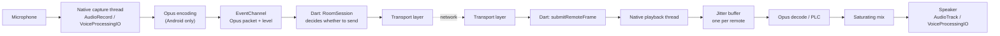

> 🌐 English | [简体中文](../音频管线.md)

# Audio Pipeline

Capture, encoding, jitter buffering, mixing, and playback all happen on the **native side** (Android Kotlin, iOS Swift, HarmonyOS ArkTS); Dart only moves Opus packets. The split is deliberate: the jitter buffer and mixer must follow the audio clock, and Dart's `Timer` has scheduling drift; moving PCM every frame (640 bytes) is also an order of magnitude more expensive than moving an Opus packet (roughly 60 bytes).

## Parameter Summary

| Parameter | Value | Defined in |
| --- | --- | --- |
| Sample rate | 16,000 Hz | `OpusCodec.SAMPLE_RATE` (Android); same value on the Swift side |
| Frame length | 20 ms | native capture/playback loops |
| Frame samples | 320 (16-bit mono PCM, 640 bytes) | `OpusCodec.FRAME_SAMPLES` |
| Codec | Opus, `OPUS_APPLICATION_VOIP`, mono | `OpusCodec.kt` (**Android only**) |
| Opus implementation | Concentus 1.0.2 (pure JVM) | `android/app/build.gradle.kts` |
| Opus output cap | 512 bytes | `OpusCodec.MAX_PACKET_BYTES`, aligned with `Frame.maxPayloadSize` |
| Uplink bitrate (Wi-Fi / Wi-Fi Direct full-duplex) | 24,000 bps | `RoomSession._wifiBitrate` |
| Uplink bitrate (Bluetooth PTT) | 16,000 bps | `RoomSession._bluetoothBitrate` |
| Capture source (Android) | `VOICE_COMMUNICATION`, with hardware AEC / NS / AGC when available | `PlatformAudioPlugin.kt` |
| Playback attributes (Android) | `USAGE_VOICE_COMMUNICATION` + `CONTENT_TYPE_SPEECH`, `CHANNEL_OUT_MONO`, `MODE_STREAM` | `PlatformAudioPlugin.kt` |
| Buffer size (Android) | `max(minBufferSize, 640 * 4)`, same rule for capture and playback | `PlatformAudioPlugin.kt` |
| Capture/playback (iOS) | AudioUnit VoiceProcessingIO (`.playAndRecord` / `.voiceChat`) | `PlatformAudioPlugin.swift` |
| Mixer full-scale divisor | 32768 | identical on C / Kotlin / Swift / Dart |

Choosing 16 kHz wideband mono is the standard compromise for voice: far clearer than 8 kHz narrowband, yet far cheaper in bandwidth and CPU than 48 kHz. A 20 ms frame length is Opus's default sweet spot, balancing encoding efficiency against latency.

## The Pipeline

```mermaid
flowchart LR
    MIC["Microphone"] --> CAP["Native capture thread<br/>AudioRecord / VoiceProcessingIO"]
    CAP --> ENC["Opus encoding<br/>(Android only)"]
    ENC --> EV["EventChannel<br/>Opus packet + level"]
    EV --> DART["Dart: RoomSession<br/>decides whether to send"]
    DART --> TX["Transport layer"]
    TX -.->|"network"| RX["Transport layer"]
    RX --> SUB["Dart: submitRemoteFrame"]
    SUB --> PB["Native playback thread"]
    PB --> JB["Jitter buffer<br/>one per remote"]
    JB --> DEC["Opus decode / PLC"]
    DEC --> MIX["Saturating mix"]
    MIX --> SPK["Speaker<br/>AudioTrack / VoiceProcessingIO"]
```

The playback beat is driven by the native playback thread: Android relies on **blocking `AudioTrack.write`** (it blocks once the buffer is full, naturally forming a 20 ms clock), while iOS relies on the AudioUnit render callback. Neither needs an extra timer.

## Dart Abstraction

`lib/core/audio/audio_io.dart` defines the `AudioIo` interface; `PlatformAudioChannel` in `lib/core/platform/platform_audio_channel.dart` is its platform implementation:

- MethodChannel `host.msknet.sunsetripple/audio`: `startCapture`, `stopCapture`, `submitRemoteFrame`, `removeRemoteMember`, `clearRemoteMembers`, `setMuted`, `setSpeakerphone`, `setUseBuiltinMic`, `setBitrate`, `stopPlayback`, `dispose`.
- EventChannel `host.msknet.sunsetripple/audio_events`: the native uplink event is `{data: Uint8List, level: double}`. On Android `data` is an Opus packet and `level` is that frame's normalized loudness (0~1).

Tests and the desktop placeholder use `MockAudioIo`.

## Capture and Sending

`RoomSession._startAudioPipeline` calls `audioIo.startCapture` and decides in the callback whether to send:

- **Full-duplex (Wi-Fi / Wi-Fi Direct)**: send whenever not muted.
- **PTT (Bluetooth)**: send only when not muted and `isPttPressed` is true.

The bitrate follows the room mode (24,000 full-duplex, 16,000 Bluetooth). The callback's `level` is throttled to 33 ms (about 30 Hz) into `waveStream`, driving the UI ripple.

Note that the uplink carries an **already-encoded Opus packet**, not PCM; the native side attaches `level` in the same event for display.

## Native Implementations

### Android

`android/app/src/main/kotlin/host/msknet/sunsetripple/PlatformAudioPlugin.kt`:

- The capture thread reads 320 samples, computes RMS (normalized by dividing by 32768), encodes to an Opus packet with Concentus, and posts it over the EventChannel.
- The playback thread takes one frame every 20 ms: for each remote stream it pulls a packet from the jitter buffer, decodes Opus (PLC on loss), adds samples one by one with saturation to `[-32768, 32767]`, and writes to `AudioTrack`. When nobody is speaking it writes a silent frame to keep the clock continuous.
- `submitRemoteFrame` parses the 6-byte header (`[1]` sender, `[2..3]` sequence, `[4..5]` payload length) and routes the payload into each sender's own jitter buffer.
- The capture source is `VOICE_COMMUNICATION`, attaching `AcousticEchoCanceler` / `NoiseSuppressor` / `AutomaticGainControl` when available; capture and playback share one communication audio route.

Concentus is not used on iOS — it is only Android's implementation choice.

### iOS

`ios/Runner/PlatformAudioPlugin.swift` uses AudioUnit VoiceProcessingIO and runs 16 kHz / mono / 16-bit RAW PCM for both capture and playback:

- The capture callback computes RMS (again divided by 32768) and posts `{data: PCM bytes, level}`.
- Incoming remote frames are routed per sender into an in-memory queue (cap 10 frames); the render callback adds samples with saturation clipping before output.

**Known gap: iOS has no Opus.** The incoming remote payload is treated directly as RAW PCM, whereas Android sends Opus packets. So **voice cannot interoperate between the current iOS path and the Android/Opus path**; iOS is an end-to-end PCM route only. The docs must state this plainly.

### HarmonyOS

`harmonyos/entry/src/main/ets/audio/HarmonyAudioEngine.ets` is the ArkTS host's audio engine, using `AudioCapturer` / `AudioRenderer` with `SOURCE_TYPE_VOICE_COMMUNICATION` / `STREAM_USAGE_VOICE_COMMUNICATION`, again 16 kHz mono RAW PCM (no Opus). `HarmonyRoomSession.ets` wires it to PTT state.

## Jitter Buffer

On the Android native side, each remote stream gets a `JitterBuffer` (`android/.../audio/JitterBuffer.kt`) that caches Opus packets keyed by the 16-bit wrapping sequence number:

- **Pre-buffering** — output only starts after 3 frames have accumulated.
- **Reordering** — packets with later sequence numbers that arrive early are held back and released in order.
- **Packet loss** — `poll()` returns `PollResult.Lost`; the caller feeds `null` to the decoder to trigger **Opus PLC** (packet loss concealment).
- **Not ready** — `PollResult.NotReady`: pre-buffer not yet full or underrun; this tick stays silent, the pointer does not advance, and PLC must not be forced.
- **Late drop** — after playback starts, frames below the current position are dropped outright.
- **Overflow** — beyond 10 frames, the oldest is dropped.
- **Realignment** — when the gap exceeds the buffer cap, `next` realigns to the current minimum sequence number so it never falls permanently behind.

The orientation is explicit: **drop rather than wait**. In an intercom scenario, late voice is worthless — accumulating latency is the real killer.

iOS has none of this reordering/PLC logic, only an approximate per-sender queue (cap 10 frames) that drops the oldest.

## Mixing

The native playback loop does its own per-sample integer add with saturation to `[-32768, 32767]` (Android's `playbackLoop`, iOS's `providePlaybackPcm`). In addition, `native/src/audio_dsp.cpp` provides C++ versions:

- `sunset_mix_pcm_streams` — multi-stream 16-bit PCM linear mixing with saturation clamping; for a single stream it does a plain `memcpy`.
- `sunset_calculate_rms` — normalized RMS with a fixed full-scale divisor of 32768.

Both are exposed to Dart through `NativeCoreFfi` / `NativeRingBuffer` in `lib/core/ffi/native_core_ffi.dart`, falling back to equivalent pure-Dart implementations when the native library is unavailable. Android packages `libsunset_ripple_native.so` via `externalNativeBuild` (`native/CMakeLists.txt`).

## Speaking Indicator

The native side only reports `level`; "who is speaking" is inferred by Dart's `RoomSession`:

- On an audio frame from a **registered** member it calls `audioIo.submitRemoteFrame` and marks that member as speaking; an unregistered `senderId` is dropped, so a forged source cannot create a decoder on the native side out of thin air.
- **Full-duplex** has no PTT release event, so it relies on the audio stream stopping: 400 ms without another audio frame clears the indicator (a 100 ms watch timer).
- The **PTT room** is driven directly by `pttState` frames, because PTT itself is an explicit intent to speak.

The UI ripple is driven by the `level` on `waveStream`, a data stream independent of the speaking indicator.

## Diagnostics Sheet

`lib/ui/pages/diagnostics_sheet.dart` shows real session statistics rather than hard-coded defaults:

- Audio format: `Opus · 16 kHz · Mono · 20 ms` (`AppStrings.audioCodecDescription`).
- Packet loss: `RoomSession.packetLossPercent`, estimated from sequence gaps per sender.
- Round-trip latency: `RoomSession.roundTripTimeMs`, the client's measured time from sending JOIN to receiving the first roster; the Host side is `null` and displays as `—`.

## Related Tests

| Test file | Coverage |
| --- | --- |
| `test/room_session_test.dart` | Remote audio only accepts registered members and enters the playback pipeline; full-duplex stream stop clears the speaking indicator after 400 ms; PTT and mute; Opus packets survive `Frame` encode/decode intact; RMS full-scale and quiet-signal regressions |
| `test/widget_test.dart`, `test/room_entry_transition_test.dart` | Mock the `host.msknet.sunsetripple/audio` and `audio_events` channels to verify the UI does not crash when the native implementation is missing |

## Related Pages

- [Architecture Overview](Architecture-Overview.md) · [Room Modes](Room-Modes.md) · [Troubleshooting](Troubleshooting.md)
