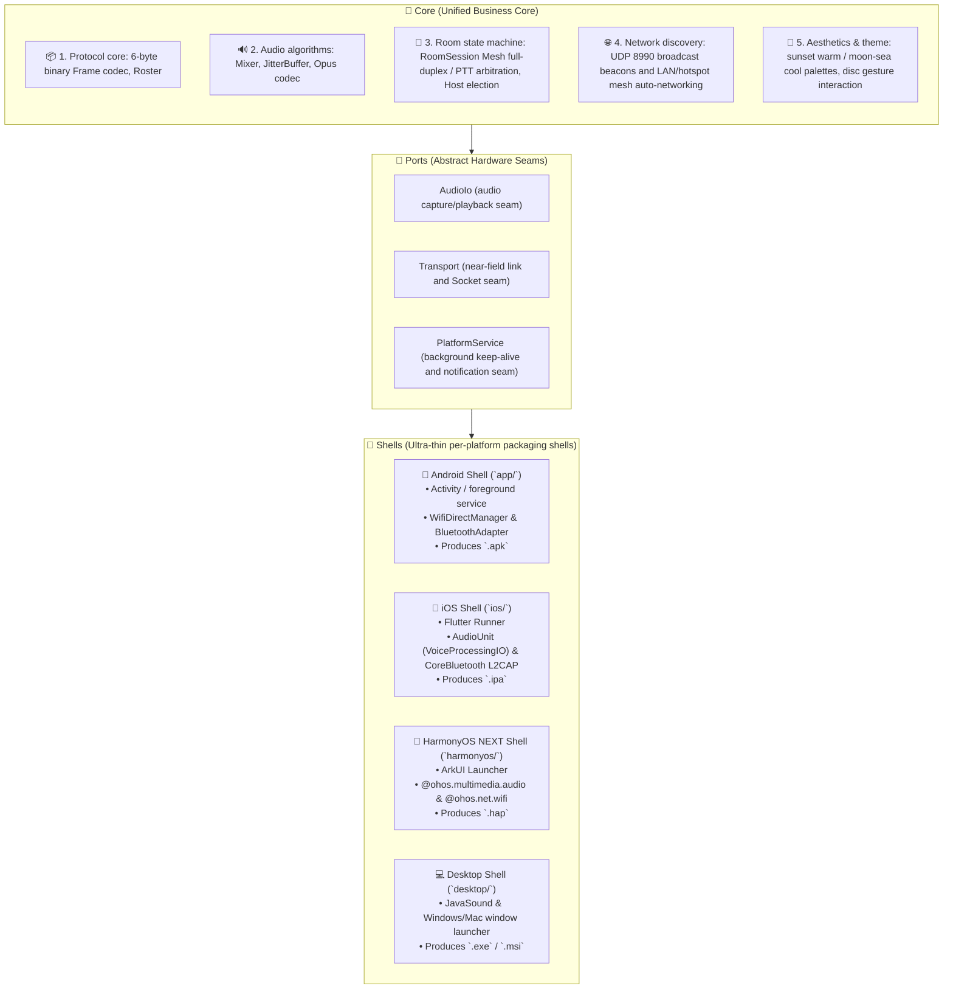

> 🌐 English | [简体中文](../Core-Shell统一多端架构.md)

# Core-Shell Unified Multi-Platform Architecture Specification

SunsetRipple (落日后残波) adopts the industry-proven **Core-Shell** and **Ports & Adapters** architectures.

---

## 1. Core Architectural Idea

Like excellent cross-platform apps such as **FlClash / Clash Verge / Spotify**:
> **"The core engine and UI business logic settle into the Core; each operating system serves only as an extremely thin Shell (startup and hardware casing)."**

---

## 2. Directory Layout and Responsibility Split

| Layer / Module | Directory | Responsibilities & Tech Stack |
| :--- | :--- | :--- |
| **Core (unified core)** | [`app/src/main/kotlin/host/msknet/sunsetripple/`](../../../app/src/main/kotlin/host/msknet/sunsetripple/) | • `protocol/`: unified binary frames • `audio/`: mixing, jitter buffer, `AudioIo` interface • `transport/lan/`: UDP 8990 cross-platform room discovery • `session/`: room session lifecycle • `ui/`: sunset palette and toolbar decision models |
| **Android Shell** | [`app/`](../../../app/) | Hosts the AndroidManifest, the foreground keep-alive service, `WifiP2pManager` and `BluetoothServerSocket` |
| **HarmonyOS Shell** | [`harmonyos/`](../../../harmonyos/) | Hosts the DevEco Studio project, the ArkTS entry point, `AudioCapturer`/`AudioRenderer`, and the ArkUI interface |
| **iOS Shell** | [`ios/`](../../../ios/) | Hosts the Xcode project, the Flutter Runner, `PlatformAudioPlugin` (VoiceProcessingIO), and `BleL2capPlugin` |

---

## 3. Cross-Platform Behavioral Consistency Guarantees

1. **Byte-level protocol consistency**:
   Audio and control frames generated on all platforms strictly follow the `[Type 1B][SenderId 1B][Seq 2B][Length 2B][Payload ≤512B]` specification, with byte order kept as network byte order (Big-Endian).
2. **Audio parameter consistency**:
   All platforms use a unified sample rate of **16,000 Hz**, mono 16-bit PCM, with **320 samples (20ms) per frame**.
3. **Visual palette consistency**:
   - **Daytime Sunset**: primary accent `#9B4A52` (warm coral), leave button `#FF9E90`, background `#F4F1EC`.
   - **Night Moon-Sea**: primary accent `#3F76AC` (ocean blue), leave button `#FF7B92` (cool rose pink), background `#0E1626`.
