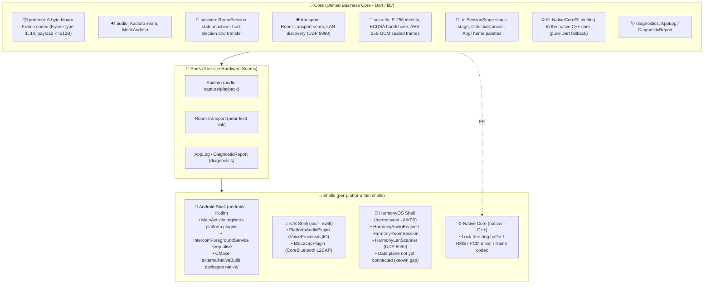

> 🌐 English | [简体中文](../Core-Shell统一多端架构.md)

# Core-Shell Unified Multi-Platform Architecture Specification

SunsetRipple (落日后残波) adopts the **Core-Shell** and **Ports & Adapters** architectures.

> This document describes the current Flutter/Dart implementation: **the Core is the Dart code under `lib/`**, each platform shell only handles startup, permissions, native audio, and near-field links; the shared C++ core lives in `native/` and is exposed to Dart via FFI.

---

## 1. Core Architectural Idea

> **"The core engine and business logic settle into the Dart Core; each operating system serves only as an extremely thin Shell (startup and hardware casing)."**

```mermaid
flowchart TD
    subgraph CORE ["💎 Core (Unified Business Core - Dart / lib/)"]
        direction TB
        PROTO["📦 protocol: 6-byte binary Frame codec (FrameType 1..14, payload <=512B)"]
        AUDIO["🔊 audio: AudioIo seam, MockAudioIo"]
        SESSION_SM["🧠 session: RoomSession state machine, host election and transfer"]
        TRANS["🌐 transport: RoomTransport seam, LAN discovery (UDP 8990)"]
        SEC["🔐 security: P-256 identity, ECDSA handshake, AES-256-GCM sealed frames"]
        UI["🎨 ui: SessionStage single stage, CelestialCanvas, AppTheme palettes"]
        FFI["⚙️ ffi: NativeCoreFfi binding to the native C++ core (pure-Dart fallback)"]
        DIAG["🩺 diagnostics: AppLog / DiagnosticReport"]
    end

    subgraph PORTS ["🔌 Ports (Abstract Hardware Seams)"]
        P_AUDIO["AudioIo (audio capture/playback)"]
        P_TRANS["RoomTransport (near-field link)"]
        P_DIAG["AppLog / DiagnosticReport (diagnostics)"]
    end

    subgraph SHELLS ["🐚 Shells (per-platform thin shells)"]
        S_AND["📱 Android Shell (android/ - Kotlin)<br/>• MainActivity registers platform plugins<br/>• IntercomForegroundService keep-alive<br/>• CMake externalNativeBuild packages native/"]
        S_IOS["🍏 iOS Shell (ios/ - Swift)<br/>• PlatformAudioPlugin (VoiceProcessingIO)<br/>• BleL2capPlugin (CoreBluetooth L2CAP)"]
        S_HARMONY["🔴 HarmonyOS Shell (harmonyos/ - ArkTS)<br/>• HarmonyAudioEngine / HarmonyRoomSession<br/>• HarmonyLanScanner (UDP 8990)<br/>• Data plane not yet connected (known gap)"]
        S_NATIVE["⚙️ Native Core (native/ - C++)<br/>• Lock-free ring buffer / RMS / PCM mixer / frame codec"]
    end

    CORE --> PORTS
    PORTS --> SHELLS
    CORE -. FFI .-> S_NATIVE
```

---

## 2. Directory Layout and Responsibility Split

| Layer / Module | Directory | Responsibilities & Tech Stack |
| :--- | :--- | :--- |
| **Core (unified core)** | [`lib/core/`](../../../lib/core/) | • `protocol/`: 6-byte binary frames, `FrameType` 1..14 • `audio/`: `AudioIo` seam and `MockAudioIo` • `transport/`: `RoomTransport` seam, `LanTransport`, `BleL2capTransport`, `LanRoomDiscovery`, `WifiDirectManager` • `session/`: `RoomSession` state machine, `host_transfer` election and handover • `security/`: P-256 identity, ECDSA handshake, AES-256-GCM sealed frames • `platform/`: `PlatformAudioChannel` (platform-channel `AudioIo` implementation) • `ffi/`: `NativeCoreFfi` / `NativeRingBuffer` • `diagnostics/`: `AppLog`, `DiagnosticReport` • `update/`: `UpdateService` |
| **UI core** | [`lib/ui/`](../../../lib/ui/) | • `pages/`: `SessionStage` single stage, home/room/diagnostics • `widgets/`: `CelestialCanvas`, member orbit, PTT button, etc. • `theme/app_theme.dart`: day-sunset / night-moon-sea palettes • `transitions/`: enter/leave choreography |
| **Android Shell** | [`android/`](../../../android/) | Kotlin thin shell: `MainActivity`, `PlatformAudioPlugin`, `BleL2capPlugin`, `WifiDirectPlugin`, `IntercomForegroundService`; `externalNativeBuild` compiles `native/` |
| **iOS Shell** | [`ios/`](../../../ios/) | Swift thin shell: `PlatformAudioPlugin` (VoiceProcessingIO) and `BleL2capPlugin` (CoreBluetooth L2CAP) |
| **HarmonyOS Shell** | [`harmonyos/`](../../../harmonyos/) | ArkTS project: `HarmonyAudioEngine`, `HarmonyRoomSession`, `RoomPage`/`Index`, `EntryAbility`, `HarmonyLanScanner`; some paths are not yet wired |
| **Native C++ Core** | [`native/`](../../../native/) | Shared C++: lock-free SPSC ring buffer, RMS, PCM mixer, protocol frame codec; packaged by Android/iOS and exposed to Dart via `lib/core/ffi` |

---

## 3. Cross-Platform Behavioral Consistency Guarantees

1. **Byte-level protocol consistency**:
   Audio and control frames generated on all platforms strictly follow the `[Type 1B][SenderId 1B][Seq 2B][Length 2B][Payload <=512B]` specification, with byte order kept as network byte order (Big-Endian). `FrameType` values are 1..14.
2. **Audio parameter consistency**:
   All platforms use a unified sample rate of **16,000 Hz**, mono 16-bit PCM, with **320 samples (20ms) per frame**.
3. **Visual palette consistency** (authoritative source: `lib/ui/theme/app_theme.dart`):
   - **Daytime Sunset**: primary accent `#9B4A52` (sunsetBurgundy), secondary `#C97C66` (sunsetCoral), background `#F4F1EC`, leave button `#FF9E90`.
   - **Night Moon-Sea**: primary accent `#3C5A8C` (nightSkyBlue), background `#0E1626`, leave button `#FF7B92` (deep rose pink).
4. **Unit tests**: `flutter test` currently passes **144/144**.

---

## 4. Known Gaps

- **HarmonyOS data plane not connected**: `harmonyos/entry/src/main/ets/plugin/PlatformAudioPlugin.ets` is currently an **empty file**, and the audio/link data plane is not yet wired; `HarmonyRoomSession`'s local PCM callback still does not pack frames for transmission. `HarmonyLanScanner` is already aligned with the Dart `LanRoomDiscovery` JSON broadcast protocol (UDP 8990, `SUNSET_RIPPLE_DISCOVERY_V1`) and can be used for room discovery.
- **C++ native core is an optional accelerator**: `NativeCoreFfi.initialize()` silently falls back to a pure-Dart implementation when the native library is unavailable, keeping both paths semantically identical (leaving `native/` out of the build does not error, it only loses the acceleration).
