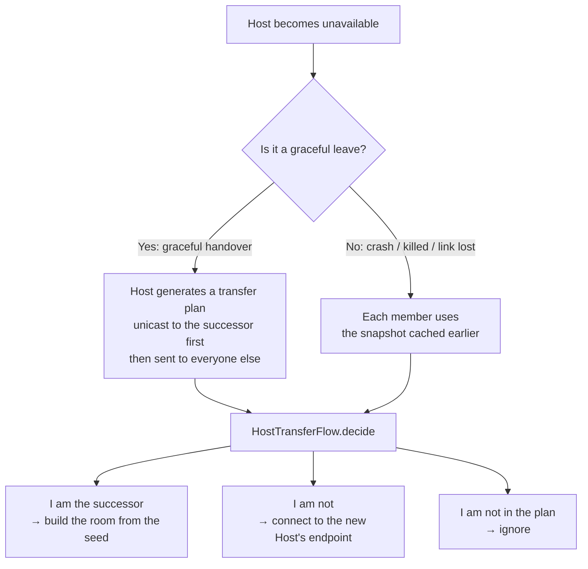

> 🌐 English | [简体中文](../房主转移机制.md)

# Host Transfer Mechanism

The most complex part of the entire project. The goal: **the room must not dissolve when the Host leaves.**

In a serverless architecture, the Host is at once the signaling hub and the membership allocator — and in the Bluetooth Room (PTT), the mixer as well. Once the Host walks away, the room is theoretically gone. This mechanism lets the remaining members automatically elect a successor and rebuild the room.

## Two Paths



### Path 1: Graceful Handover

When the Host taps "Leave", the transport layer calls `prepareHostTransfer()` (implemented separately by `WifiHostTransport` / `BluetoothHostTransport`):

1. `HostElection` picks the successor.
2. The `HOST_TRANSFER` frame is **unicast to the successor first**, then sent to the remaining members.
3. If that succeeds, **the ordinary `LEAVE` is no longer broadcast** — otherwise the other members would mistake it for just an ordinary member leaving.

This is locked in by both `RoomSessionTest` and `BluetoothRoomSessionTest`: "a Host that has prepared a transfer no longer broadcasts LEAVE".

### Path 2: Failure Takeover

When the Host crashes, is killed by the system, or the link suddenly drops, there is no time to send anything. So the strategy is **pre-distributing snapshots**:

- Every time the Host **pushes the roster**, it also sends a `HOST_SNAPSHOT` frame.
- Clients cache it as `recoverySnapshot`.
- After a client disconnects, it first retries at 1 / 2 / 4 second intervals per `ReconnectPolicy`. Once the three attempts are exhausted, `RoomSession.onDisconnected` / `BluetoothRoomSession.onDisconnected` does **not** end the room; instead, it promotes the cached snapshot into `onHostTransfer(snapshot)`, entering exactly the same downstream flow as a graceful handover.

This is the key trade-off of the whole mechanism: **a little continuous bandwidth (one extra frame per roster update) is exchanged for recoverability after a Host crash.**

## Election Rules

`HostElection` (`transport/HostTransfer.kt`):

1. Filter for members with `connected && endpoint.isNotBlank()` — **they must be online and must have a stable endpoint**.
2. Sort by `joinOrder`, ties broken by `memberId`.
3. Take the first one as the successor.

In other words, the **earliest-joined member still online** succeeds. The rule is simple and fully deterministic — every device computing from the same snapshot arrives at the same result, with no negotiation rounds needed.

Members currently reconnecting **do not count as online** and are skipped (`BluetoothTransportContractTest` has a dedicated case: "transfer skips the earliest member that is reconnecting").

## Data Structures

```kotlin
data class TransferCandidate(memberId, joinOrder, nickname, endpoint, connected)
data class HostTransferMember(memberId, joinOrder, nickname, endpoint)
data class HostTransferPlan(successorId, members)     // MAX_MEMBERS = 6
data class SeededTransferMember(previousId, newId, joinOrder, nickname, endpoint)
data class HostTransferSeed(members, nextJoinOrder)
```

`HostTransferPlan` validation is quite strict: member IDs, endpoints, and join orders must each be unique; the successor must be within the member list; and `successorId in 1..255`.

`HostTransferSeed.from(plan)` remaps IDs — **the successor becomes ID `0`** (the Host's fixed ID), the remaining members are renumbered to `1..N`, and `nextJoinOrder = maxOrder + 1`. After remapping, **the original join order is preserved**, so any subsequent transfer still proceeds by the original joining order, and the A→B→C chain stays stable.

## Endpoints: The Key to Stable Identity

The `endpoint` in the election result is the address other members use to **reconnect to the new Host**. It must remain valid across host changes, so an IP address cannot be used (it changes after the Wi-Fi group is rebuilt):

| Room type | Endpoint content | Source |
| --- | --- | --- |
| Wi-Fi | P2P device address | `wifi.thisDevice.value.deviceAddress`, filtering out the anonymous placeholder value `02:00:00:00:00:00` |
| Bluetooth | Bluetooth MAC | Derived by the server from `connection.remoteAddress` |
| Nearby | — | Transfer not supported |

The endpoint is reported by clients in the v2 version of the `JOIN` frame (on the Bluetooth side, v1 suffices because the server can obtain the MAC directly). Members without a stable endpoint **are not eligible to succeed** — `HostTransferTest` has a corresponding case.

## How Clients Decide

`ui/HostTransferFlow.kt` is a pure function with no Android dependency:

```kotlin
HostTransferFlow.decide(plan, selfId) -> HostTransferAction
```

```kotlin
sealed interface HostTransferAction {
    data class BecomeHost(val seed: HostTransferSeed)  // 我是继任者
    data class JoinHost(val endpoint: String)          // 去连新房主
    object Ignore                                       // 我不在计划里，忽略
}
```

The `Ignore` branch handles **stale plans**: if a device is not in the member list (e.g., it already left), receiving a plan should not trigger any action at all.

## Rebuilding the Room

### Bluetooth Room (PTT)

The successor restarts the RFCOMM server with the seed, and the other members connect to it. Rebuilding uses **insecure mode** (`secure = false`) to avoid the system asking for pairing confirmation again.

### Wi-Fi Room

The successor must **rebuild the entire Wi-Fi Direct group**, and the other members reconnect using the successor's device address. This comes at a cost:

- Voice is **briefly interrupted**.
- The system **may pop the connection confirmation dialog again**.

This is the fundamental reason the Wi-Fi Room's transfer experience is worse than the Bluetooth Room's, and it is one of the items currently listed under known limitations.

## Reservation and Release

After taking over, the successor **reserves slots for original members that have not yet reconnected** for 7 seconds (`TRANSFER_RESERVATION_GRACE_MS = 7_000L`); reconnecting with the token restores the original ID and join order.

After the timeout, the reservation is released — otherwise a device that never returns would permanently occupy one of the 6 slots. Both `BluetoothTransportContractTest` and `WifiTransportTest` have the case "the successor releases unreconnected reservations after the grace period".

During the reservation window, **a device holding the wrong token cannot fraudulently claim** that slot.

## Codec

`HostTransferCodec`, version 1; the format is documented in [Protocol Specification](Protocol-Specification.md#host_transfer--host_snapshot). Decoding rejects a wrong version number, an out-of-range member count, non-ASCII in endpoints, invalid UTF-8, and the presence of extra trailing bytes.

## Known Limitations

- **Depends on the snapshot having arrived** — a client can only take over if it has received at least one `HOST_SNAPSHOT`. Recovery is impossible if power is lost right after the room is created, if all candidate devices go offline at the same time, or if the wireless environment is fully isolated.
- **Wi-Fi transfer interrupts voice** — the P2P group must be rebuilt; voice stutters during that window and the system may pop the confirmation dialog again.
- **Nearby Room not supported** — `NearbyRoomTransport` does not implement `prepareHostTransfer()`.
- **Consecutive A→B→C transfers pending on-device acceptance** — guaranteed logically by "preserving the original join order" and covered by unit tests, but multi-device on-device acceptance testing is not yet complete.

## Related Tests

| Test file | Coverage |
| --- | --- |
| `transport/HostTransferTest.kt` | Election rules, no plan produced when there is no stable endpoint, codec round-trip, rejection of duplicate members/endpoints/join orders, seed remapping preserves order |
| `ui/HostTransferFlowTest.kt` | Successor builds the room, other members connect to the new Host, ignore when not in the plan |
| `transport/bluetooth/BluetoothTransportContractTest.kt` | Everyone takes over from the snapshot after an abnormal host shutdown, graceful transfer to the earliest online member, a snapshot is sent with every roster update, reconnecting members are skipped, the successor releases expired reservations |
| `transport/wifi/WifiTransportTest.kt` | Transfer uses the P2P endpoint reported in JOIN and preserves join order, members receive the disaster-recovery snapshot, the successor releases expired reservations |
| `session/RoomSessionTest.kt` | A client holding a snapshot escalates a disconnect into a transfer, no takeover if the snapshot does not contain itself, HOST_TRANSFER receipt is not recorded as "room ended", a Host that prepared a transfer does not broadcast LEAVE |

## Related Pages

- [Protocol Specification](Protocol-Specification.md) · [Room Modes](Room-Modes.md) · [Architecture Overview](Architecture-Overview.md)
