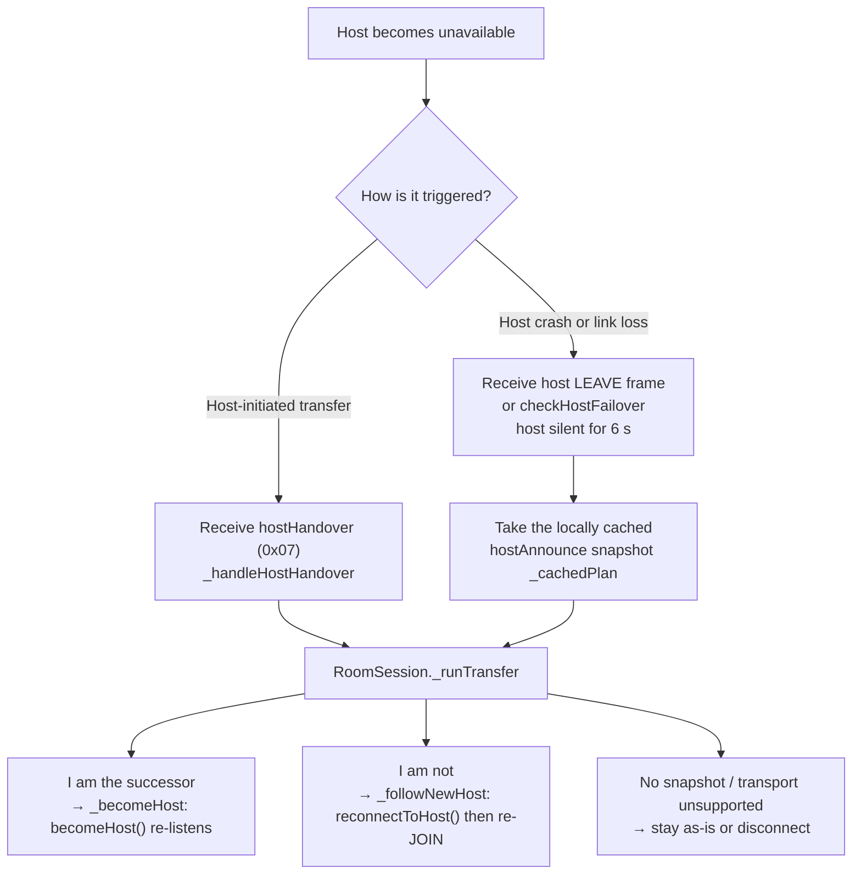

> 🌐 English | [简体中文](../房主转移机制.md)

# Host Transfer Mechanism

The most complex part of the entire project. The goal: **the room must not dissolve when the Host leaves.**

In a serverless architecture, the Host is at once the signaling hub and the membership allocator. Once the Host walks away, the room is theoretically gone. This mechanism lets the remaining members automatically elect a successor and rebuild the room.

## Session and Host

The current implementation has exactly one session class: `RoomSession` in `lib/core/session/room_session.dart`. The two room modes are distinguished by `RoomMode`: `wifiFullDuplex` and `bluetoothPtt`.

- The Host always has member ID **1**; clients get **2..6**; the room capacity is **6**.
- The heartbeat fires every **2 seconds**. On each heartbeat the Host calls `pruneStaleMembers()`, removing any member that has sent no frames for **10 seconds** (`_memberTimeout = Duration(seconds: 10)`).
- The Host is the sole authority for the roster; `_handleJoinReq` allocates member IDs. The `sessionToken` (16 bytes) is how a reconnecting member is recognized — a nickname is never treated as an identity.

## Trigger Paths

Host transfer has a single entry point: `RoomSession._runTransfer(plan)`. The `plan` may come from an immediately received handover frame or from the previously cached snapshot.


```mermaid
flowchart TD
    START["Host becomes unavailable"]
    KIND{"How is it triggered?"}
    HANDOVER["Receive hostHandover (0x07)<br/>_handleHostHandover"]
    LEAVE["Receive host LEAVE frame<br/>or checkHostFailover<br/>host silent for 6 s"]
    PLAN["Take the locally cached<br/>hostAnnounce snapshot _cachedPlan"]
    RUN["RoomSession._runTransfer"]
    BECOME["I am the successor<br/>→ _becomeHost: becomeHost() re-listens"]
    FOLLOW["I am not<br/>→ _followNewHost: reconnectToHost() then re-JOIN"]
    NONE["No snapshot / transport unsupported<br/>→ stay as-is or disconnect"]

    START --> KIND
    KIND -->|"Host-initiated transfer"| HANDOVER
    KIND -->|"Host crash or link loss"| LEAVE
    HANDOVER --> RUN
    LEAVE --> PLAN
    PLAN --> RUN
    RUN --> BECOME
    RUN --> FOLLOW
    RUN --> NONE
```

### Graceful Handover

The Host calls `transferHost(targetMemberId)`:

1. It assembles a plan with `_buildTransferPlan(preferredSuccessorId: targetMemberId)`. If the target's endpoint is not yet known (the peer has never sent audio), it gives up and logs it.
2. It broadcasts `FrameType.hostHandover (0x07)` with the full plan in v2 encoding.
3. It waits 300 ms for the frame to go out, then the Host itself calls `_followNewHost()`, becoming an ordinary member and reconnecting to the successor.

There is no `prepareHostTransfer()`, and no "unicast to the successor first" step: the handover frame uses the ordinary send path, and in the host role the transport relays it to the remaining members.

### Failure Takeover

When the Host crashes, is killed by the system, or the link suddenly drops, there is no time to send a handover frame. So the strategy is **pre-distributing snapshots**:

- On **every 2-second heartbeat** the Host calls `_broadcastSnapshot()`, sending a `FrameType.hostAnnounce (0x08)` frame with the same payload as a handover; the Host also caches it locally as `_cachedPlan`.
- In `_handleHostAnnounce` a client **only** caches the plan and does not change the current Host — a late snapshot must never depose the incumbent. `_isPlanFresh` filters out late or replayed old plans by the maximum `joinOrder` in the plan.
- Takeover is triggered in two ways: a host `leave` frame (`_handleLeave`, where the sender is marked as Host in the cached roster), or `checkHostFailover()` noticing the Host's `lastActiveAt` is more than **6 seconds** old.
- Both paths check `_cachedPlan`: if there is a snapshot they call `_runTransfer`; if there is none they simply move the session to `disconnected`.

This is the key trade-off of the whole mechanism: **a little continuous bandwidth (one extra frame per heartbeat) is exchanged for recoverability after a Host crash.**

## Election Rules

`HostElection` (`lib/core/session/host_transfer.dart`):

1. Filter for candidates with `connected && endpoint.trim().isNotEmpty` — **they must be online and have a non-empty endpoint**.
2. Sort by `joinOrder` ascending, ties broken by `memberId` ascending.
3. Take the first one as the successor; return `null` when there is no eligible candidate.

In other words, the **earliest-joined member still online** succeeds. The rule is simple and fully deterministic — every device computing from the same plan arrives at the same result, with no negotiation rounds needed.

The host-side `_buildTransferPlan` only includes members **other than the Host that have a non-empty endpoint and hold a valid 16-byte `sessionToken`**; a missing token voids the entire plan (returns `null`) rather than downgrading it. Endpoints come from `transport.peerEndpoints`, falling back to the `endpoint` already recorded in the member table.

## Data Structures

The current implementation lives in `lib/core/session/host_transfer.dart`:

```dart
TransferCandidate(memberId, joinOrder, nickname, endpoint, sessionToken, connected)
HostTransferMember(memberId, joinOrder, nickname, endpoint, sessionToken)
HostTransferPlan(successorId, members) // maxMembers = 6
HostTransferSeed(members, nextJoinOrder) // SeededTransferMember(previousId, newId, ...)
HostElection.plan(candidates) // assembles the whole plan
```

`HostTransferPlan` validation is quite strict: member IDs, endpoints (case-insensitively), and `joinOrder` must each be unique; the successor must be within the member list; `successorId` and every member ID must be in `1..255`; `joinOrder >= 0`; endpoints must be non-empty; and every member's `sessionToken` must be a unique, non-all-zero 16-byte value.

`HostTransferSeed.from(plan)` sorts by `joinOrder` / `memberId` and remaps IDs — **the successor goes first with `newId = 0` (and then takes 1 as Host)**, the remaining members are renumbered to `1..N`, and `nextJoinOrder = maxOrder + 1`. **The original `joinOrder` is preserved** after remapping, so any subsequent transfer still proceeds by the original joining order and the A→B→C chain stays stable. `expectedByEndpoint()` indexes the non-host members by endpoint so the new Host can claim reconnecting peers.

## Wire Format (`HostTransferCodec` v2)

```
[version=2 1B][successorId 1B][count 1B]
per member: [memberId 1B][joinOrder 8B big-endian][nickLen 1B][nick UTF-8]
            [endpointLen 1B][endpoint ASCII][sessionToken 16B]
```

Encoding truncates the nickname to 64 UTF-8 bytes without splitting a multi-byte character, and the endpoint must be ASCII. Decoding rejects: a version other than 2, a member count outside `1..6`, a non-ASCII endpoint, invalid UTF-8, an incomplete token, a payload over `Frame.maxPayloadSize`, and trailing bytes. A plan without a complete token is rejected rather than downgraded.

Note: the token travels in the current plaintext control frame; it is not an encryption key and does not prevent eavesdropping or token copying.

## How Clients Decide

- `_handleHostHandover`: verifies the sender really is the roster's Host (`_isHostFrame`), decodes the plan, runs the `_isPlanFresh` check, then calls `_runTransfer` immediately.
- `_handleHostAnnounce`: the same decode and freshness check, but **only** writes `_cachedPlan`.
- `_runTransfer`: if `transport == null` or `!transport.supportsHostTransfer`, it logs an error and returns without changing the session. Otherwise it branches on `plan.successorId == _selfMemberId`:
  - `_becomeHost(plan, t)`: rebuilds the member table from `HostTransferSeed.from(plan)` and calls `t.becomeHost()` to listen again. The successor becomes member 1; the other members keep their original ID, `joinOrder`, endpoint, and token. It restores `_nextJoinOrder` and broadcasts the new roster. **The audio pipeline is not restarted.**
  - `_followNewHost(plan, t)`: calls `t.reconnectToHost(plan.successor.endpoint)`, then `joinRoom(startAudio: false)` to run JOIN again **without restarting audio**.

An unexpected link drop is handled separately by `ReconnectController`: it retries `t.reconnect()` + re-JOIN on a `[1s, 2s, 4s]` backoff; after all three fail it invokes `onMaxRetriesReached` and the session goes `disconnected`.

## Rebuilding the Room

### Wi-Fi Room (`LanTransport`)

The successor's `becomeHost()` = `stop()` + `startHost()`: it rebinds control TCP `8988` and audio UDP `8989` and starts listening. The other members' `reconnectToHost(endpoint)` = `stop()` + up to 6 attempts at `startClient()` spaced 300 ms apart. This comes at a cost:

- Voice is **briefly interrupted**.
- The Wi-Fi Direct group may be rebuilt, and the system **may pop the connection confirmation dialog again**.

When first joining, the client connects to the Wi-Fi Direct group owner address (the `groupOwnerAddress` returned by `WifiDirectManager`, typically `192.168.49.1`); after a handover it reconnects using the successor's IP cached in the transfer plan.

### Bluetooth Room (`BleL2capTransport`)

**Bluetooth rooms do not support host transfer.** `BleL2capTransport.supportsHostTransfer` is always `false`, `peerEndpoints` is always an empty map, and `becomeHost()` / `reconnectToHost()` only log an error and return `false`. The reason: the L2CAP PSM is assigned by the system when listening starts and published over BLE advertising, so changing Host means the new Host must listen again, re-advertise, and everyone else must re-scan to discover the new PSM — a flow that is not implemented.

## Endpoints: The Key to Stable Identity

The `endpoint` in the election result is the address other members use to **reconnect to the new Host**. A member without a stable endpoint **is not eligible to succeed** — nobody can find them.

| Room type | Transport | `supportsHostTransfer` | Endpoint source |
| --- | --- | --- | --- |
| Wi-Fi full-duplex | `LanTransport` | `true` | `peerEndpoints`, the peer IP derived from the UDP audio datagram source address (`_audioEndpoints`) |
| Bluetooth PTT | `BleL2capTransport` | `false` | `peerEndpoints` is always empty; transfer unsupported |

The endpoint is not part of the JOIN payload; the transport maintains it from the actual connection.

## Identity Reservation and Reconnect

In `_becomeHost` the successor **pre-populates the member table from the plan**: original members that have not yet reconnected stay in the roster with their original ID, `joinOrder`, endpoint, and token, so their slots are held. When they re-JOIN with the same 16-byte `sessionToken`, `_handleJoinReq` matches by token and restores the original member ID and `joinOrder`; the nickname may change but the identity does not.

The current Dart implementation has **no dedicated reservation timer**: an unreconnected member is cleaned up by the new Host's regular 10-second heartbeat timeout (`pruneStaleMembers`), after which the slot is released — otherwise a device that never returns would permanently occupy one of the 6 slots. A device with a mismatched token cannot fraudulently claim the reserved slot.

## Known Limitations

- **Depends on the snapshot having arrived** — a client can only take over if it has received at least one `hostAnnounce`. Recovery is impossible if the Host loses power before anyone has a snapshot, if all candidate devices go offline at the same time, or if the wireless environment is fully isolated.
- **Wi-Fi transfer interrupts voice** — listening and the Wi-Fi Direct group must be rebuilt; voice stutters during that window and the system may pop the confirmation dialog again.
- **Bluetooth rooms not supported** — `BleL2capTransport.supportsHostTransfer == false`, so host transfer never happens in a Bluetooth room.
- **The successor's endpoint must be known** — endpoints come from peers' UDP audio source addresses, so a member who has never spoken has no endpoint and cannot be elected.
- **Consecutive A→B→C transfers pending on-device acceptance** — guaranteed logically by "preserving `joinOrder`" and covered by unit tests, but multi-device on-device acceptance testing is not yet complete.

## Related Tests

| Test file | Coverage |
| --- | --- |
| `test/host_transfer_test.dart` | v2 codec round-trip, rejection of v1 / truncated / trailing bytes / non-ASCII endpoints, plan validation, `HostElection` selection rules, seed remapping and `expectedByEndpoint` |
| `test/room_session_test.dart` | Snapshot caches without deposing the Host, dropping an older plan with a smaller `joinOrder`, v2 handover reserving the token and reusing the original member ID on a reconnecting JOIN |

## Related Pages

- [Protocol Specification](Protocol-Specification.md) · [Room Modes](Room-Modes.md) · [Architecture Overview](Architecture-Overview.md)
