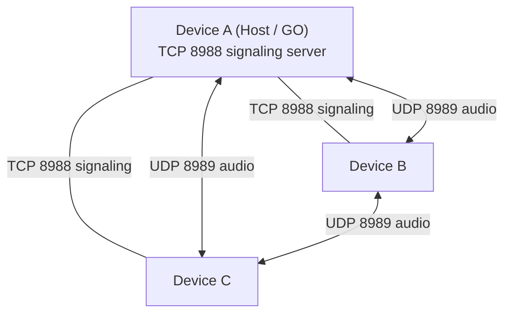
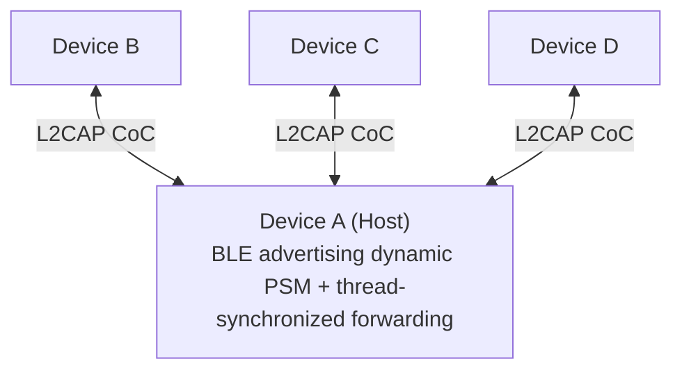

> 🌐 English | [简体中文](../房间模式对比.md)

# Room Mode Comparison

Both room types share the same frame protocol and session abstraction, but they differ completely in topology, conversation style, and suitable scenarios.

## Quick Reference

| | Wi-Fi Room (LAN / hotspot / near-field direct) | Bluetooth BLE L2CAP Room (PTT) |
| --- | --- | --- |
| **Status** | ✅ Available (recommended) | ✅ Available |
| **Conversation mode** | Full-duplex (free conversation) | Push-to-talk (PTT) |
| **Topology** | Star signaling + mesh audio direct send | Star topology (atomic frame forwarding) |
| **Audio path** | UDP point-to-point direct send | Forwarded via the Host's mutex lock |
| **Session class** | `RoomSession` | `RoomSession` (PTT mode) |
| **Signaling / discovery** | TCP 8988 / UDP 8990 broadcast + Wi-Fi Direct P2P | BLE advertising manufacturer data (PSM) |
| **Audio** | UDP 8989 | BLE L2CAP connection-oriented channel (CoC) |
| **Bitrate** | 24 kbps Opus | 16 kbps Opus |
| **Max participants** | 6 devices | 6 devices |
| **Typical range** | Tens of meters in open space | About 10 meters |
| **Dependencies** | Same Wi-Fi router, portable hotspot, or internet-free Wi-Fi Direct connection | Bluetooth 5.0+ (Android 10+ / iOS 15+ / HarmonyOS) |
| **Host transfer** | ✅ Supports manual handover and failure takeover | ❌ Not yet supported (the room dissolves when the host leaves) |
| **Power consumption** | Higher | Lower |

## Wi-Fi Room (LAN / Hotspot / Near-field Direct)



Signaling converges in a TCP star toward the Host, while **audio is sent directly over UDP in a mesh**. Voice between B and C never passes through A — the Host does no forwarding, so it never becomes a bandwidth bottleneck or an extra source of latency. When a new Host takes over, everyone immediately registers the new Host's UDP endpoint, so the voice links recover instantly.

Three underlying connection topologies are supported (negotiated fully automatically by the system; no manual switching required):
1. **Same Wi-Fi router**: devices communicate via UDP 8990 broadcast and the router's LAN IP addresses;
2. **Portable hotspot**: one device enables its hotspot and the other devices join that hotspot's LAN;
3. **Wi-Fi Direct internet-free direct connection**: both sides merely enable Wi-Fi without connecting to any hotspot/router; the Host automatically creates a P2P Group Owner (`192.168.49.1`), and joiners discover and connect directly via P2P probes.

**Pros**: full-duplex, ample bandwidth, best audio quality, host transfer support, fully offline router-free direct connection.
**Best for**: high-fidelity calls for 2–6 people over the same Wi-Fi, a portable hotspot, or offline outdoors.

## Bluetooth BLE L2CAP Room (PTT)



Pure star. There are no direct links between clients; **all audio is forwarded by the Host, synchronized on a native-layer thread**.

PTT-only is a deliberate trade-off: Bluetooth channel bandwidth cannot sustain 6 concurrent full-duplex mixed streams. Making it an explicit push-to-talk keeps link pressure manageable and behavior predictable, and it is closer to the mental model of a walkie-talkie. L2CAP CoC was chosen so that it can interoperate with iOS and HarmonyOS NEXT without MFi certification.

## Nearby Room (Shelved)

The code and unit tests are still in the repository (`transport/nearby/`, two test files covering the manager and the transport), but the Home screen entry is turned off by `HomeRoomAvailability`:

```kotlin
visibleRoomKinds = setOf(RoomKind.WIFI, RoomKind.BLUETOOTH)
```

Three reasons it was shelved:

1. **Dependency on Google Play services** — many device models in mainland China lack GMS and cannot run it. This is the fundamental reason Nearby was never made the sole option in the first place.
2. **No host transfer support** — `NearbyRoomTransport` does not implement `prepareHostTransfer()`; `MainActivity` directly rejects transfer requests for `RoomKind.NEARBY` with "the current room type does not support host handover".
3. **Capability overlap with the Wi-Fi Room** — it is also mesh full-duplex, just with one extra layer of dependency.

Technically it uses `Strategy.P2P_CLUSTER`, one `Payload.Type.BYTES` payload per frame, and clients only initiate connections to peers with `member.id > selfId` to avoid duplicate links.

## How the Session Layer Is Reused

The Wi-Fi Room and the Nearby Room share `RoomSession` (mesh full-duplex), while the Bluetooth Room uses `BluetoothRoomSession` (star PTT). Both expose `StateFlow<RoomUiState>` to the outside, so the UI layer is virtually identical for either.

`RoomScreen` decides which interaction core to render in a very simple way — it checks whether `onPttChanged` is `null`; only the Bluetooth Room passes a non-null value:

```kotlin
if (onPttChanged != null) PushToTalkCore(...) else FullDuplexCore(...)
```

## How to Choose

- **Few people, want natural conversation, can tolerate battery drain** → Wi-Fi Room.
- **More people, want to save power, take-turns talking is enough** → Bluetooth Room (PTT).
- **All devices definitely have GMS and host transfer is not needed** → Nearby Room (you must re-enable the entry yourself).

## Related Pages

- [Protocol Specification](Protocol-Specification.md) · [Audio Pipeline](Audio-Pipeline.md) · [Host Transfer](Host-Transfer.md) · [Troubleshooting](Troubleshooting.md)
