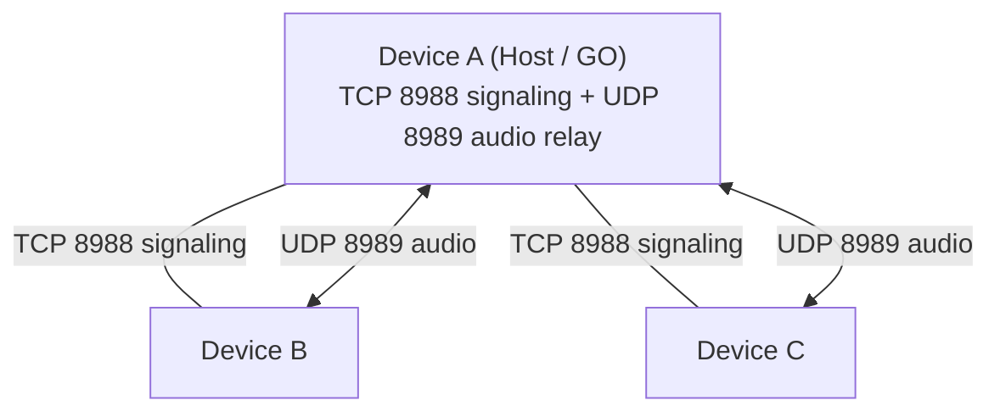
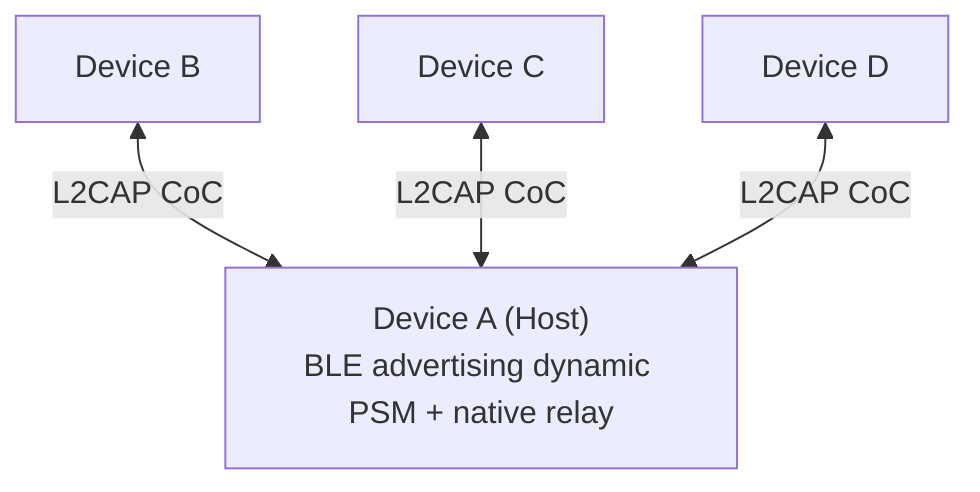

> 🌐 English | [简体中文](../房间模式对比.md)

# Room Mode Comparison

Both room types share the same frame protocol and session abstraction, but they differ in
topology, conversation style, and suitable scenarios.

## Quick Reference

| | Wi-Fi Room (LAN / hotspot / near-field direct) | Bluetooth BLE L2CAP Room (PTT) |
| --- | --- | --- |
| **Status** | ✅ Available (recommended) | ✅ Available |
| **Conversation mode** | Full-duplex (free conversation) | Push-to-talk (PTT) |
| **Topology** | Star signaling + star audio (UDP relayed by the host) | Star (native frame forwarding) |
| **Audio path** | Client → Host → other members (UDP 8989) | Client → Host → other members (L2CAP) |
| **Session class** | `RoomSession` (`wifiFullDuplex`) | `RoomSession` (`bluetoothPtt`) |
| **Signaling / discovery** | TCP 8988 / UDP 8990 broadcast + Wi-Fi Direct P2P | BLE advertising manufacturer data (PSM) |
| **Audio** | UDP 8989 | BLE L2CAP connection-oriented channel (CoC) |
| **Bitrate** | 24 kbps Opus | 16 kbps Opus |
| **Max participants** | 6 devices (host + 5) | 6 devices |
| **Typical range** | Tens of meters in open space | About 10 meters |
| **Dependencies** | Same Wi-Fi router, portable hotspot, or internet-free Wi-Fi Direct connection | Bluetooth 5.0+ (Android 10+ / iOS 15+ / HarmonyOS) |
| **Host transfer** | ✅ Supports manual handover and failure takeover | ❌ Not supported (the room dissolves when the host leaves) |
| **Power consumption** | Higher | Lower |

## Wi-Fi Room (LAN / Hotspot / Near-field Direct)


```mermaid
flowchart TD
    GO["Device A (Host / GO)<br/>TCP 8988 signaling + UDP 8989 audio relay"]
    B["Device B"]
    C["Device C"]

    GO ---|"TCP 8988 signaling"| B
    GO ---|"TCP 8988 signaling"| C
    B <-->|"UDP 8989 audio"| GO
    C <-->|"UDP 8989 audio"| GO
```

Signaling converges on TCP 8988 and audio uses UDP 8989. A client sends its audio
datagrams to the host, which forwards them to every registered endpoint except the source —
so voice between B and C passes through A. After a host transfer, everyone re-registers
using the endpoints from the handover plan and the voice path recovers.

Three underlying connection topologies are supported (negotiated automatically; no manual
switching required):

1. **Same Wi-Fi router**: devices communicate via UDP 8990 broadcast and the router's LAN IP addresses;
2. **Portable hotspot**: one device enables its hotspot and the others join that hotspot's LAN;
3. **Wi-Fi Direct internet-free direct connection**: both sides merely enable Wi-Fi without
   connecting to any hotspot/router; the host creates a P2P Group Owner (`192.168.49.1`)
   and joiners discover and connect via P2P probes.

**Pros**: full-duplex, ample bandwidth, best audio quality, host transfer support, fully offline.
**Best for**: high-fidelity calls for 2–6 people over the same Wi-Fi, a portable hotspot, or offline outdoors.

## Bluetooth BLE L2CAP Room (PTT)


```mermaid
flowchart TD
    H["Device A (Host)<br/>BLE advertising dynamic PSM + native relay"]
    B["Device B"]
    C["Device C"]
    D["Device D"]

    B <-->|"L2CAP CoC"| H
    C <-->|"L2CAP CoC"| H
    D <-->|"L2CAP CoC"| H
```

Pure star. There are no direct links between clients; **all frames are forwarded by the
host natively to the other members**.

PTT-only is a deliberate trade-off: Bluetooth channel bandwidth cannot sustain 6
concurrent full-duplex mixed streams. An explicit push-to-talk keeps link pressure
manageable and behavior predictable, and it matches the walkie-talkie mental model.
L2CAP CoC was chosen so it can interoperate with iOS and HarmonyOS NEXT without MFi
certification. The PSM is allocated dynamically by the host's system and advertised over
BLE; it is never hard-coded.

## How the Session Layer Is Reused

The Wi-Fi Room and the Bluetooth Room share the same `RoomSession`, using `RoomMode` to
distinguish the topology; both expose the same Dart `Stream`s (`stateStream`,
`membersStream`, etc.), so the UI layer is virtually identical.

The room page picks the full-duplex or PTT interaction core based on the session mode:

```dart
// RoomContent switches between the PTT core and the full-duplex core via isFullDuplex.
final isPtt = !session.isFullDuplex;
```

## How to Choose

- **Few people, want natural conversation, can tolerate battery drain** → Wi-Fi Room.
- **More people, want to save power, take-turns talking is enough** → Bluetooth Room (PTT).

## Related Pages

- [Protocol Specification](Protocol-Specification.md) · [Audio Pipeline](Audio-Pipeline.md) · [Host Transfer](Host-Transfer.md) · [Troubleshooting](Troubleshooting.md)
