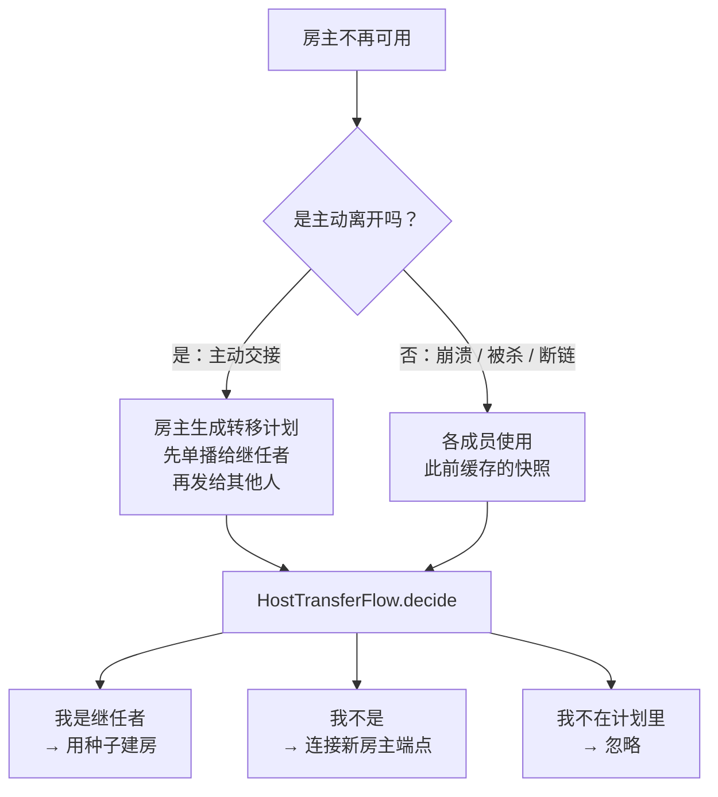

> 🌐 [English](en/Host-Transfer.md) | 简体中文
# 房主转移机制

全项目最复杂的部分。目标是：**房主离开时房间不解散。**

在没有服务器的架构里，房主同时是信令中枢、成员分配者，蓝牙房里还是混音器。房主一走，房间理论上就没了。这套机制让剩下的人自动选出继任者并重建房间。

## 两条路径



### 路径一：主动交接

房主点「离开」时，传输层调用 `prepareHostTransfer()`（`WifiHostTransport` / `BluetoothHostTransport` 各自实现）：

1. 用 `HostElection` 选出继任者。
2. 把 `HOST_TRANSFER` 帧**先单播给继任者**，再发给其余成员。
3. 若成功，**不再广播普通的 `LEAVE`**——否则其他成员会误以为只是一个普通成员离开。

这一点被 `RoomSessionTest` 和 `BluetoothRoomSessionTest` 双双锁定：「已准备转移的房主不会再广播 LEAVE」。

### 路径二：异常接管

房主崩溃、被系统杀死或链路突然断开时，来不及发任何东西。所以采用**预先分发快照**的策略：

- 房主**每次推送花名册时**顺带发一个 `HOST_SNAPSHOT` 帧。
- 客户端把它缓存为 `recoverySnapshot`。
- 客户端断线后，先按 `ReconnectPolicy` 重试 1 / 2 / 4 秒。三次耗尽后，`RoomSession.onDisconnected` / `BluetoothRoomSession.onDisconnected` **不是结束房间**，而是把缓存的快照提升为 `onHostTransfer(snapshot)`，走与主动交接完全相同的后续流程。

这是整个机制的关键取舍：**用一点持续带宽（每次花名册更新多一帧）换取房主崩溃后的可恢复性。**

## 选举规则

`HostElection`（`transport/HostTransfer.kt`）：

1. 过滤出 `connected && endpoint.isNotBlank()` 的成员——**必须在线，且必须有稳定端点**。
2. 按 `joinOrder` 排序，相同则按 `memberId`。
3. 取第一个作为继任者。

也就是**仍在线的、最早入房的成员**继位。规则简单且完全确定——所有设备用同一份快照会算出同一个结果，不需要任何协商轮次。

正在重连中的成员**不算在线**，会被跳过（`BluetoothTransportContractTest` 有专门用例：「转移跳过正在重连的最早成员」）。

## 数据结构

当前 Flutter 实现位于 `lib/core/session/host_transfer.dart`：

```dart
TransferCandidate(memberId, joinOrder, nickname, endpoint, sessionToken, connected)
HostTransferMember(memberId, joinOrder, nickname, endpoint, sessionToken)
HostTransferPlan(successorId, members) // MAX_MEMBERS = 6
SeededTransferMember(previousId, newId, joinOrder, nickname, endpoint, sessionToken)
HostTransferSeed(members, nextJoinOrder)
```

`HostTransferPlan` 的校验相当严格：成员 ID、端点、入房顺序三者各自唯一，继任者必须在成员列表内，`successorId in 1..255`。

`HostTransferSeed.from(plan)` 做 ID 重映射——**继任者变成 ID `0`**（房主固定 ID），其余成员重排为 `1..N`，`nextJoinOrder = maxOrder + 1`。重映射后**原始入房顺序被保留**，因此后续再次转移仍按最初的入房次序进行，A→B→C 的链条是稳定的。

## 端点：稳定身份的关键

选举结果里的 `endpoint` 是其他成员用来**重新连接新房主**的地址。它必须在房主更替后依然有效，所以不能用 IP（WiFi 组重建后会变）：

| 房型 | endpoint 内容 | 来源 |
| --- | --- | --- |
| WiFi | P2P 设备地址 | `wifi.thisDevice.value.deviceAddress`，过滤掉匿名占位值 `02:00:00:00:00:00` |
| 蓝牙 | 蓝牙 MAC | 服务端从 `connection.remoteAddress` 推导 |
| Nearby | —— | 不支持转移 |

端点不在当前 JOIN payload 中，由传输层从实际连接维护。没有稳定端点的成员**不具备继任资格**。

## 客户端如何决策

当前 Flutter 由 `RoomSession._handleHostHandover`、`_handleHostAnnounce`、
`_becomeHost` 和 `_followNewHost` 执行交接：

```dart
HostTransferCodec.decode(payload) -> HostTransferPlan
```

不在计划中的设备或无法通过计划校验的设备直接忽略，不改变当前会话。

## 重建房间

### 蓝牙房

继任者用种子重新开启 RFCOMM 服务端，其余成员连过去。重建时使用**非安全模式**（`secure = false`），避免系统再次要求配对确认。

### WiFi 房

继任者需要**重建整个 WiFi Direct 组**，其余成员按继任者的设备地址重连。这个过程有代价：

- 语音会**短暂中断**。
- 系统**可能再次弹出连接确认对话框**。

这是 WiFi 房转移体验不如蓝牙房的根本原因，也是当前列在已知限制里的一条。

## 保留与释放

继任者接手后，会为**尚未重连的原成员保留位置** 7 秒（`TRANSFER_RESERVATION_GRACE_MS = 7_000L`），凭令牌重连即可恢复原 ID 与入房顺序。

超时后释放——否则一台永远不回来的设备会永久占用 6 个名额中的一个。`BluetoothTransportContractTest` 和 `WifiTransportTest` 都有「继任者在宽限期后释放未重连的保留」用例。

保留期间，**持错误令牌的设备无法冒名占用**该位置。

## 编解码

当前 Flutter 实现只使用 `HostTransferCodec` v2：每个成员必须附带唯一的、
非全零 16 字节 `sessionToken`，新房主可在重连时恢复原成员号；格式见
[协议规范](协议规范.md#host_transfer--host_snapshot)。缺少 Token 的计划不会降级，
而是被拒绝。解码会拒绝版本号错误、成员数越界、端点含非 ASCII、UTF-8 非法、
token 不完整和多余尾字节。

注意：token 随当前明文控制帧传输，不是加密密钥，也不能提供防窃听或防复制能力。

## 已知限制

- **依赖快照已送达**——客户端必须已收到至少一次 `HOST_SNAPSHOT` 才能接管。房间刚建立就断电、所有候选设备同时离线、或无线环境完全隔离时无法恢复。
- **WiFi 转移中断语音**——需要重建 P2P 组，期间语音断续，系统可能再次弹确认框。
- **Nearby 房不支持**——`NearbyRoomTransport` 未实现 `prepareHostTransfer()`。
- **连续 A→B→C 转移待真机验收**——逻辑上由「保留原始入房顺序」保证，单元测试也覆盖了，但多机真机验收尚未完成。

## 相关测试

| 测试文件 | 覆盖 |
| --- | --- |
| `test/host_transfer_test.dart` | 选举、Token 唯一性、v2 往返、拒绝 v1/截断/尾随字节、种子重映射 |
| `test/room_session_test.dart` | 快照缓存、v2 接管、Token 重连复用成员号、非法计划忽略 |

## 相关页面

- [协议规范](协议规范.md) · [房间模式对比](房间模式对比.md) · [架构总览](架构总览.md)
