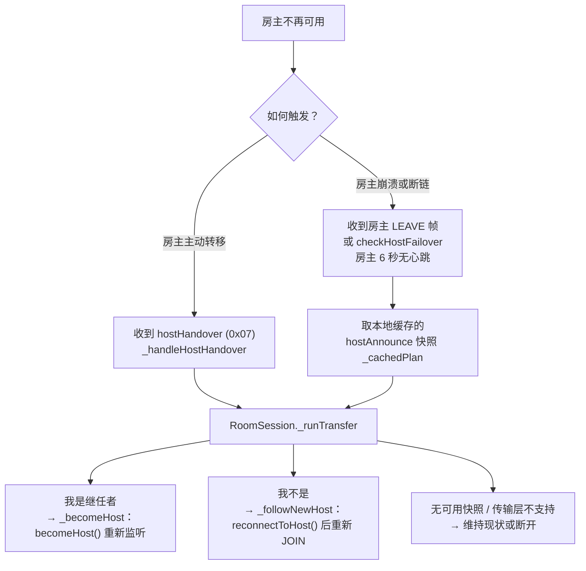

> 🌐 [English](en/Host-Transfer.md) | 简体中文
# 房主转移机制

全项目最复杂的部分。目标是：**房主离开时房间不解散。**

在没有服务器的架构里，房主同时是信令中枢和成员分配者。房主一走，房间理论上就没了。这套机制让剩下的人自动选出继任者并重建房间。

## 会话与房主

当前实现只有一个会话类：`lib/core/session/room_session.dart` 里的 `RoomSession`。两种房间模式由 `RoomMode` 区分：`wifiFullDuplex`（Wi-Fi 全双工）和 `bluetoothPtt`（蓝牙 PTT）。

- 房主固定成员号 **1**，客户端获得 **2..6**，房间容量 **6**。
- 心跳每 **2 秒**一次；房主在每次心跳里调用 `pruneStaleMembers()`，把 **10 秒**内没有任何帧的成员移出名单（`_memberTimeout = Duration(seconds: 10)`）。
- 房主是名单的唯一权威，成员号由 `_handleJoinReq` 分配；`sessionToken`（16 字节）用来判定重连成员，昵称不能作为身份依据。

## 触发路径

房主转移的入口只有一个：`RoomSession._runTransfer(plan)`。`plan` 可能来自即时收到的交接帧，也可能来自此前缓存的快照。


```mermaid
flowchart TD
    START["房主不再可用"]
    KIND{"如何触发？"}
    HANDOVER["收到 hostHandover (0x07)<br/>_handleHostHandover"]
    LEAVE["收到房主 LEAVE 帧<br/>或 checkHostFailover<br/>房主 6 秒无心跳"]
    PLAN["取本地缓存的<br/>hostAnnounce 快照 _cachedPlan"]
    RUN["RoomSession._runTransfer"]
    BECOME["我是继任者<br/>→ _becomeHost：becomeHost() 重新监听"]
    FOLLOW["我不是<br/>→ _followNewHost：reconnectToHost() 后重新 JOIN"]
    NONE["无可用快照 / 传输层不支持<br/>→ 维持现状或断开"]

    START --> KIND
    KIND -->|"房主主动转移"| HANDOVER
    KIND -->|"房主崩溃或断链"| LEAVE
    HANDOVER --> RUN
    LEAVE --> PLAN
    PLAN --> RUN
    RUN --> BECOME
    RUN --> FOLLOW
    RUN --> NONE
```

### 主动交接

房主调用 `transferHost(targetMemberId)`：

1. 用 `_buildTransferPlan(preferredSuccessorId: targetMemberId)` 组装计划。若还不知道目标成员的端点（对端从未发过语音），直接放弃并记录日志。
2. 广播 `FrameType.hostHandover (0x07)`，载荷是 v2 编码的完整计划。
3. 等待 300 ms 让帧发出去，然后房主自己调用 `_followNewHost()`，降为普通成员重连到继任者。

没有 `prepareHostTransfer()`，也没有「先单播给继任者」这一步：交接帧走普通发送路径，房主角色下由传输层转发给其余成员。

### 异常接管

房主崩溃、被系统杀死或链路突然断开时，来不及发交接帧。所以采用**预先分发快照**：

- 房主**每次 2 秒心跳**都会调用 `_broadcastSnapshot()`，发送 `FrameType.hostAnnounce (0x08)` 帧，载荷与交接帧相同；房主自己也把它缓存为 `_cachedPlan`。
- 客户端在 `_handleHostAnnounce` 里只缓存，不改变当前房主——一条迟到的快照绝不能把现任房主顶下去。`_isPlanFresh` 用计划中最大的 `joinOrder` 过滤掉迟到或被重放的旧计划。
- 触发接管有两种：收到房主的 `leave` 帧（`_handleLeave`，且该成员在缓存名单里标记为房主），或 `checkHostFailover()` 发现房主 `lastActiveAt` 超过 **6 秒**未更新。
- 两条路径都检查 `_cachedPlan`：有快照就 `_runTransfer`；没有快照就直接把会话置为 `disconnected`。

这是整个机制的关键取舍：**用一点持续带宽（每次心跳多一帧快照）换取房主崩溃后的可恢复性。**

## 选举规则

`HostElection`（`lib/core/session/host_transfer.dart`）：

1. 过滤出 `connected && endpoint.trim().isNotEmpty` 的候选——**必须在线，且必须有非空端点**。
2. 按 `joinOrder` 升序排序，相同则按 `memberId` 升序。
3. 取第一个作为继任者；没有合格候选时返回 `null`。

也就是**仍在线的、最早入房的成员**继位。规则简单且完全确定——所有设备用同一份计划会算出同一个结果，不需要任何协商轮次。

房主侧组装的 `_buildTransferPlan` 只把**除房主外、端点非空、且持有有效 16 字节 `sessionToken`** 的成员纳入候选；任一成员缺 token 会让整份计划作废（返回 `null`），而不是降级。端点来自 `transport.peerEndpoints`，取不到时回退成员表里已记录的 `endpoint`。

## 数据结构

当前实现位于 `lib/core/session/host_transfer.dart`：

```dart
TransferCandidate(memberId, joinOrder, nickname, endpoint, sessionToken, connected)
HostTransferMember(memberId, joinOrder, nickname, endpoint, sessionToken)
HostTransferPlan(successorId, members) // maxMembers = 6
HostTransferSeed(members, nextJoinOrder) // SeededTransferMember(previousId, newId, ...)
HostElection.plan(candidates) // 组装整份计划
```

`HostTransferPlan` 的校验相当严格：成员 ID、端点（大小写不敏感）、`joinOrder` 三者各自唯一；继任者必须在成员列表内；`successorId` 与每个成员 ID 都在 `1..255`；`joinOrder >= 0`；端点非空；每个成员的 `sessionToken` 必须是唯一的、非全零的 16 字节。

`HostTransferSeed.from(plan)` 按 `joinOrder` / `memberId` 排序后做 ID 重映射——**继任者排到最前，`newId = 0`（随后作为房主取 1）**，其余成员重排为 `1..N`，`nextJoinOrder = maxOrder + 1`。重映射后**原始 `joinOrder` 被保留**，因此后续再次转移仍按最初的入房次序进行，A→B→C 的链条是稳定的。`expectedByEndpoint()` 按端点索引除新房主外的成员，供新房主认领重连上来的人。

## 线格式（`HostTransferCodec` v2）

```
[version=2 1B][successorId 1B][count 1B]
每个成员：[memberId 1B][joinOrder 8B 大端][nickLen 1B][nick UTF-8]
         [endpointLen 1B][endpoint ASCII][sessionToken 16B]
```

编码时昵称按 UTF-8 截断到 64 字节且不切断多字节字符，端点必须为 ASCII。解码会拒绝：版本号不是 2、成员数不在 `1..6`、端点含非 ASCII、UTF-8 非法、token 不完整、载荷超过 `Frame.maxPayloadSize`、以及尾部多余字节。缺少完整 Token 的计划不会降级，而是被拒绝。

注意：token 随当前明文控制帧传输，不是加密密钥，也不能提供防窃听或防复制能力。

## 客户端如何决策

- `_handleHostHandover`：校验发送者确实是名单里的房主（`_isHostFrame`），解码计划，做 `_isPlanFresh` 检查，然后立即 `_runTransfer`。
- `_handleHostAnnounce`：同样的解码与新鲜度检查，但**只**写入 `_cachedPlan`。
- `_runTransfer`：若 `transport == null` 或 `!transport.supportsHostTransfer`，记录错误并返回，不改变会话。否则按 `plan.successorId == _selfMemberId` 分流：
  - `_becomeHost(plan, t)`：`HostTransferSeed.from(plan)` 重建成员表，`t.becomeHost()` 重新监听；继任者成为成员 1，其余成员保留原 ID、`joinOrder`、端点和 token；恢复 `_nextJoinOrder` 并广播新名单。**音频管线不重启。**
  - `_followNewHost(plan, t)`：`t.reconnectToHost(plan.successor.endpoint)` 重连，成功后调用 `joinRoom(startAudio: false)` 重新走一次 JOIN，**不重启音频**。

链路的意外断开由 `ReconnectController` 单独处理：按 `[1s, 2s, 4s]` 退避重试 `t.reconnect()` + 重新 JOIN；三次都失败后触发 `onMaxRetriesReached`，会话进入 `disconnected`。

## 重建房间

### Wi-Fi 房（`LanTransport`）

继任者 `becomeHost()` = `stop()` + `startHost()`：重新绑定控制 TCP `8988` 和语音 UDP `8989` 开始监听。其余成员 `reconnectToHost(endpoint)` = `stop()` + 以 300 ms 间隔最多尝试 6 次 `startClient()`。这个过程有代价：

- 语音会**短暂中断**。
- Wi-Fi Direct 组可能重建，系统**可能再次弹出连接确认对话框**。

首次入房时客户端连的是 Wi-Fi Direct 的组主地址（`WifiDirectManager` 返回的 `groupOwnerAddress`，典型值 `192.168.49.1`）；交接后的重连则用交接计划里缓存的继任者 IP。

### 蓝牙房（`BleL2capTransport`）

**蓝牙房不支持房主转移。** `BleL2capTransport.supportsHostTransfer` 恒为 `false`，`peerEndpoints` 恒为空 Map，`becomeHost()` / `reconnectToHost()` 只记录错误并返回 `false`。原因是 L2CAP 的 PSM 由系统在开监听时分配并经 BLE 广播发布，换房主意味着新房主要重新开监听、重新广播，其余人全部重新扫描发现新 PSM——这套流程尚未实现。

## 端点：稳定身份的关键

选举结果里的 `endpoint` 是其他成员用来**重新连接新房主**的地址。没有稳定端点的成员**不具备继任资格**——别人找不到他。

| 房型 | 传输层 | `supportsHostTransfer` | endpoint 来源 |
| --- | --- | --- | --- |
| Wi-Fi 全双工 | `LanTransport` | `true` | `peerEndpoints`，由 UDP 语音包源地址（`_audioEndpoints`）推导出的对端 IP |
| 蓝牙 PTT | `BleL2capTransport` | `false` | `peerEndpoints` 恒为空，不支持转移 |

端点不在 JOIN payload 中，由传输层从实际连接维护。

## 身份预留与重连

继任者在 `_becomeHost` 里**用计划预先填好成员表**：尚未重连的原成员也带着原 ID、`joinOrder`、端点和 token 留在名单里，因此他们的位置被保留。凭同一个 16 字节 `sessionToken` 重新 JOIN 时，`_handleJoinReq` 按 token 匹配回原成员号与 `joinOrder`，昵称可以更新但身份不变。

当前 Dart 实现里**没有独立的预留计时器**：未重连的成员由新房主常规的 10 秒心跳超时（`pruneStaleMembers`）清理，超时后释放名额，否则一台永远不回来的设备会永久占用 6 个名额之一。token 不匹配的设备无法冒名占用预留位置。

## 已知限制

- **依赖快照已送达**——客户端必须已收到至少一次 `hostAnnounce` 才能接管。房主在任何人收到快照前就断电、所有候选设备同时离线、或无线环境完全隔离时无法恢复。
- **Wi-Fi 转移中断语音**——需要重建监听与 Wi-Fi Direct 组，期间语音断续，系统可能再次弹确认框。
- **蓝牙房不支持**——`BleL2capTransport.supportsHostTransfer == false`，蓝牙房不会发生房主转移。
- **继任者端点必须已知**——端点来自对端的 UDP 语音包源地址，从未说过话的成员没有端点，无法被选为继任者。
- **连续 A→B→C 转移待真机验收**——逻辑上由「保留 `joinOrder`」保证，单元测试也覆盖了，但多机真机验收尚未完成。

## 相关测试

| 测试文件 | 覆盖 |
| --- | --- |
| `test/host_transfer_test.dart` | v2 编解码往返、拒绝 v1 / 截断 / 尾随字节 / 非 ASCII 端点、计划校验、`HostElection` 选取规则、种子重映射与 `expectedByEndpoint` |
| `test/room_session_test.dart` | 快照只缓存不顶替房主、丢弃 `joinOrder` 更小的旧计划、v2 交接后预留 token 并在重连 JOIN 时复用原成员号 |

## 相关页面

- [协议规范](协议规范.md) · [房间模式对比](房间模式对比.md) · [架构总览](架构总览.md)
