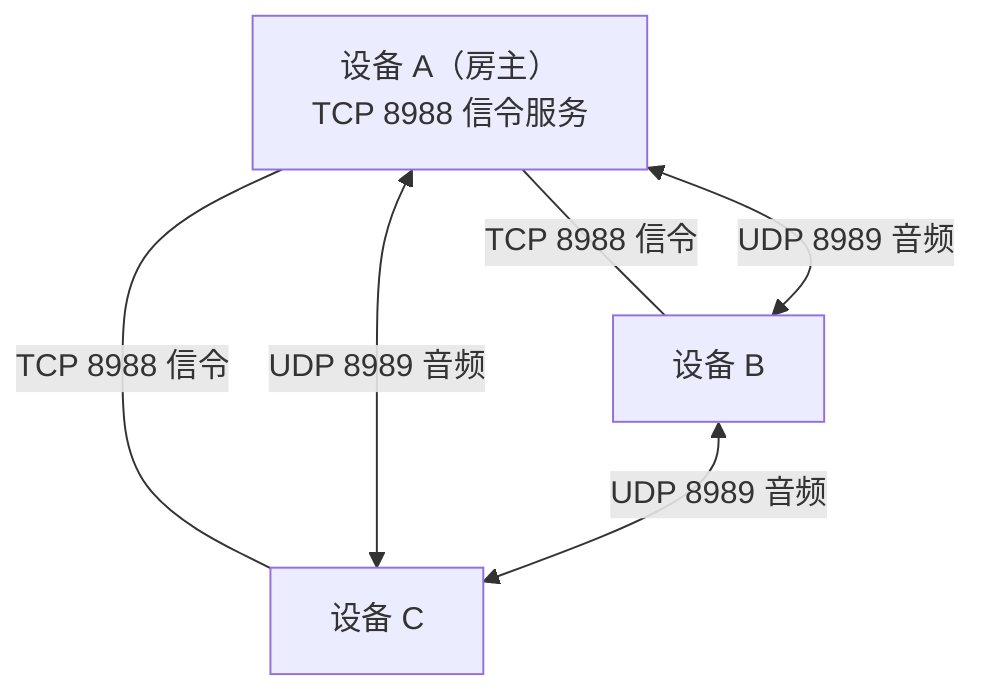
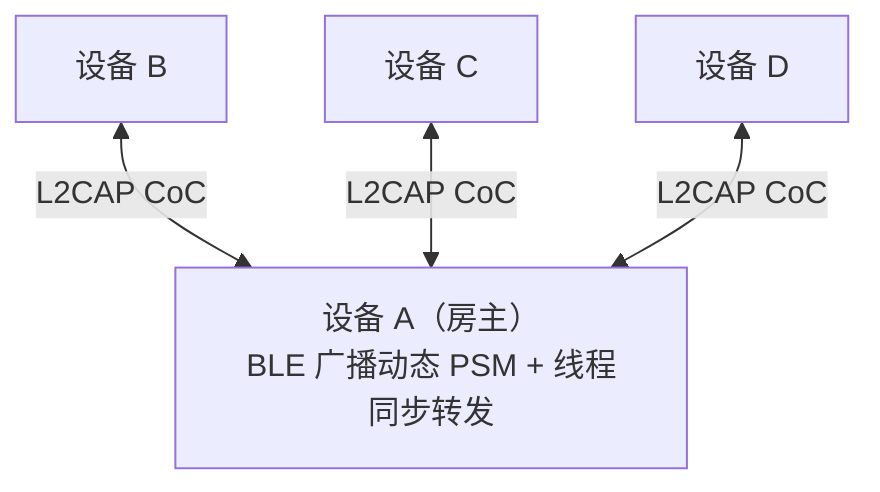

# 房间模式对比

两种房型共用同一套帧协议与会话抽象，但拓扑、通话方式和适用场景完全不同。

## 速查

| | WiFi 局域网/热点房 | 蓝牙 BLE L2CAP 房 |
| --- | --- | --- |
| **状态** | ✅ 可用（推荐） | ✅ 可用 |
| **通话方式** | 全双工（自由交谈） | 按住说话（PTT） |
| **拓扑** | 星型信令 + 网状音频直发 | 星型拓扑（原子帧转发） |
| **音频路径** | UDP 点对点直发 | 经房主互斥锁转发 |
| **会话类** | `RoomSession` | `RoomSession` (PTT 模式) |
| **信令 / 发现** | TCP 8988 / UDP 8990 广播 | BLE 广播厂商数据 (PSM) |
| **音频** | UDP 8989 | BLE L2CAP 面向连接通道 (CoC) |
| **码率** | 24 kbps Opus | 16 kbps Opus |
| **最大人数** | 6 台设备 | 6 台设备 |
| **典型距离** | 空旷数十米 | 约 10 米 |
| **依赖** | 同一 Wi-Fi 路由或随身热点 | 蓝牙 5.0+ (Android 10+ / iOS 15+ / 鸿蒙) |
| **房主转移** | ✅ 支持手动与异常接管 | ❌ 暂不支持（主机退出即散会） |
| **功耗** | 较高 | 较低 |

## WiFi 局域网/热点房



信令走 TCP 星型汇聚到房主，**音频走 UDP 网状直发**。B 和 C 之间的语音不经过 A——房主不做转发，因此不会成为带宽瓶颈或额外延迟源。新房主接管时，全员即刻注册新房主 UDP 端点，保障语音链路瞬间恢复。

**优点**：全双工、带宽充裕、音质最好、支持房主转移。
**适用**：同一 Wi-Fi 或随身热点下 2~6 人高保真通话。

## 蓝牙 BLE L2CAP 房



纯星型。客户端之间没有直连链路，**所有音频由房主在原生层线程同步转发**。

只做 PTT 是刻意的取舍：蓝牙信道带宽撑不起 6 路并发全双工混音，做成明确的按住说话，链路压力可控，行为也可预期，更接近对讲机的心理模型。选用 L2CAP CoC 则是为了无需 MFi 即可与 iOS 及纯血鸿蒙互通。

## Nearby 房（已搁置）

代码与单元测试都在仓库里（`transport/nearby/`，两个测试文件覆盖管理器与传输），但首页入口被 `HomeRoomAvailability` 关掉了：

```kotlin
visibleRoomKinds = setOf(RoomKind.WIFI, RoomKind.BLUETOOTH)
```

搁置的三个原因：

1. **依赖 Google Play 服务**——国内大量机型没有 GMS，跑不起来。这是当初决定不把 Nearby 作为唯一方案的根本原因。
2. **不支持房主转移**——`NearbyRoomTransport` 没有实现 `prepareHostTransfer()`；`MainActivity` 对 `RoomKind.NEARBY` 的转移请求直接返回「当前房型不支持房主交接」。
3. **能力与 WiFi 房重叠**——同样是网状全双工，但多一层依赖。

技术上它是 `Strategy.P2P_CLUSTER`，一帧一个 `Payload.Type.BYTES`，客户端只向 `member.id > selfId` 的对端发起连接以避免重复建链。

## 会话层如何复用

WiFi 房与 Nearby 房共用 `RoomSession`（网状全双工），蓝牙房用 `BluetoothRoomSession`（星型 PTT）。两者都对外暴露 `StateFlow<RoomUiState>`，界面层因此几乎无差别。

`RoomScreen` 判断渲染哪种交互核心的方式很朴素——看 `onPttChanged` 是否为 `null`，只有蓝牙房会传非空值：

```kotlin
if (onPttChanged != null) PushToTalkCore(...) else FullDuplexCore(...)
```

## 怎么选

- **人少、要自然对话、能接受耗电** → WiFi 房。
- **人多、要省电、轮流说话即可** → 蓝牙房。
- **设备明确都有 GMS 且不需要房主转移** → Nearby 房（需自行放开入口）。

## 相关页面

- [协议规范](协议规范.md) · [音频管线](音频管线.md) · [房主转移机制](房主转移机制.md) · [故障排查](故障排查.md)
