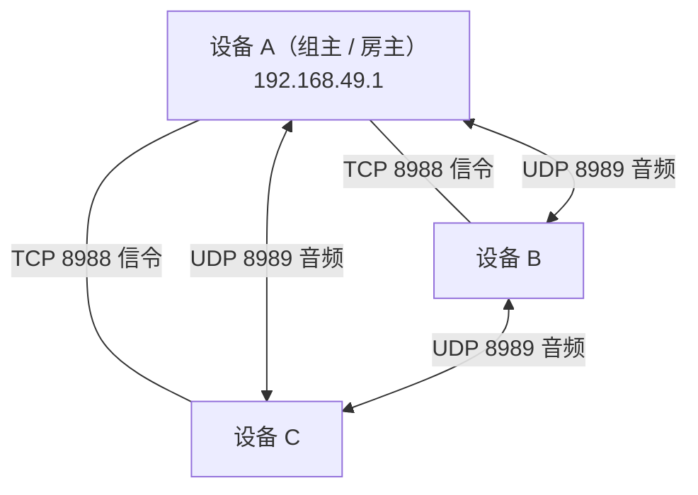
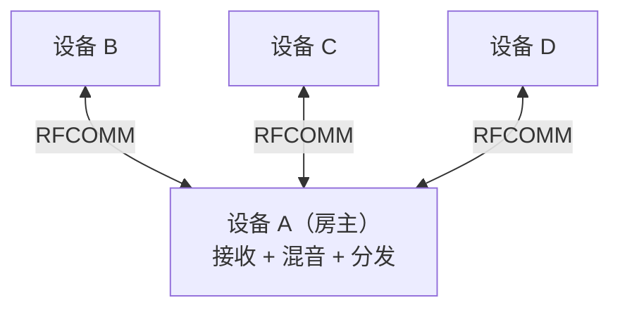

# 房间模式对比

三种房型共用同一套帧协议与会话抽象，但拓扑、通话方式和适用场景完全不同。

## 速查

| | WiFi Direct 房 | 蓝牙 RFCOMM 房 | Nearby 房 |
| --- | --- | --- | --- |
| **状态** | ✅ 可用 | ✅ 可用 | ⏸ 已实现，入口隐藏 |
| **通话方式** | 全双工 | 按住说话（PTT） | 全双工 |
| **拓扑** | 网状 | 星型 | 网状 |
| **音频路径** | 点对点直发 | 经房主混音转发 | 点对点直发 |
| **会话类** | `RoomSession` | `BluetoothRoomSession` | `RoomSession` |
| **信令** | TCP 8988 | RFCOMM 单流复用 | Nearby BYTES |
| **音频** | UDP 8989 | 同上，同一条流 | 同上 |
| **码率** | 24 kbps | 16 kbps | 24 kbps |
| **最大人数** | 6 | 6 | 6 |
| **典型距离** | 空旷数十米 | 约 10 米 | 取决于底层选路 |
| **依赖** | WiFi P2P 支持 | 经典蓝牙 RFCOMM | Google Play 服务 |
| **房主转移** | ✅ | ✅ | ❌ |
| **功耗** | 较高 | 较低 | 较高 |

## WiFi Direct 房



信令走 TCP 星型汇聚到房主，**音频走 UDP 网状直发**。B 和 C 之间的语音不经过 A——组主只是普通参与者，不做转发，因此不会成为带宽瓶颈或额外延迟源。

组主地址由 Android 固定为 `192.168.49.1`。客户端每 3 秒发一次 `PING` 维持房主侧的读超时（10 秒）。首帧必须在 5 秒内送达且必须是 `JOIN`，否则连接被关闭。

**优点**：全双工、带宽充裕、音质最好。
**代价**：功耗明显更高；建组时系统可能弹出连接确认对话框；部分机型的 WiFi P2P 实现有各自的怪癖。

## 蓝牙 RFCOMM 房



纯星型。客户端之间没有直连链路，**所有音频必须经房主转发**，因此房主承担混音职责：给每个成员发一路定制混音，内容是「所有人的声音减去你自己的」。

只做 PTT 是刻意的取舍。RFCOMM 的有效带宽撑不起 6 路全双工混音——强行做只会得到断续、忽高忽低的全双工体验。做成明确的按住说话，链路压力可控，行为也可预期，更接近对讲机的心理模型。

配套机制：

- 发送队列音频容量 3 帧，溢出丢最旧的音频，信令永不丢。
- 房主用自己分配的成员 ID 重写收到的帧头，客户端伪造 `senderId` 无效。
- 可被发现时长 300 秒。
- 房主转移后重建连接使用**非安全模式**，避免重新配对。

**优点**：功耗低、配对模型为用户熟悉、连接稳定。
**代价**：半双工、码率低、距离短。

## Nearby 房（已搁置）

代码与单元测试都在仓库里（`transport/nearby/`，两个测试文件覆盖管理器与传输），但首页入口被 `HomeRoomAvailability` 关掉了：

```kotlin
visibleRoomKinds = setOf(RoomKind.WIFI, RoomKind.BLUETOOTH)
```

搁置的三个原因：

1. **依赖 Google Play 服务**——国内大量机型没有 GMS，跑不起来。这是当初决定不把 Nearby 作为唯一方案的根本原因。
2. **不支持房主转移**——`NearbyRoomTransport` 没有实现 `prepareHostTransfer()`；`MainActivity` 对 `RoomKind.NEARBY` 的转移请求直接返回「当前房型不支持房主交接」。
3. **能力与 WiFi 房重叠**——同样是网状全双工，但多一层依赖。

技术上它是 `Strategy.P2P_CLUSTER`，一帧一个 `Payload.Type.BYTES`，客户端只向 `member.id > selfId` 的对端发起连接以避免重复建链。

## 会话层如何复用

WiFi 房与 Nearby 房共用 `RoomSession`（网状全双工），蓝牙房用 `BluetoothRoomSession`（星型 PTT）。两者都对外暴露 `StateFlow<RoomUiState>`，界面层因此几乎无差别。

`RoomScreen` 判断渲染哪种交互核心的方式很朴素——看 `onPttChanged` 是否为 `null`，只有蓝牙房会传非空值：

```kotlin
if (onPttChanged != null) PushToTalkCore(...) else FullDuplexCore(...)
```

## 怎么选

- **人少、要自然对话、能接受耗电** → WiFi 房。
- **人多、要省电、轮流说话即可** → 蓝牙房。
- **设备明确都有 GMS 且不需要房主转移** → Nearby 房（需自行放开入口）。

## 相关页面

- [协议规范](协议规范.md) · [音频管线](音频管线.md) · [房主转移机制](房主转移机制.md) · [故障排查](故障排查.md)
