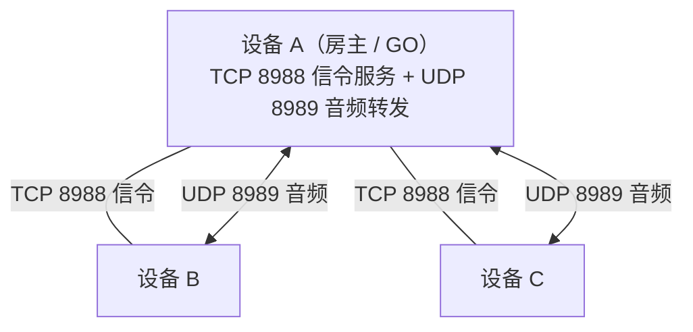
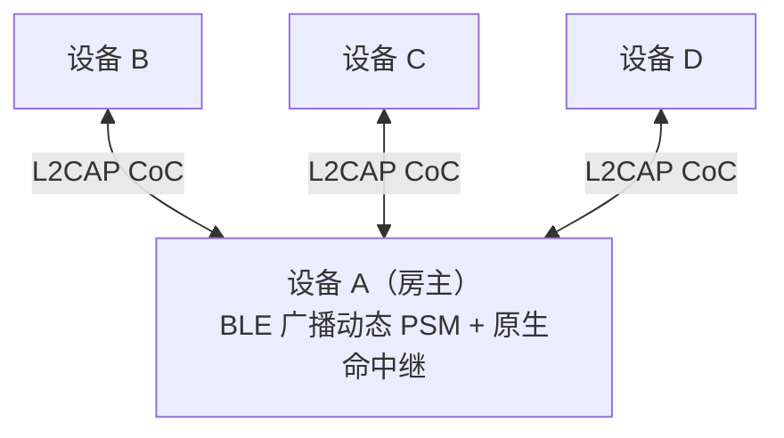

> 🌐 [English](en/Room-Modes.md) | 简体中文
# 房间模式对比

两种房型共用同一套帧协议与会话抽象，但拓扑、通话方式和适用场景不同。

## 速查

| | WiFi 房（局域网/热点/近场直连） | 蓝牙 BLE L2CAP 房 |
| --- | --- | --- |
| **状态** | ✅ 可用（推荐） | ✅ 可用 |
| **通话方式** | 全双工（自由交谈） | 按住说话（PTT） |
| **拓扑** | 星型信令 + 星型音频（经房主 UDP 转发） | 星型（原生帧转发） |
| **音频路径** | 客户端 → 房主 → 其余成员（UDP 8989） | 客户端 → 房主 → 其余成员（L2CAP） |
| **会话类** | `RoomSession` (`wifiFullDuplex`) | `RoomSession` (`bluetoothPtt`) |
| **信令 / 发现** | TCP 8988 / UDP 8990 广播 + Wi-Fi Direct P2P | BLE 广播厂商数据 (PSM) |
| **音频** | UDP 8989 | BLE L2CAP 面向连接通道 (CoC) |
| **码率** | 24 kbps Opus | 16 kbps Opus |
| **最大人数** | 6 台设备（房主 + 5） | 6 台设备 |
| **典型距离** | 空旷数十米 | 约 10 米 |
| **依赖** | 同一 Wi-Fi 路由、随身热点或 Wi-Fi Direct 免网直连 | 蓝牙 5.0+ (Android 10+ / iOS 15+ / 鸿蒙) |
| **房主转移** | ✅ 支持手动与异常接管 | ❌ 暂不支持（主机退出即散会） |
| **功耗** | 较高 | 较低 |

## WiFi 房（局域网 / 热点 / 近场直连）


```mermaid
flowchart TD
    GO["设备 A（房主 / GO）<br/>TCP 8988 信令服务 + UDP 8989 音频转发"]
    B["设备 B"]
    C["设备 C"]

    GO ---|"TCP 8988 信令"| B
    GO ---|"TCP 8988 信令"| C
    B <-->|"UDP 8989 音频"| GO
    C <-->|"UDP 8989 音频"| GO
```

信令汇聚到 TCP 8988，音频走 UDP 8989。客户端把音频数据报发给房主，
房主按已登记的端点表转发给除来源外的其他成员——因此 B 与 C 之间的语音会经过 A。
房主转移后，全员用交接计划里的新端点重新登记，语音链路随之恢复。

支持三种底层连接拓扑（系统全自动协商，无需用户手动切换）：

1. **同一 Wi-Fi 路由器**：设备间通过 UDP 8990 广播与路由器内网 IP 通信；
2. **随身热点**：一台设备开启热点，其余设备接入热点局域网；
3. **Wi-Fi Direct 免网直连**：双方开启 Wi-Fi 开关但无需连接任何热点/路由器，
   房主自动创建 P2P Group Owner（`192.168.49.1`），加入者通过 P2P 探针自动发现并直连。

**优点**：全双工、带宽充裕、音质最好、支持房主转移、支持完全离线免路由直连。
**适用**：同一 Wi-Fi、随身热点或离线户外 2~6 人高保真通话。

## 蓝牙 BLE L2CAP 房


```mermaid
flowchart TD
    H["设备 A（房主）<br/>BLE 广播动态 PSM + 原生命中继"]
    B["设备 B"]
    C["设备 C"]
    D["设备 D"]

    B <-->|"L2CAP CoC"| H
    C <-->|"L2CAP CoC"| H
    D <-->|"L2CAP CoC"| H
```

纯星型。客户端之间没有直连链路，**所有帧由房主在原生层转发给其余成员**。

只做 PTT 是刻意的取舍：蓝牙信道带宽撑不起 6 路并发全双工混音，做成明确的按住说话，
链路压力可控、行为可预期，也更接近对讲机的心理模型。选用 L2CAP CoC 则是为了无需 MFi
即可与 iOS 及纯血鸿蒙互通。PSM 由房主系统动态分配并经 BLE 广播发布，不写死。

## 会话层如何复用

WiFi 房与蓝牙房共用同一个 `RoomSession`，用 `RoomMode` 区分拓扑；两者都对外暴露
同一组 Dart `Stream`（`stateStream`、`membersStream` 等），界面层因此几乎无差别。

房间页通过会话模式决定渲染全双工还是 PTT 交互核心：

```dart
// RoomContent 依据 isFullDuplex 在 PTT 核心与全双工核心之间切换。
final isPtt = !session.isFullDuplex;
```

## 怎么选

- **人少、要自然对话、能接受耗电** → WiFi 房。
- **人多、要省电、轮流说话即可** → 蓝牙房（PTT）。

## 相关页面

- [协议规范](协议规范.md) · [音频管线](音频管线.md) · [房主转移机制](房主转移机制.md) · [故障排查](故障排查.md)
