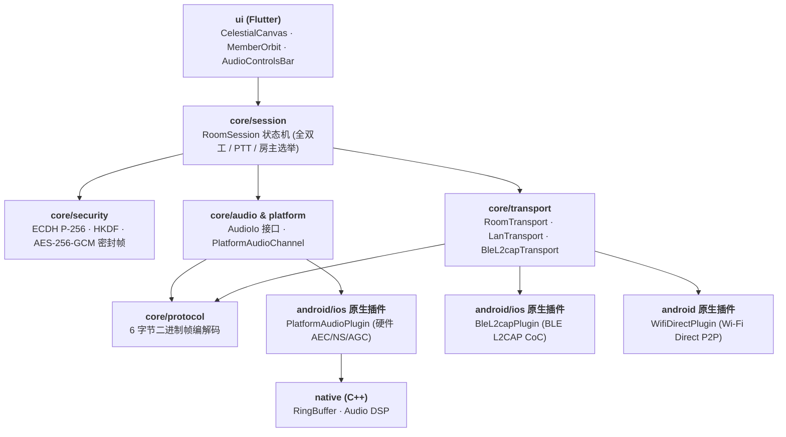

# 架构总览

源码采用 **Flutter 跨平台统一架构**，业务核心位于 `lib/core`，UI 组件位于 `lib/ui`，原生底层位于 `android/`、`ios/` 和 `native/`。

## 分层



方向是单向的：`ui` 驱动 `session`，`session` 面向 `transport` 与 `audio` 接口编程，传输与音频通过 Platform Channels 桥接平台原生底层能力。

## 包职责

| 目录 | 职责 |
| --- | --- |
| `lib/core/protocol` | 二进制帧定义与各类型 Payload 编解码 |
| `lib/core/security` | 设备身份、ECDH 协商、HKDF 派生与 AES-256-GCM 密封帧加密 |
| `lib/core/session` | 房间状态机、成员花名册、PTT 话权令牌、房主选举与交接快照 |
| `lib/core/transport` | 传输接口、LanTransport (TCP/UDP)、BleL2capTransport (BLE L2CAP)、LanRoomDiscovery (UDP 8990 广播)、WifiDirectManager (Wi-Fi P2P) |
| `lib/core/audio` | 音频输入输出抽象与平台通道桥接 |
| `lib/core/diagnostics` | 结构化日志 (AppLog) 与脱敏诊断报告生成 (DiagnosticReport) |
| `lib/ui` | Flutter 界面、落日/月夜天体画布、成员轨道动效、音频操作栏与诊断弹窗 |
| `android/` | Android 宿主、前台保活服务、PlatformAudioPlugin、BleL2capPlugin 与 WifiDirectPlugin |
| `ios/` | iOS 宿主、SwiftUI 资产与原生 PlatformAudioPlugin (AudioUnit) |
| `native/` | 跨平台 C++ 核心（无锁环形缓冲区 RingBuffer、DSP 混音算法） |

## 核心抽象

### 帧（`protocol`）

- `Frame` / `FrameType`——固定 6 字节头 + 最大 512 字节负载，详见 [协议规范](协议规范.md)。
- `FrameStreamReader`——面向 TCP / RFCOMM 的长度前缀分帧器，阻塞式，EOF 或长度越界返回 `null`。
- `FrameReading.readFrameSafely()`——把 `IllegalArgumentException` 吞成 `null`，语义是「协议错误，丢弃这个对端」而不是「崩溃整个房间」。

### 传输（`transport`）

`Transport` 接口把三种物理链路收敛成同一组能力：发送、广播、监听、关闭、`isHost` 标志。会话层只面向它编程。

| 实现 | 说明 |
| --- | --- |
| `WifiHostTransport` / `WifiClientTransport` | TCP 信令服务端 + UDP 音频套接字；客户端每次重连都重建 TCP、UDP 与线程 |
| `BluetoothHostTransport` / `BluetoothClientTransport` | 星型；接受循环 + 每客户端读线程 + 每客户端写线程 |
| `NearbyRoomTransport` | 网状，客户端向 `member.id > selfId` 的对端发起连接以避免重复建链 |

辅助组件：

- `WifiDirectManager`——包装 `WifiP2pManager`，把回调式 API 转成 `StateFlow`（`peers`、`connection`、`thisDevice`、`lastError`、`channelLost`）。
- `BluetoothRoomManager`——发现/已配对设备/可被发现意图的适配器，可被发现时长 300 秒。
- `BluetoothSendQueue`——有界音频队列，音频容量 3，溢出丢最旧的音频帧，信令帧永不丢弃。
- `ReconnectPolicy`——退避序列 `[1s, 2s, 4s]`，耗尽返回 `null` 表示放弃。

### 会话（`session`）

两种会话对应两种拓扑，都实现各自的传输监听接口，都对外暴露 `StateFlow<RoomUiState>`：

| 会话 | 拓扑 | 用于 |
| --- | --- | --- |
| `RoomSession` | 网状全双工 | WiFi 房、Nearby 房 |
| `BluetoothRoomSession` | 星型 PTT，房主端混音 | 蓝牙房 |

`RoomSession` 为每个远端各自维护一套 `JitterBuffer` + `OpusCodec` + `SpeakingDetector`。生命周期是一次性的：`start` 只能调用一次，`shutdown` 后不可复用；连续 10 次发送失败会主动关闭会话。

`BluetoothRoomSession` 则由房主承担混音：每个下行成员有独立的编码器和独立的 16 位序号计数器，收到的混音里剔除接收者自己的声音。

### 音频（`audio`）

`AudioEngine` 是唯一接触 `AudioRecord` / `AudioTrack` 的类，内部通过 `AudioIo` 接口隔离以便测试。其余组件都是纯计算：`OpusCodec`、`JitterBuffer`、`Mixer`、`MicGate`、`SpeakingDetector`、`BluetoothMixPlanner`。参数与链路详见 [音频管线](音频管线.md)。

### 界面（`ui`）

导航就是一个枚举加一个 `mutableStateOf`，没有 Navigation 组件：

```kotlin
enum class Screen { HOME, SCAN, BLUETOOTH_SCAN, NEARBY_SCAN, ROOM, LOOPBACK }
```

界面文件：`HomeScreen`、`ScanScreen`、`BluetoothScanScreen`、`NearbyScanScreen`、`RoomScreen`、`LoopbackScreen`。品牌与动效在 `SunsetRippleTheme`、`BrandElements`、`SunsetControls`、`SunsetMotion`、`RoomToolbarModel`。昼夜配色在 `ThemeMode`、`ThemeModeStore`、`ThemeModeToggle`。

`RoomScreen` 靠 `onPttChanged` 是否为 `null` 来决定渲染 PTT 核心还是全双工核心——只有蓝牙房会传非空值。

**纯决策对象**是这一层的关键设计。以下对象完全不依赖 Android，因此可以直接在 JVM 上测试：

| 对象 | 决定什么 |
| --- | --- |
| `RoomFlow` | 何时可以入房、组主地址超时、房间何时算「死亡」 |
| `BluetoothRoomFlow` / `NearbyRoomFlow` | 房型对应的创建/加入/清理路径 |
| `RoomPermissions` / `BluetoothPermissions` / `NearbyPermissions` | 按 SDK 版本与角色分级的权限清单与中文拒绝文案 |
| `HostTransferFlow` | 收到转移计划后本机该成为房主、去连新房主，还是忽略 |
| `HomeRoomAvailability` | 首页显示哪些房型（当前为 WiFi + 蓝牙） |
| `ThemeModeResolver` | 跟随系统 / 强制浅色 / 强制深色三档如何解析为实际配色，以及档位循环与存档值映射 |

### 服务（`service`）

`CallForegroundService` 是 `microphone` 类型前台服务，通知渠道 `room_call`（低重要度），通知 ID `1001`，类别 `CATEGORY_CALL`。持有不计数、无超时的 `WifiLock`（Android Q+ 用低延迟模式）与 `PARTIAL_WAKE_LOCK`，在 `onDestroy` 释放。任务被移除时自动离房。

服务本身**不持有会话引用**，而是通过 `CallControlBridge` / `ActiveCallControls` 这个进程内桥接层控制通话，避免服务与会话相互持有导致泄漏。

## 状态与并发

- 界面状态统一走 `StateFlow`，由 `lifecycle-runtime-compose` 感知生命周期收集。
- 传输层用**裸线程**（接受循环、读线程、写线程），不是协程——因为底层是阻塞式 socket / 流 API。
- 会话层用协程调度音频节拍与状态更新。
- 关闭路径做了幂等保护：`leave()` 与 `onDisconnected` 并发时只释放一次，这是测试重点覆盖的场景。

## 值得注意的取舍

- **房主不信任客户端自报身份**——蓝牙房主收到帧后用自己分配的成员 ID 重写帧头，客户端伪造 `senderId` 无效。
- **花名册是个性化单播**——每个成员收到的 `yourId` 不同，所以不能广播。
- **音频不经房主转发**（WiFi / Nearby）——组主只是普通参与者，避免它成为带宽瓶颈与单点延迟。
- **蓝牙必须经房主转发**——RFCOMM 是星型点对点链路，客户端之间物理上无法直连。
- **Opus 用纯 JVM 实现**——牺牲一些 CPU，换取构建不依赖 NDK、产物不含 `.so`。

## 明确不存在的东西

- 没有 `androidTest` 插桩测试源集，没有 Robolectric。
- 没有 `gradle/libs.versions.toml` 版本目录，版本号内联在构建脚本里。
- 没有 `strings.xml` / `colors.xml`，没有多语言；`res/values-night` 只放窗口主题，不放文案。
- 昼夜各一套调色板（`SunsetDayPalette` / `SunsetNightPalette`），经 `LocalSunsetPalette` 下发，并各自映射到 Material 3 的 `lightColorScheme` / `darkColorScheme`。

## 相关页面

- [协议规范](协议规范.md) · [音频管线](音频管线.md) · [房主转移机制](房主转移机制.md) · [房间模式对比](房间模式对比.md)
