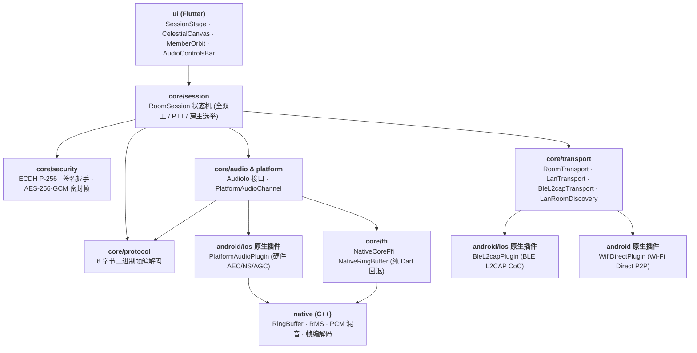

> 🌐 [English](en/Architecture-Overview.md) | 简体中文
# 架构总览

源码采用 **Flutter 跨平台统一架构**，业务核心位于 `lib/core`，UI 组件位于 `lib/ui`，
平台原生插件位于 `android/`、`ios/`，跨平台 C++ 核心位于 `native/`，鸿蒙宿主位于
`harmonyos/`。

## 分层

```mermaid
flowchart TD
    UI["<b>ui (Flutter)</b><br/>SessionStage · CelestialCanvas · MemberOrbit · AudioControlsBar"]
    SESSION["<b>core/session</b><br/>RoomSession 状态机 (全双工 / PTT / 房主选举)"]
    CRYPTO["<b>core/security</b><br/>ECDH P-256 · 签名握手 · AES-256-GCM 密封帧"]
    AUDIO["<b>core/audio & platform</b><br/>AudioIo 接口 · PlatformAudioChannel"]
    TRANS["<b>core/transport</b><br/>RoomTransport · LanTransport · BleL2capTransport · LanRoomDiscovery"]
    PROTO["<b>core/protocol</b><br/>6 字节二进制帧编解码"]
    FFI["<b>core/ffi</b><br/>NativeCoreFfi · NativeRingBuffer (纯 Dart 回退)"]
    NATIVE_AUDIO["<b>android/ios 原生插件</b><br/>PlatformAudioPlugin (硬件 AEC/NS/AGC)"]
    NATIVE_BLE["<b>android/ios 原生插件</b><br/>BleL2capPlugin (BLE L2CAP CoC)"]
    NATIVE_WIFI["<b>android 原生插件</b><br/>WifiDirectPlugin (Wi-Fi Direct P2P)"]
    NATIVE_DSP["<b>native (C++)</b><br/>RingBuffer · RMS · PCM 混音 · 帧编解码"]

    UI --> SESSION
    SESSION --> CRYPTO
    SESSION --> AUDIO
    SESSION --> TRANS
    SESSION --> PROTO
    AUDIO --> NATIVE_AUDIO
    TRANS --> NATIVE_BLE
    TRANS --> NATIVE_WIFI
    AUDIO --> PROTO
    AUDIO --> FFI
    NATIVE_AUDIO --> NATIVE_DSP
    FFI --> NATIVE_DSP
```

方向是单向的：`ui` 驱动 `session`，`session` 面向 `transport` 与 `audio` 接口编程，
传输与音频通过 Platform Channels 桥接平台原生底层能力。`native/` 的 C++ 既被
Android/iOS 原生音频插件静态链接，也通过 `core/ffi` 直接暴露给 Dart。

## 包职责

| 目录 | 职责 |
| --- | --- |
| `lib/core/protocol` | 二进制帧定义与各类型 Payload 编解码 |
| `lib/core/security` | 设备身份 (P-256)、ECDSA 签名握手、AES-256-GCM 密封帧 |
| `lib/core/session` | 房间状态机、成员花名册、PTT 话权、房主选举与交接快照 |
| `lib/core/transport` | `RoomTransport` 接口、`LanTransport` (TCP/UDP)、`BleL2capTransport` (BLE L2CAP)、`LanRoomDiscovery` (UDP 8990 广播)、`WifiDirectManager` (Wi-Fi P2P) |
| `lib/core/audio` | 音频输入输出抽象与纯内存测试实现 (`AudioIo` / `MockAudioIo`) |
| `lib/core/platform` | 平台通道实现 (`PlatformAudioChannel`) |
| `lib/core/ffi` | 原生 C++ 动态库桥接 (`NativeCoreFfi` / `NativeRingBuffer`)，不可用时回退纯 Dart |
| `lib/core/diagnostics` | 结构化日志 (`AppLog`) 与脱敏诊断报告 (`DiagnosticReport`) |
| `lib/core/update` | 语义化版本解析与更新检查 (`UpdateService`) |
| `lib/ui` | 单一舞台 (`SessionStage`)、天体画布、成员轨道、对讲盘、聊天抽屉与诊断弹窗 |
| `android/` | Android 宿主、前台保活服务、`PlatformAudioPlugin`、`BleL2capPlugin` 与 `WifiDirectPlugin` |
| `ios/` | iOS Flutter 宿主、`PlatformAudioPlugin` (AudioUnit VoiceProcessingIO) 与 `BleL2capPlugin` |
| `harmonyos/` | 鸿蒙宿主，目前只有 UDP 房间发现 (`HarmonyLanScanner`)，数据面未接通 |
| `native/` | 跨平台 C++ 核心（无锁环形缓冲、RMS、PCM 混音、帧编解码） |

## 核心抽象

### 帧（`protocol`）

- `Frame` / `FrameType`——固定 6 字节头 + 最大 512 字节负载，详见 [协议规范](协议规范.md)。
- `_FrameAccumulator`——`LanTransport` 内部的 TCP 长度前缀分帧器。跨回调的半帧由
  `NativeRingBuffer`（C++ 无锁环形缓冲）持有，原生库不可用时退回纯 Dart List。
- `Frame.decode`——非法或未知类型返回 `null`，语义是「丢弃这个帧」而不是「崩溃整个房间」。

### 传输（`transport`）

`RoomTransport` 接口把物理链路收敛成同一组能力：发送、广播、收帧、断开通知、
`isHost`、成员端点、房主转移、关闭/释放。会话层只面向它编程。

| 实现 | 说明 |
| --- | --- |
| `LanTransport` | TCP 8988 信令 + UDP 8989 音频；客户端每次重连重建 TCP/UDP，房主中继控制帧与音频帧 |
| `BleL2capTransport` | BLE L2CAP CoC 星型；PSM 由房主系统动态分配并广播；转发在原生侧完成（转发前按链路绑定重写 `senderId`，见下）；不支持房主转移 |

辅助组件：

- `WifiDirectManager`——包装 `WifiP2pManager` 回调式 API，转成 Dart `Stream`（`peersStream`、`connectionStream`），并提供 `connectAndWait` 等待连接就绪。
- `LanRoomDiscovery`——UDP 8990 广播发现，JSON 载荷，magic `SUNSET_RIPPLE_DISCOVERY_V1`，带房间数量上限与来源 IP 绑定。
- `ReconnectController`——退避序列 `[1s, 2s, 4s]`，耗尽后回调会话进入 `disconnected`。

### 会话（`session`）

`RoomSession` 是**唯一**的会话状态机，用 `RoomMode` 区分两种拓扑：

| 模式 | 拓扑 | 用于 |
| --- | --- | --- |
| `RoomMode.wifiFullDuplex` | 星型信令 + 经房主转发的全双工音频 | WiFi 房 |
| `RoomMode.bluetoothPtt` | 星型 PTT | 蓝牙房（L2CAP CoC） |

会话对每个远端维护说话超时判定；全双工模式靠音频停流熄灭「正在说话」，
PTT 模式由 `pttState` 帧驱动。房主负责分配成员号、广播名单、定期广播交接快照
并清理静默成员；成员检测房主失联后按快照迁移。生命周期一次性：
`leave()` / `dispose()` 幂等，`dispose` 后不可复用。

### 音频（`audio`）

`AudioIo` 接口把采集与播放抽象出来：`PlatformAudioChannel` 走平台通道，
`MockAudioIo` 供单元测试与桌面端占位。采集、Opus 编解码、抖动缓冲、混音、
送扬声器全部在原生侧完成，Dart 只搬运 Opus 包（`[data, level]` 事件）。

### 安全（`security`）

`DeviceIdentity` 生成/持有 P-256 身份密钥对；`SessionHandshake` 用 ECDSA 签名
校验对端；`SecureFrameCodec` 把普通帧密封成 `SEALED` 帧。默认明文，
仅在注入 `secureCodec` 时启用。

### 界面（`ui`）

首页与房间是同一块画布上的两组前景，由 `SessionStage` 在一个 `AnimationController`
上编排：背景天体从首页形态插值到房间形态，前景依次进出，不做页面跳转。
唯一的路由是 `AboutPage`（`Navigator.push`）。主题由 `AppTheme` 的昼夜两套调色板
驱动，通过 `MaterialApp.themeMode` 切换。

主要组件：`SessionStage`、`HomeContent`、`RoomContent`、`CelestialCanvas`、
`MemberOrbit`、`AudioControlsBar`、`RoomChatSheet`、`DiagnosticsSheet`。

## 状态与并发

- 会话状态统一走 Dart `Stream`（`stateStream`、`membersStream`、`waveStream`、
  聊天流），UI 用 `StreamBuilder` 订阅；生命周期结束统一关闭 controller。
- 传输层用异步 `Stream` + socket，不引入额外线程模型。
- 收帧串行化：`RoomSession` 用 `_incomingTail` 把到达的帧按序排队处理。
- 关闭路径做了幂等保护：`leave()` 与断线并发时只释放一次。

## 值得注意的取舍

- **房主不信任客户端自报身份**——TCP 与 UDP 帧头里的 `senderId` 都会被房主按
  连接/白名单重写或过滤。
- **花名册单播**——客户端只接受 `senderId == hostId` 的名单，不能接受远端伪造名单。
- **音频经房主转发**（WiFi 与蓝牙）——客户端把 UDP 音频发给房主，房主按端点表
  转发给除来源外的成员；当前两种房型都是星型音频路径。
- **蓝牙必须经房主转发**——L2CAP 是星型点对点链路，客户端之间物理上无法直连。
- **蓝牙房的发送者身份由房主侧链路绑定**——L2CAP 是链路寻址，接收端没有
  TCP 那种「按连接身份重写 `senderId`」的机会。房主在 JOIN 后通过
  `bindMember(peerAddress, memberId)` 把成员号绑到具体链路，转发时按绑定重写帧头
  `senderId`；未绑定的链路按 `senderId=0` 丢弃。这是与 LAN 房同语义的防冒用。
- **原生 C++ 可选**——`NativeCoreFfi` 加载失败时所有能力都有等价的纯 Dart 回退，
  单元测试因此在桌面环境无需编译原生库。

## 明确不存在的东西

- 没有旧 `app/` Kotlin/Compose 工程，没有 `NearbyRoomTransport`、`FrameStreamReader`、
  RFCOMM 服务、`BluetoothRoomSession`、`CallForegroundService` 等已删除实现。
- 没有 Android 插桩测试源集，没有 Robolectric。
- 没有 `gradle/libs.versions.toml` 版本目录，版本号内联在构建脚本里。
- 没有多语言资源文件；双语由 `lib/l10n/app_strings.dart` 纯类型实现。

## 近场文字聊天室 (Room Text Chat)

采用**纯内存、仅限当前房间生命周期、零服务端**的设计，WiFi 房与蓝牙房共享同一套
Dart 会话模型与 UI 抽屉面板。

### 1. 通道隔离与路由

- **WiFi 房**：文字消息经 `ChatMessagePayload` 编码为 `FrameType.chat (0x0c)`，
  严格路由至 TCP 8988 控制信道，由房主向其他客户端中继转发；**严禁**泄漏至
  UDP 8989 音频端口，保障语音最高调度优先级。
- **蓝牙房**：复用 BLE L2CAP 逻辑链路信道，Dart 层推送到 `sendL2capData`，
  原生层分发到其余成员。
- **历史同步与撤回**：`chatSync (0x0d)` 由房主单播给新成员补历史；
  `chatDelete (0x0e)` 广播撤回，按帧的实际发送者校验作者身份。
- **安全信封**：按当前产品要求默认明文；仅在会话配置 `secureCodec` 时，
  `sendFrame` 才密封为 `FrameType.sealed (0x0b)`。

### 2. 平台能力现状与已知缺口 (Platform Matrix)

| 平台 | WiFi 文字聊天 | 蓝牙 (BLE L2CAP) 文字聊天 | 现状与已知阻塞缺口 |
| :--- | :--- | :--- | :--- |
| **Android** | ✅ 完全支持 | ✅ 完全支持 | WiFi Direct P2P 建组与 Client 均已验证；`BleL2capPlugin.kt` 提供原生缓冲与主机广播。 |
| **iOS** | ⚠️ 局域网支持 | ⚠️ 插件已实现 | 同 WiFi/热点下的 LAN TCP 可用；`BleL2capPlugin.swift` 已实现长度前缀重组与房主转发，但出站未按 MTU 分片、转发会丢失原始发送方身份，且数据面尚未真机验证。 |
| **HarmonyOS** | ❌ 未通数据面 | ❌ 未通数据面 | `harmonyos/` 仅有 UDP 发现 (`HarmonyLanScanner`)，尚未打通房间数据信道。 |

## 相关页面

- [协议规范](协议规范.md) · [音频管线](音频管线.md) · [房主转移机制](房主转移机制.md) · [房间模式对比](房间模式对比.md)
