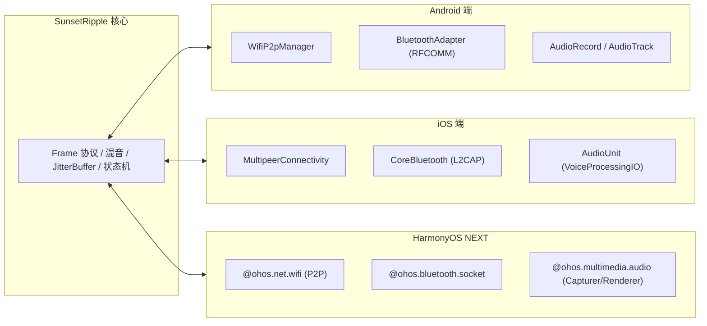

# 跨平台多端架构规范（iOS & HarmonyOS NEXT）

本文档定义 SunsetRipple 在保留 Android 原有近场对讲优势的同时，向 **iOS** 与 **HarmonyOS NEXT（纯血鸿蒙）** 演进的多端架构规范与适配器接口设计。

---

## 1. 架构核心原则

1. **业务决策层与平台 SDK 彻底隔离**：
   - 所有的核心状态机（`RoomSession`、`BluetoothRoomSession`）、二进制协议（`Frame`）、音频处理算法（`JitterBuffer`、`Mixer`、`MicGate`、`Opus`）、断线重连退避策略与房主选举算法均保持纯逻辑实现，不直接依赖任何单一平台的特定 SDK。
2. **Adapter 模式接入硬件能力**：
   - 平台差异（如录音/播音、WiFi P2P、经典蓝牙/BLE/Multipeer、前台保活、权限请求）均通过标准接口桥接。
3. **零云端、近场点对点**：
   - 跨端互通不走中心服务器，优先使用直连模式（热点局域网 Mesh 或近场 P2P）。

---

## 2. 平台能力对应矩阵



---

## 3. 音频硬件接口规范 (`AudioIo`)

所有平台的音频驱动需满足以下契约：

```kotlin
interface AudioIo {
    /** 麦克风静音开关 */
    var micMuted: Boolean

    /** 启动采集线程与播放管线 */
    fun start()

    /** 阻塞写入一帧 PCM 采样（16kHz, 16bit, 单声道, 每帧 320 采样 / 20ms） */
    fun playPcm(pcm: ShortArray)

    /** 释放音频硬件资源 */
    fun stop()
}
```

* **Android**：`AudioRecord`（`VOICE_COMMUNICATION`） + `AudioTrack` + `AcousticEchoCanceler`。
* **iOS**：`AVAudioEngine` / `AudioUnit`（`kAudioUnitSubType_VoiceProcessingIO`，内置 iPhone 硬件级 AEC）。
* **HarmonyOS NEXT**：`AudioCapturer`（`SOURCE_TYPE_VOICE_COMMUNICATION`）+ `AudioRenderer`（`STREAM_USAGE_VOICE_COMMUNICATION`）。

---

## 4. 传输驱动规范 (`Transport`)

```kotlin
interface Transport {
    val isHost: Boolean get() = false
    /** 向房间成员广播帧（AUDIO 走不可靠 UDP/数据报，控制信令走可靠通道） */
    fun broadcast(frame: Frame)
    /** 房主转移准备 */
    fun prepareHostTransfer(): HostTransferPlan? = null
    /** 关闭链路 */
    fun close()
}
```

* **iOS 原生 P2P**：通过 `MultipeerConnectivity` 框架的 `MCSession` 实现 `sendData(..., mode: .unreliable)` 发送音频，`mode: .reliable` 发送控制帧。
* **HarmonyOS NEXT 原生 P2P**：通过 `@ohos.net.wifi.p2p` 获取组主 IP，建立 TCP 信令与 UDP 音频 Socket。
* **通用跨端热点 Mesh**：在任意手机建立 Wi-Fi 热点时，三端设备均使用标准 UDP 多播组网和直连 Socket。

